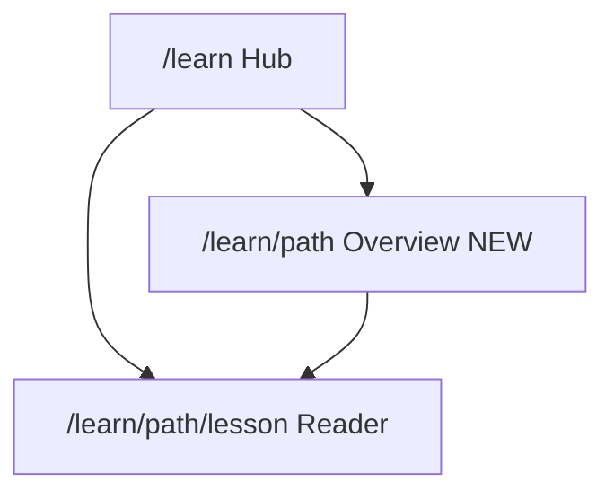

# Redesign Learn Hub → Neon Blueprint

## Konteks

Learn Hub saat ini **sengaja masih v2** (charcoal + oranye `#FF5C1A` + font Outfit), terpisah dari produk yang sudah Neon Blueprint.

| Fakta | Detail |
|-------|--------|
| Routes | `/learn` (hub), `/learn/[path]` (**redirect** ke lesson pertama), `/learn/[path]/[lesson]` (baca) |
| Chrome | Dual sticky: PrimaryNav 68px + TopicStrip 48px = **116px** |
| Accent | Oranye merata; DS v3.1 menetapkan **violet `#9D4EDD`** sebagai identitas Learn |
| Font | Outfit (`--font-learn`); Neon = **Unbounded** heading + **JetBrains Mono** body/label |
| Content | 6 path × 4 lesson di `src/lib/learn-content/` — **tidak diubah** (hanya UI) |

**Keputusan default (supaya plan solid):**
- **Dark-first** Neon Blueprint; theme toggle light diganti ke “daylight soft” ringan ATAU disembunyikan di v1 migrasi (favor konsistensi produk — mulai dengan dark, toggle boleh tetap tapi token remapped, tanpa partikel/cursor oranye).
- **Path overview page nyata** menggantikan redirect — kunci “informatif & profesional”.
- **Chrome dirampingkan**: satu primary nav 76px + strip topik lebih tipis (40px) ATAU strip jadi secondary row dengan tone surface, bukan second full chrome hitam.
- Efek “bar-bar” dihilangkan: custom cursor, particle oranye, card hover-lift agresif → diganti blueprint grid 1× + accent violet fokus.

---

## 1. Token shell `.learn-app`

**Files:** [`src/app/globals.css`](src/app/globals.css) (blok `.learn-shell` ~935+), [`src/app/learn/layout.tsx`](src/app/learn/layout.tsx), [`src/components/learn/LearnShell.tsx`](src/components/learn/LearnShell.tsx)

- Tambah scope `.learn-app` (pola mirip `.generate-app` / `.tools-app`):
  - Surfaces → `--app-bg-base` / `surface` / `elevated` / navy `#0D1321`
  - `--learn-accent` → **violet** `#9D4EDD` (identitas Learn)
  - CTA / fokus keputusan → amber `#FFB020`
  - Info / tip / progress → sky `#38BDF8`
  - Remap `--color-orange` / hardcoded `rgba(255,92,26,*)` di dalam Learn ke token baru
- Layout: unloaded Outfit sebagai UI default; pakai `--font-unbounded` + `--font-jetbrains-mono` (sudah global)
- Update status di [`docs/03-DESIGN-SYSTEM.md`](docs/03-DESIGN-SYSTEM.md) baris Learn: ✅ v3.1 + `.learn-app`

---

## 2. Chrome navigasi (profesional, kurang makan viewport)

**Files:** [`LearnPrimaryNav.tsx`](src/components/learn/LearnPrimaryNav.tsx), [`LearnTopicStrip.tsx`](src/components/learn/LearnTopicStrip.tsx), [`LearnLogo.tsx`](src/components/learn/LearnLogo.tsx), [`learn-links.ts`](src/lib/learn-links.ts), [`LearnNavDropdown.tsx`](src/components/learn/LearnNavDropdown.tsx), [`LearnSearch.tsx`](src/components/learn/LearnSearch.tsx)

- Logo: Node Cluster + `ArroBuild` amber + badge **Learn** violet (selaras marketing)
- Primary nav tinggi **76px** (selaras Mini Tools / NavbarV3); solid navy blur
- Topic strip: pills mono, active violet/sky by track; hapus / nonaktifkan item “Latihan — Segera” dari primary nav (bising)
- Search & dropdown: panel elevated navy, border default, focus amber
- Hapus ketergantungan `.btn-*` v2 lime pada chrome Learn

---

## 3. Hub `/learn` — informatif, bukan landing kosong

**Files:** [`src/app/learn/page.tsx`](src/app/learn/page.tsx), [`LearnHubHero.tsx`](src/components/learn/LearnHubHero.tsx), [`LearnHowTo.tsx`](src/components/learn/LearnHowTo.tsx), [`LearnPathSection.tsx`](src/components/learn/LearnPathSection.tsx), [`LearnFooter.tsx`](src/components/learn/LearnFooter.tsx) → prefer shared [`Footer.tsx`](src/components/marketing/Footer.tsx)

**Struktur section (variasi layout, 1 blueprint max):**

1. **Hero** (bg-base): headline Unbounded, body mono max ~480px, stats nyata (`pathCount` / `lessonCount`), CTA scroll ke path + “Mulai path pemula”
2. **Cara belajar** (bg-surface): horizontal steps / numbered list — **bukan** 3 kartu identik
3. **Katalog path** dikelompokkan level (`pemula` / `menengah` / `lanjut`): tiap path = panel elevated dengan icon, deskripsi, jumlah lesson, badge level (violet/sky/amber beda track), link ke **overview path** dan “Mulai lesson 1”
4. **Footer** shared marketing (konsisten dengan `/tools`)

Update [`PATH_THEMES`](src/lib/learn-nav.ts): warnai track (bukan semua oranye sama).

---

## 4. Path overview `/learn/[path]` (baru — profesional)

**File:** [`src/app/learn/[path]/page.tsx`](src/app/learn/[path]/page.tsx) — **hapus `redirect`**, render overview.

Konten overview:
- Breadcrumb: Learn → Path
- Judul path, level, estimasi (# lesson)
- Deskripsi + “Apa yang kamu pelajari” (dari metadata path)
- Daftar 4 lesson dengan nomor, judul, status (bisa static “siap dibaca”), CTA per lesson
- Primary CTA: Mulai / Lanjutkan lesson pertama

Ini yang membuat Learn terasa **katalog kursus**, bukan langsung loncat ke artikel.

---

## 5. Lesson reader — scanable seperti app work surface

**Files:** [`LearnLessonDashboard.tsx`](src/components/learn/LearnLessonDashboard.tsx), [`LearnSidebar.tsx`](src/components/learn/LearnSidebar.tsx), [`LessonContent.tsx`](src/components/learn/LessonContent.tsx), [`LearnLessonNav.tsx`](src/components/learn/LearnLessonNav.tsx), lesson page

- Sidebar: surface navy, active lesson border-left violet, hover jelas (bukan opacity saja)
- Top lesson chrome: breadcrumb mono + progress bar sky/violet (tipis)
- Tipografi artikel: heading Unbounded/semibold, body mono 14–15px, line-length ~65ch
- Block semantics di `LessonContent`:
  - tip → sky
  - warning → warning token
  - callout / keputusan → amber sparingly
  - code → elevated + blueprint border soft (bukan `#0D0D0D` charcoal keras)
- Prev/Next: CTA amber untuk next (keputusan), ghost untuk prev

---

## 6. Efek & décor

**Files:** [`LearnBackground.tsx`](src/components/learn/LearnBackground.tsx), [`LearnParticles.tsx`](src/components/learn/LearnParticles.tsx), [`LearnCursor.tsx`](src/components/learn/LearnCursor.tsx)

- Matikan / sederhanakan particles + custom cursor (tidak profesional untuk reading UI)
- Background: grid blueprint **maks 1×** (hero hub saja); lesson reader bersih tanpa noise
- Hapus `learn-hover-card` lift berat

---

## 7. Integrasi nav produk

- Entry “Belajar” dari [`NavbarV3`](src/components/marketing/landing/NavbarV3.tsx) / dashboard tetap `/learn`
- Pastikan open-in-new-tab (jika masih dipakai) tetap works
- Tidak memaksa Learn memakai AppShell marketing — tetap `LearnShell` dedicated (konten panjang + sidebar)

---

## Urutan implementasi

1. Token `.learn-app` + layout fonts  
2. Chrome (nav + strip + logo + search)  
3. Hub sections  
4. Path overview (ganti redirect)  
5. Lesson dashboard + content blocks + sidebar  
6. Cleanup effects + docs status  
7. Smoke: `/learn`, satu path overview, satu lesson, light/dark jika toggle dipertahankan  

## Di luar scope

- Menulis ulang / menambah kurikulum lesson  
- Progress tracking user / quiz (kecuali UI placeholder yang sudah ada — dibersihkan)  
- Migrasi MDX (tetap TS modules)  
- Learn API / payment  

## Success criteria

- Belajar terasa satu produk dengan landing/tools (navy, Unbounded/Mono, Node logo)  
- Violet terbaca sebagai identitas Learn; amber hanya CTA keputusan  
- Hub menjelaskan **apa yang dipelajari** dan **urutan path**  
- Path punya halaman ringkas sebelum masuk lesson  
- Membaca lesson nyaman: hierarchy jelas, callout semantik, chrome tidak menelan viewport