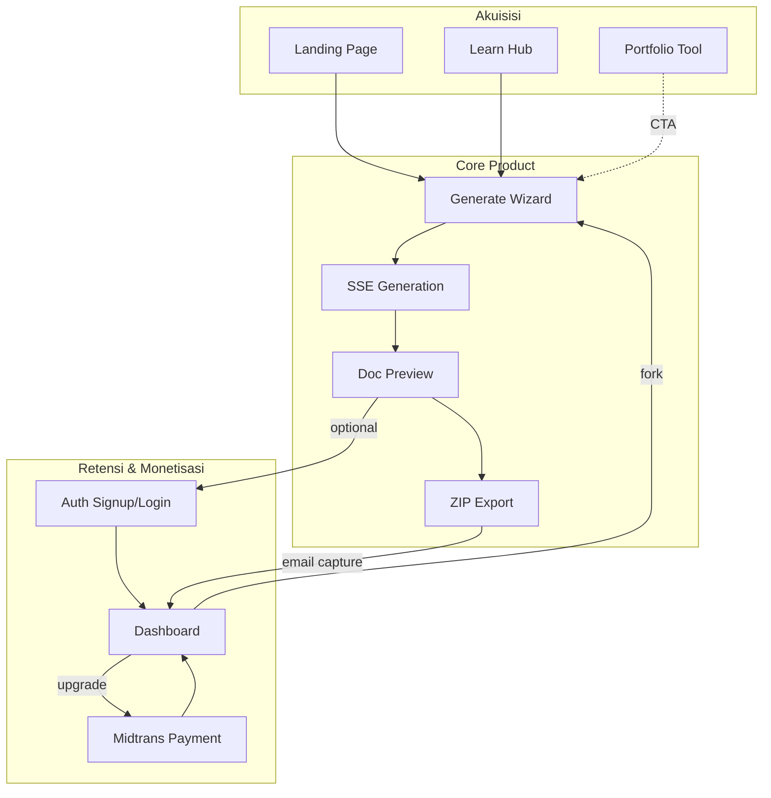

# ArroBuild — Analisis Mendalam Kondisi & Kesiapan

> **Tanggal analisis:** 27 Juni 2026  
> **Versi codebase:** `0.1.0` (Next.js 16.2.9)  
> **Scope:** Backend, AI API, Monetisasi, Frontend, UX, dan alur pengguna end-to-end

---

## 1. Ringkasan Eksekutif

ArroBuild adalah platform SaaS berbahasa Indonesia untuk **vibe coding** — pengguna mendeskripsikan ide produk, sistem AI menghasilkan dokumentasi terstruktur (PRD, context, plan, design system, agents, dll.), lalu mengekspor bundel ZIP yang siap dipakai di Cursor, Claude Code, atau Windsurf.

**Penilaian keseluruhan:** Produk berada di tahap **MVP+ yang fungsional**, dengan inti produk (generate → stream → preview → export) sudah terbangun dengan kualitas tinggi. Autentikasi Supabase dan pembayaran Midtrans sudah terintegrasi. Namun terdapat **kesenjangan signifikan antara konfigurasi tier, copy marketing, dan enforcement runtime**, serta beberapa bug UI↔API yang dapat membingungkan pengguna.

| Area | Skor Kesiapan | Status |
|------|---------------|--------|
| Backend & API | 75% | Fungsional, perlu hardening keamanan & kuota |
| AI API | 85% | Pipeline matang, multi-provider, streaming |
| Monetisasi | 65% | Midtrans live-ready, model langganan belum lengkap |
| Frontend | 80% | Polished, beberapa inkonsistensi |
| UX & Flow | 70% | Funnel utama solid, ada friction points |
| **Kesiapan Launch** | **~72%** | Perlu perbaikan kritis sebelum soft launch publik |

**Blocker build saat ini:** `npm run build` gagal pada TypeScript check di `src/lib/midtrans.ts` — fungsi `tierIdToSubscriptionTier` tidak menangani semua cabang `switch` (tier `starter` tidak ada return). Ini harus diperbaiki sebelum deploy production.

---

## 2. Konteks Produk & Arsitektur

### 2.1 Tech Stack

| Lapisan | Teknologi |
|---------|-----------|
| Framework | Next.js 16 App Router, React 19, TypeScript strict |
| Styling | Tailwind CSS v4, design system custom (lime + orange, dark-only) |
| Auth | Supabase Auth (email/password + Google OAuth) |
| Database | PostgreSQL (Supabase) + Prisma 7 (`@prisma/adapter-pg`) |
| AI | Gemini, OpenAI, Anthropic, DeepSeek — tanpa Vercel AI SDK |
| Pembayaran | Midtrans Snap (Indonesia) |
| Export | JSZip server-side |
| Validasi | Zod |
| Analytics | Vercel Analytics + custom `trackEvent` |
| Deploy | Vercel (target) |

**Tidak digunakan:** Server Actions, Stripe SDK, Resend, global state manager (Redux/Zustand).

### 2.2 Model Arsitektur

```
┌─────────────────────────────────────────────────────────────┐
│                     Client (Browser)                        │
│  Landing │ Generate Wizard │ Dashboard │ Learn │ Auth       │
└──────────────────────────┬──────────────────────────────────┘
                           │ fetch / SSE
┌──────────────────────────▼──────────────────────────────────┐
│              Next.js Route Handlers (src/app/api/)          │
│  /generate  /export  /payment/*  /user/me  /auth/*          │
└──────┬─────────────────┬──────────────────┬─────────────────┘
       │                 │                  │
┌──────▼──────┐  ┌───────▼───────┐  ┌──────▼──────┐
│  AI Engine  │  │    Prisma     │  │  Supabase   │
│ orchestrator│  │  PostgreSQL   │  │    Auth     │
│ generator   │  │               │  │             │
│ tier-enforcer│ │               │  │             │
└──────┬──────┘  └───────────────┘  └─────────────┘
       │
┌──────▼──────────────────────────────────────┐
│  LLM Providers: Gemini │ OpenAI │ Anthropic │
│                 DeepSeek (OpenAI-compatible)  │
└─────────────────────────────────────────────┘
```

### 2.3 Database Schema (Prisma)

| Model | Fungsi |
|-------|--------|
| `User` | Mirror Supabase UUID, email, profil |
| `Subscription` | Tier (FREE/STARTER/PRO/UNLIMITED), status, `expiresAt` |
| `Project` | Idea, clarifications JSON, presets JSON, status, optional `userId` |
| `GeneratedFile` | Konten per dokumen (`fileKey`, `content`) |
| `Payment` | Order Midtrans, tier, amount, snapToken, status |

**Catatan:** `STARTER` ada di enum Prisma tetapi **tidak dijual** di UI maupun `PAID_TIER_IDS`.

---

## 3. Analisis Backend

### 3.1 Kondisi Saat Ini — Yang Sudah Berjalan

#### API Endpoints

| Method | Endpoint | Auth | Status |
|--------|----------|------|--------|
| `POST` | `/api/generate` | Opsional | ✅ Produksi-ready (SSE, max 180s) |
| `GET` | `/api/export?projectId=` | **Tidak ada** | ⚠️ Berfungsi, tidak aman |
| `PATCH` | `/api/project/[id]` | **Tidak ada** | ⚠️ Email capture tanpa verifikasi |
| `GET` | `/api/user/me` | Opsional | ✅ Profil + 20 project terakhir |
| `POST` | `/api/payment/create` | Wajib | ✅ Midtrans Snap token |
| `POST` | `/api/payment/confirm` | Wajib | ✅ Fallback localhost post-payment |
| `POST` | `/api/payment/webhook` | Signature | ✅ Aktivasi subscription |
| `GET` | `/api/payment/config` | Publik | ✅ Status konfigurasi Midtrans |
| `GET` | `/api/auth/callback` | OAuth | ✅ Sync user ke Prisma |
| `POST` | `/api/auth/signout` | — | ✅ |
| `POST` | `/api/tools/portfolio` | **Tidak ada** | ✅ Streaming Gemini Flash |

#### Autentikasi

- **Supabase SSR** dengan middleware refresh session di setiap request (`src/middleware.ts`).
- Flow lengkap: register, login, Google OAuth, lupa password, reset password.
- `syncDbUser()` otomatis membuat record Prisma + subscription FREE saat pertama login.
- `getEffectiveTier()` memeriksa status ACTIVE dan `expiresAt` sebelum memberikan akses berbayar.

**Kelemahan auth:**
- Tidak ada **route guard server-side** — `/dashboard` hanya redirect client-side jika tidak login.
- `SUPABASE_SERVICE_ROLE_KEY` tercantum di launch checklist tetapi **tidak dipakai** di kode `src/`.
- Export dan PATCH project bisa diakses siapa saja yang punya `projectId`.

#### Logika Bisnis Tier (`src/lib/auth.ts`)

```typescript
const FREE_PROJECT_LIMIT = 1; // Hanya untuk user login tier free
```

`assertCanGenerate()` saat ini hanya mengecek:
1. Model AI sesuai tier
2. User login free: maksimal **1 project total** (bukan per bulan)

**Tidak dipanggil:** `checkMonthlyQuota()` dan `checkDailyLimit()` dari `tier-enforcer.ts` — padahal sudah diimplementasikan lengkap.

### 3.2 Kesenjangan Backend — Tier & Kuota

| Aturan | `pricing.ts` / Marketing | `tier-enforcer.ts` (V3) | `auth.ts` (Runtime) |
|--------|--------------------------|-------------------------|---------------------|
| Free — project/bulan | 5/bulan | 5/bulan | **1 total** (login) / **unlimited** (anonim) |
| Free — dokumen | 3 file | 3 file | ✅ (via orchestrator) |
| Pro — project/bulan | 30/bulan | 30/bulan | ❌ Tidak dicek |
| Pro Max — harian | — | 10/hari soft limit | ❌ Tidak dicek |
| Export format per tier | Berbeda per tier | Dikonfigurasi | ❌ Semua format selalu di-ZIP |

Ini adalah **inkonsistensi paling kritis** di backend: konfigurasi tier sudah matang di `V3_TIER_CONFIG`, tetapi enforcement di route handler tidak lengkap.

### 3.3 Validasi Input API (`/api/generate`)

Schema Zod membatasi:

```typescript
framework: z.enum(["nextjs", "laravel", "django", "rails", "fastapi"])
design: z.enum(["neo-brutalist", "minimal", "corporate", "bold", "apple", "linear", "stripe", "notion", "vercel"])
```

Frontend (`StackStep.tsx`, `types.ts`) menawarkan **20+ framework** (Nuxt, Remix, SvelteKit, React Native, Flutter, `ai-recommend`, dll.) dan design tambahan (`glassmorphism`, `dashboard`, `ai-recommend`).

**Dampak:** Pilihan di luar whitelist API menghasilkan **HTTP 422 Validation failed** — pengguna tidak mendapat pesan yang jelas di UI.

Field `clarifications` selalu dikirim sebagai `{}` dari halaman generate — data konteks produk hanya masuk lewat string `idea` yang dibangun dari `buildIdeaString()`.

### 3.4 Kesiapan Backend — Penilaian

| Aspek | Status | Catatan |
|-------|--------|---------|
| CRUD Project | ✅ | Create + status update via orchestrator |
| Streaming SSE | ✅ | Stabil, event types lengkap |
| Multi-tenant isolation | ⚠️ | Project anonim tidak terikat user |
| Rate limiting | ❌ | Tidak ada di API manapun |
| Error handling | ✅ | Zod + typed errors, logging console |
| Background jobs | ❌ | DB writes in-process via queue sederhana |
| Build CI | ❌ | TypeScript error di `midtrans.ts` |
| Migrations | ✅ | 3 migration files, schema konsisten |
| Testing scripts | ✅ | `test:generate`, `test:midtrans`, `test:validation` |

**Skor backend: 75/100** — Fungsional untuk MVP, butuh security & quota hardening sebelum skala.

---

## 4. Analisis AI API

### 4.1 Arsitektur Pipeline

Dokumentasi internal (`AI-API.md`) akurat. Alur utama:

```
POST /api/generate
  → Zod validation
  → assertCanGenerate (parsial)
  → prisma.project.create (GENERATING)
  → orchestrateGeneration() [SSE]
       → enforceTier (docs + model)
       → loop per dokumen (urutan canonical)
           → ContextManager.buildContextString()
           → buildPromptForTier()
           → streamWithFinishReason() + fallback chain
           → validateGeneratedContent() + auto-continuation
           → queueFileWrite() [non-blocking]
       → project status DONE/FAILED
```

### 4.2 Provider & Model

| Provider | Env Var | Model | Tier Default |
|----------|---------|-------|--------------|
| Google Gemini | `GEMINI_API_KEY` | `gemini-2.5-flash`, `gemini-2.5-pro` | Free / Pro |
| DeepSeek | `DEEPSEEK_API_KEY` | `deepseek-chat` | Free |
| OpenAI | `OPENAI_API_KEY` | `gpt-4o` | Pro / Pro Max |
| Anthropic | `ANTHROPIC_API_KEY` | `claude-sonnet-4-20250514` | Pro Max |

**Fallback chain** (`retry-handler.ts`): Jika provider utama gagal (429, timeout, quota), otomatis fallback ke model alternatif dalam chain yang dikonfigurasi.

### 4.3 Dokumen yang Dihasilkan (8 tipe)

| Urutan | File Key | Label | Tier Minimum |
|--------|----------|-------|--------------|
| 1 | `context` | Project Context | Free |
| 2 | `prd` | Product Requirements | Free |
| 3 | `plan` | Development Plan | Free |
| 4 | `design-system` | Design System | Pro |
| 5 | `agents` | AI Agents & Rules | Pro |
| 6 | `production-hardening` | Production Hardening | Pro Max |
| 7 | `scale-performance` | Scale & Performance | Pro Max |
| 8 | `growth-quality` | Growth & Quality | Pro Max |

### 4.4 Kualitas & Fitur AI

| Fitur | Status | Detail |
|-------|--------|--------|
| Streaming real-time | ✅ | Chunk per karakter ke client |
| Context accumulation | ✅ | `ContextManager` + `summarizeForContext` |
| Truncation detection | ✅ | Auto-continuation hingga 2x |
| Retry + backoff | ✅ | Exponential backoff |
| Model fallback | ✅ | Chain multi-provider |
| Token limit per tier | ✅ | 2K / 4K / 8K |
| RAG / Vector context | ❌ | Heuristic text summarization saja |
| Self-reflection quality gate | ❌ | Hanya structural validation |
| Mock layer untuk testing | ❌ | Bergantung API key live |
| Regen per file | ❌ | Dikonfigurasi Pro Max, belum di UI |

### 4.5 Bug Kritis: `selectedDocs` Tidak Dikirim ke API

Di `GenerationProgress.tsx` baris 98:

```typescript
body: JSON.stringify({ idea, clarifications, presets, tier, modelId }),
// selectedDocs TIDAK disertakan
```

Orchestrator kemudian memakai default tier:

```typescript
const requestedDocs = input.selectedDocs ??
  DOC_ORDER.filter((k) => tierConfig.allowedDocuments.includes(k));
```

**Dampak UX:** Pengguna memilih dokumen di Step 4, tetapi server mengabaikan pilihan dan menghasilkan set default tier. Progress UI menampilkan file yang dipilih user, sementara server mungkin generate set berbeda — **mismatch antara UI dan output**.

### 4.6 Endpoint Sekunder: Portfolio Tool

`POST /api/tools/portfolio` — streaming teks plain (bukan SSE JSON), Gemini Flash, tanpa auth, tanpa rate limit. Risiko abuse API key jika tidak dibatasi.

### 4.7 Kesiapan AI API — Penilaian

| Aspek | Status |
|-------|--------|
| Core generation | ✅ Matang |
| Multi-provider | ✅ |
| Tier doc enforcement | ✅ (server-side) |
| Tier doc selection dari UI | ❌ Bug |
| Quota enforcement | ❌ |
| Context quality | ⚠️ Cukup untuk MVP |
| Observability | ⚠️ Console.log saja |

**Skor AI API: 85/100** — Engine kuat, perlu perbaikan integrasi UI dan observability.

---

## 5. Analisis Monetisasi

### 5.1 Model Bisnis Saat Ini

| Tier UI | Harga | Prisma Tier | Dijual? |
|---------|-------|-------------|---------|
| Free | Rp 0 | FREE | ✅ |
| Starter | Rp 49K (FAQ landing) | STARTER | ❌ Tidak ada di `PAID_TIER_IDS` |
| Pro | Rp 99K/bulan | PRO | ✅ |
| Pro Max | Rp 199K/bulan | UNLIMITED | ✅ |

**Model pembayaran:** Satu kali via Midtrans Snap → **30 hari akses** (`SUBSCRIPTION_DAYS = 30`). Bukan recurring billing otomatis.

### 5.2 Alur Pembayaran

```
User klik Upgrade (dashboard / pricing)
  → POST /api/payment/create
  → Midtrans Snap token
  → User bayar di Snap overlay / redirect
  → Production: POST /api/payment/webhook (signature verified)
  → Localhost fallback: POST /api/payment/confirm
  → activateSubscriptionForOrder()
  → subscription.tier + expiresAt (+30 hari)
```

**File kunci:**
- `src/lib/midtrans.ts` — Snap token, status check, webhook signature (SHA512)
- `src/lib/payment/activate-subscription.ts` — Upsert subscription
- `src/components/dashboard/UpgradeSection.tsx` — UI checkout

### 5.3 Yang Sudah Berjalan

- ✅ Midtrans sandbox/production auto-detection dari key prefix
- ✅ `GET /api/payment/config` untuk validasi env di client
- ✅ Script `npm run test:midtrans`
- ✅ Plan pre-selection via `?plan=pro|unlimited` di signup/login
- ✅ Payment return handling (`?payment=finish` + sessionStorage confirm)

### 5.4 Yang Belum / Tidak Lengkap

| Fitur | Status | Dampak Bisnis |
|-------|--------|---------------|
| Stripe (internasional) | ❌ Hanya di docs | Tidak bisa terima USD/card global |
| Tier Starter Rp 49K | ❌ | Gap harga antara free dan pro |
| Auto-renewal | ❌ | Churn tinggi setelah 30 hari |
| Cancel subscription UI | ❌ | User tidak bisa self-service |
| `GET /api/user/subscription` | ❌ | Dashboard baca langsung dari `/api/user/me` |
| Invoice / receipt email | ❌ | Resend tidak diintegrasikan |
| Refund handling | ❌ | Manual via Midtrans dashboard |
| Usage-based billing | ❌ | Flat monthly only |
| Trial period | ❌ | Langsung bayar atau free |

### 5.5 Inkonsistensi Copy Monetisasi

| Lokasi | Masalah |
|--------|---------|
| Landing FAQ | Menyebut tier Starter Rp 49K |
| `pricing.ts` | Hanya Free, Pro, Pro Max |
| `auth.ts` error message | "Upgrade ke **Starter**" padahal Starter tidak dijual |
| Landing pricing footnote | "Midtrans segera hadir" — padahal sudah live di dashboard |
| `completed_tasks.md` | Masih menyebut payment sebagai "fokus selanjutnya" |

### 5.6 Kesiapan Monetisasi — Penilaian

**Skor: 65/100** — Alur bayar inti sudah jalan untuk pasar Indonesia, tetapi model langganan, tiering, dan copy belum selaras. Perlu keputusan produk: apakah Starter dihidupkan, atau dihapus dari semua referensi.

---

## 6. Analisis Frontend

### 6.1 Struktur Halaman

| Route | File | Kelengkapan |
|-------|------|-------------|
| `/` | `page.tsx` | ✅ Landing lengkap (hero, FAQ, pricing, social proof) |
| `/generate` | `generate/page.tsx` | ✅ Wizard 7 langkah |
| `/dashboard` | `dashboard/page.tsx` | ✅ History, fork, upgrade |
| `/learn` | `learn/page.tsx` | ✅ 4 path, 20 lesson |
| `/learn/[path]` | — | ✅ |
| `/learn/[path]/[lesson]` | — | ✅ |
| `/docs` | `docs/page.tsx` | ✅ Reference hub |
| `/integrations` | `integrations/page.tsx` | ⚠️ 2 coming soon |
| `/tools/portfolio` | `tools/portfolio/page.tsx` | ✅ |
| `/login`, `/signup` | — | ✅ |
| `/forgot-password` | — | ✅ |
| `/auth/reset-password` | — | ✅ |
| `/tools/readme` | — | ❌ Tidak ada |
| `/tools/api-docs` | — | ❌ Tidak ada |
| `/pricing` | — | ❌ Anchor `/#pricing` saja |
| `/project/[id]` | — | ❌ Tidak ada preview project lama |

### 6.2 Komponen Utama

**Generate flow** (`src/components/generate/`):
- `ProductTypeStep`, `ContextStep`, `StackStep`, `DocumentPickerStep`
- `ConfirmScreen`, `GenerationProgress`, `DocPreview`, `EmailCaptureModal`

**Komponen legacy tidak terpakai:**
- `IdeaInput.tsx`, `ClarificationStep.tsx`, `PresetSelector.tsx`

**Layout:**
- `AppShell` — wrapper dengan Navbar
- `AuthLayout` — split panel marketing (desktop)
- Design system v2 di `globals.css` (lime `#CCFF00`, orange `#FF5C1A`)

**Catatan styling:** shadcn/ui dikonfigurasi (`components.json`) tetapi hampir tidak dipakai — mayoritas UI memakai class custom `.btn`, `.card`, `.input`.

### 6.3 Kondisi Build

```
npm run build → FAILED
Error: src/lib/midtrans.ts:175 — tierIdToSubscriptionTier missing return for 'starter'
```

Compile Turbopack sukses; gagal di TypeScript check. **Deploy production terblokir** sampai diperbaiki.

### 6.4 Kesiapan Frontend — Penilaian

**Skor: 80/100** — Visual dan struktur halaman matang. Perlu sinkronisasi kontrak API dan hapus komponen legacy.

---

## 7. Analisis UX

### 7.1 Kekuatan UX

| Area | Detail |
|------|--------|
| Bahasa & tone | Konsisten Bahasa Indonesia, ramah developer |
| Generate wizard | Progress bar, sticky header, back navigation, tips edukatif per file |
| Streaming feedback | Per-file status (pending → generating → done), progress bar |
| Doc preview | Tab per file, toggle raw/rendered markdown, copy, download ZIP |
| Learn Hub | Sidebar navigasi (desktop), progress bar, CTA ke generate |
| Auth | Inline validation, Google OAuth, plan pre-selection |
| Dashboard | Fork project via sessionStorage, re-download tanpa kuota AI |
| Design consistency | Dark theme, typography Unbounded + JetBrains Mono |
| Reduced motion | `prefers-reduced-motion` di globals.css |

### 7.2 Titik Friksi & Masalah UX

#### Prioritas Tinggi

| # | Masalah | Dampak Pengguna |
|---|---------|-----------------|
| 1 | Doc selection tidak sampai ke API | User pilih 5 dokumen, dapat 3 (free) tanpa penjelasan |
| 2 | Framework invalid → 422 | Generate gagal tanpa pesan yang actionable |
| 3 | Free user bisa centang 8 dokumen di UI | Expectation mismatch saat output < pilihan |
| 4 | Kuota free: marketing 5/bulan vs runtime 1 total | Kepercayaan rusak setelah project ke-2 |
| 5 | Tidak ada preview project dari dashboard | Harus download ZIP untuk lihat ulang |

#### Prioritas Sedang

| # | Masalah | Dampak |
|---|---------|--------|
| 6 | Social proof hardcoded (347 projects, 1200+ devs) | Kurangi kredibilitas jika diketahui |
| 7 | Learn sidebar hilang di mobile | Navigasi lesson sulit |
| 8 | Progress learn tidak persist | Tidak ada sense of completion |
| 9 | Pricing copy bertentangan | Confusion saat upgrade |
| 10 | Email modal sebelum download | Friction tambahan (meski opsional) |

#### Prioritas Rendah

| # | Masalah |
|---|---------|
| 11 | FAQ tanpa `aria-expanded` |
| 12 | Tab preview tanpa `role="tablist"` |
| 13 | Modal tanpa focus trap |
| 14 | CSS class `glass`, `bg-dot-pattern` dipakai tapi tidak didefinisikan |
| 15 | `docs/design-system.md` outdated (v1 green/Inter) |

### 7.3 Aksesibilitas

| Aspek | Status |
|-------|--------|
| `lang="id"` | ✅ |
| Focus visible | ✅ Global outline lime |
| Label form auth | ✅ |
| ARIA pada hamburger | ✅ |
| Skip to content | ❌ |
| Keyboard modal | ⚠️ Escape works, no trap |
| Screen reader tabs | ❌ |
| Color-only status | ⚠️ Partially mitigated by text |

### 7.4 Mobile Responsiveness

- Landing: `clamp()` typography, auto-fit grids — **baik**
- Generate: step labels collapse ke dots — **baik**
- Dashboard: stack layout — **baik**
- Doc preview actions: bisa crowded — **perlu perbaikan**
- Learn: sidebar hidden `< lg` — **navigasi terbatas**

**Skor UX: 70/100**

---

## 8. Analisis Flow Pengguna

### 8.1 Funnel Utama — Anonymous → Generate → Download

```
Landing (/)
  │ CTA "Mulai generate"
  ▼
/generate
  │ Step 1: Product Type + Stage
  │ Step 2: Context (pertanyaan kondisional per tipe produk)
  │ Step 3: Stack (framework, design, agent tool, DB, deploy)
  │ Step 4: Document picker + model AI
  │ Step 5: Confirm review
  ▼
GenerationProgress
  │ POST /api/generate (SSE)
  │ Real-time chunk streaming
  ▼
DocPreview
  │ Tab preview per file
  │ Optional: EmailCaptureModal
  │ Download ZIP → GET /api/export
  ▼
CTA: /learn atau generate ulang
```

**Tanpa login:** Alur penuh bisa diselesaikan. Project tidak tersimpan di dashboard.

**Dengan login (free):** Project tersimpan, limit 1 project total.

### 8.2 Funnel Retensi — Auth → Dashboard → Upgrade

```
Pricing / Dashboard CTA
  ▼
/signup?plan=pro|unlimited
  ▼
/api/auth/callback → syncDbUser
  ▼
/dashboard
  │ List projects, quota bar, fork, re-download
  │ UpgradeSection → Midtrans Snap
  ▼
?payment=finish → confirm → tier refresh
```

### 8.3 Funnel Edukasi — Learn Hub

```
/learn → pilih path (4 opsi)
  ▼
/learn/[path] → daftar lesson
  ▼
/learn/[path]/[lesson] → konten + prev/next
  │ CTA block → /generate
```

**20 lesson** di 4 path: Vibe Coding 101, Arsitektur, Production, Growth.

### 8.4 Funnel Mini-Tool — Portfolio

```
/tools/portfolio
  │ Identitas → Konten → Design
  ▼
ResultScreen (client-side prompt build)
  │ Copy prompt / buka Claude / deploy guide
```

Tidak ada panggilan AI di result screen — berbeda dari `/api/tools/portfolio` yang ada di backend.

### 8.5 Diagram Flow Lengkap



---

## 9. Matriks Kesiapan Launch

Berdasarkan `docs/LAUNCH-CHECKLIST.md` — semua item masih **unchecked**:

| Checklist | Status Kode | Blocker |
|-----------|-------------|---------|
| Supabase email + Google | ✅ Implemented | Perlu konfigurasi production |
| Midtrans webhook | ✅ Implemented | Perlu URL production |
| Env vars Vercel | ⚠️ Partial | `sync-vercel-env.mjs` ada |
| `npm run build` | ❌ **FAIL** | TypeScript midtrans.ts |
| Prisma migrate deploy | ✅ Migrations ready | Perlu jalankan di prod |
| Manual testing | ⚠️ Scripts ada | Belum diverifikasi end-to-end |
| OG image & meta | ✅ `og-image.png` ada | Perlu verifikasi |
| Cross-browser | ❓ Unknown | Belum ditest |

---

## 10. Risiko & Dampak

| Risiko | Probabilitas | Dampak | Mitigasi |
|--------|--------------|--------|----------|
| Abuse generate anonim tanpa limit | Tinggi | Biaya API Gemini membengkak | Rate limit IP + captcha |
| Export tanpa auth | Sedang | Data leak project ID | Auth check + signed URLs |
| UI/API mismatch docs | Tinggi | Churn, support tickets | Fix `selectedDocs` di fetch body |
| Framework 422 errors | Sedang | Generate gagal | Expand Zod schema atau map UI→API |
| Build gagal deploy | **Pasti** | Tidak bisa launch | Fix `tierIdToSubscriptionTier` |
| Subscription 30 hari tanpa reminder | Sedang | Revenue loss | Email expiry + renewal CTA |
| Portfolio API tanpa rate limit | Sedang | API key abuse | Auth atau rate limit |
| Copy pricing misleading | Sedang | Trust issues | Audit semua teks tier |

---

## 11. Rekomendasi Prioritas

### P0 — Blocker Launch (1–3 hari)

1. **Perbaiki TypeScript error** di `src/lib/midtrans.ts` (`starter` case atau hapus dari return type).
2. **Kirim `selectedDocs`** di `GenerationProgress.tsx` POST body.
3. **Wire `checkMonthlyQuota`** dan `checkDailyLimit` di `/api/generate` route.
4. **Selaraskan limit free tier** — pilih satu: 1 total, 5/bulan, atau unlimited anonim + 5/bulan login.
5. **Expand Zod schema** framework/design agar match UI, atau batasi pilihan UI ke whitelist API.

### P1 — Pre-Launch Hardening (1 minggu)

6. Tambah **auth check** pada `/api/export` dan `/api/project/[id]`.
7. **Lock dokumen** di `DocumentPickerStep` berdasarkan tier user (dari `/api/user/me`).
8. Audit dan **seragamkan copy pricing** di landing, FAQ, auth errors, dashboard.
9. Jalankan **launch checklist** manual + fix sitemap (tambah `/docs`, `/integrations`, `/tools/portfolio`).
10. Hapus atau implementasikan route **coming soon** (`/tools/readme`, `/tools/api-docs`).

### P2 — Post-Launch (2–4 minggu)

11. Halaman `/project/[id]` untuk preview project lama.
12. Rate limiting (middleware atau Upstash).
13. Email transaksional (Resend) — receipt, expiry reminder.
14. Keputusan produk: hidupkan tier Starter atau hapus dari enum/docs.
15. Observability — structured logging, error tracking (Sentry).
16. Perbaikan aksesibilitas (ARIA tabs, modals, FAQ).

### P3 — Roadmap

17. Stripe untuk pasar internasional.
18. GitHub / Notion integration.
19. Public API (`/docs` section).
20. RAG / LLM summarizer untuk context management.
21. Regen per file (Pro Max feature).

---

## 12. Lampiran

### 12.1 Environment Variables

**Wajib (core):**
```
NEXT_PUBLIC_SUPABASE_URL
NEXT_PUBLIC_SUPABASE_ANON_KEY
DATABASE_URL
DIRECT_URL
GEMINI_API_KEY
NEXT_PUBLIC_APP_URL
```

**Wajib (pembayaran):**
```
MIDTRANS_SERVER_KEY
NEXT_PUBLIC_MIDTRANS_CLIENT_KEY
MIDTRANS_IS_PRODUCTION
NEXT_PUBLIC_MIDTRANS_IS_PRODUCTION
```

**Opsional (model premium):**
```
OPENAI_API_KEY
ANTHROPIC_API_KEY
DEEPSEEK_API_KEY
```

**Belum dipakai:**
```
SUPABASE_SERVICE_ROLE_KEY
STRIPE_*
RESEND_API_KEY
```

### 12.2 Tier Feature Matrix (V3 Config)

| Fitur | Free | Pro | Pro Max |
|-------|------|-----|---------|
| Dokumen | 3 | 5 | 8 |
| Project/bulan | 5* | 30 | ∞ |
| Model default | Gemini Flash | Gemini Pro | Claude Sonnet 4 |
| Token/doc | 2.000 | 4.000 | 8.000 |
| Export formats | zip | +cursorrules, claude-md, system-prompt | +agents-json |
| Custom presets | ❌ | ✅ | ✅ |
| Fork project | ❌ | ✅ | ✅ |
| Regen per file | ❌ | ❌ | ✅ |
| Daily soft limit | — | — | 10/hari |

*\*Dikonfigurasi di `tier-enforcer.ts` tetapi tidak di-enforce di runtime.*

### 12.3 File Referensi Kunci

| Area | Path |
|------|------|
| Generate API | `src/app/api/generate/route.ts` |
| Orchestrator | `src/lib/ai/orchestrator.ts` |
| Tier config | `src/lib/ai/tier-enforcer.ts` |
| Auth logic | `src/lib/auth.ts` |
| Pricing | `src/lib/pricing.ts` |
| Midtrans | `src/lib/midtrans.ts` |
| Generate UI | `src/app/generate/page.tsx` |
| SSE client | `src/components/generate/GenerationProgress.tsx` |
| Export | `src/app/api/export/route.ts` |
| Schema DB | `prisma/schema.prisma` |
| Launch checklist | `docs/LAUNCH-CHECKLIST.md` |
| AI docs | `AI-API.md` |

### 12.4 Status Fase Pengembangan (dari `completed_tasks.md`)

| Fase | Status |
|------|--------|
| Fase 2 — Learn Hub | ✅ Selesai |
| Fase 3 — Generate Flow v2 | ✅ Selesai |
| Fase 4 — Export & Integrations | ✅ Selesai |
| Fase 5 — Portfolio Tool | ✅ Selesai |
| Dashboard Redesign | ✅ Selesai |
| Payment Gateway (Midtrans) | ✅ Di kode, ⚠️ belum terverifikasi production |
| Docs Page Redesign | ✅ Selesai |

---

## 13. Kesimpulan

ArroBuild memiliki **fondasi teknis yang kuat** untuk produk vibe-coding: pipeline AI multi-provider dengan streaming, retry, dan context accumulation sudah setara produk komersial early-stage. Frontend dan Learn Hub memberikan diferensiasi edukatif yang jelas.

**Hambatan utama menuju launch** bukan pada fitur inti, melainkan pada:
1. **Konsistensi** — tier rules, marketing copy, dan runtime enforcement harus satu sumber kebenaran.
2. **Integritas UI↔API** — bug `selectedDocs` dan schema framework harus diselesaikan.
3. **Keamanan** — endpoint terbuka (export, portfolio) perlu dibatasi.
4. **Build blocker** — error TypeScript di Midtrans.

Dengan perbaikan P0 (estimasi 1–3 hari kerja), produk **siap untuk soft launch terbatas**. Untuk launch publik penuh dengan confidence tinggi, selesaikan juga item P1 dalam minggu berikutnya.

---

*Dokumen ini dibuat berdasarkan analisis langsung terhadap codebase pada 27 Juni 2026. Perbarui setelah perubahan signifikan pada arsitektur atau fitur.*
