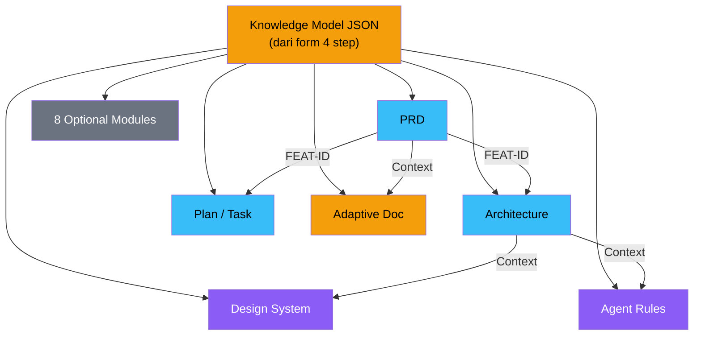

# ArroBuild — Analisis Menyeluruh: Sistem Dokumen & Fitur

**Tanggal:** 29 Juli 2026  
**Tujuan:** Referensi lengkap untuk perencanaan upgrade jumlah, jenis, isi, dan konsep fitur dokumen  
**Sumber:** Kode sumber ([documents.ts](file:///d:/Dokumen/ArroBuild/src/lib/config/documents.ts)), prompt templates ([prompts/](file:///d:/Dokumen/ArroBuild/src/lib/ai/prompts)), PRD ([01-PRD.md](file:///d:/Dokumen/ArroBuild/docs/01-PRD.md)), dan seluruh dokumentasi project

---

## Ringkasan Eksekutif

ArroBuild menghasilkan hingga **14 file `.md`** per proyek, terbagi dalam **6 dokumen inti** + **8 dokumen opsional**. Selain itu, ada **ekosistem mini tools** (14 tools termasuk yang Coming Soon) yang masing-masing menghasilkan output dokumen sendiri. Sistem dokumen ini dilengkapi dengan **4 kelas model AI** (Hemat → Ultra), **3 tier harga** (Starter/Pro/Pro Max), dan **Knowledge Model JSON** sebagai sumber data bersama.



---

## A. DOKUMEN INTI (6 File)

### 1. 📝 PRD (`prd.md`)

| Aspek | Detail |
|-------|--------|
| **File** | [prd.ts](file:///d:/Dokumen/ArroBuild/src/lib/ai/prompts/prd.ts) |
| **Min Tier** | Starter |
| **Token Budget** | Starter: 4.096 / Pro: 5.000 / Pro Max: 8.000 |
| **Default Model** | Starter: Hemat / Pro: Menengah / Pro Max: Flagship |
| **AI Persona** | Senior Product Manager |

#### Isi Dokumen per Tier

**Starter (7 sections):**
1. Ringkasan Produk (2-3 kalimat)
2. Masalah yang Diselesaikan
3. Target Pengguna
4. Fitur Utama (tabel FEAT-XXX — sinkron dengan YAML)
5. Cara Kerja Tiap Fitur (P0/P1 — 1 baris deskripsi, tanpa kriteria formal panjang)
6. Alur Pengguna Utama (1 alur)
7. Batasan
8. Section khusus product_type *(wajib)*

**Pro (menambahkan):**
- Target Pengguna → multi-persona
- Cara Kerja Tiap Fitur → user story + **Kriteria selesai** untuk P0/P1

**Pro Max (menambahkan):**
- Kondisi gagal/edge case per fitur P0
- Minimal 1 alur alternatif (mis. pembayaran gagal)
- Detail lebih dalam di section product_type

#### Section Khusus per Tipe Produk

| Tipe Produk | Section #8 |
|-------------|------------|
| SaaS | Model Harga & Langganan |
| Marketplace | Peran Dua Sisi & Aturan Transaksi |
| Mobile App | Platform & Fitur Native |
| API/Backend | Pengguna API & Skenario Use Case |
| E-commerce | Katalog, Pembayaran & Checkout |
| AI-Powered App | Model AI, Privasi & Perilaku Gagal |
| Internal Tool | Pengguna Internal & Integrasi Legacy |
| Portfolio | Proyek Unggulan & Audiens |
| Other | Konteks Produk (dari input user) |

> [!IMPORTANT]
> PRD selalu dimulai dengan **YAML metadata block** yang berisi FEAT-ID registry. Ini adalah "source of truth" yang dirujuk semua dokumen lain. PRD **selalu wajib** di-generate (bahkan jika user tidak memilihnya, sistem otomatis menambahkannya).

---

### 2. 🏗️ Architecture & Blueprint (`architecture.md`)

| Aspek | Detail |
|-------|--------|
| **File** | [architecture.ts](file:///d:/Dokumen/ArroBuild/src/lib/ai/prompts/architecture.ts) |
| **Min Tier** | Starter |
| **Token Budget** | Starter: 4.096 / Pro: 4.000 / Pro Max: 7.000 |
| **Default Model** | Starter: Hemat / Pro: Menengah / Pro Max: Flagship |
| **AI Persona** | Senior Software Architect |

#### Isi Dokumen per Tier

**Starter (4 sections):**
1. Keputusan Teknis Utama (tabel dari stack form)
2. Skema Database (tabel + kolom penting, link FEAT-ID)
3. Struktur Folder Proyek
4. Batasan & Pertimbangan Teknis (singkat)

**Pro (menambahkan):**
- Keputusan Teknis + alasan singkat
- Skema Database + relasi antar tabel + FEAT-ID
- Kontrak API (tabel endpoint jika relevan)

**Pro Max (menambahkan):**
- Diagram ER Mermaid untuk skema database
- Strategi migrasi skema
- Format error response API standar
- API versioning jika perlu

> [!NOTE]
> Dokumen ini menerima stack dari form user (Language, Framework, Backend, Database, Deployment) dan menggunakan FEAT-ID dari PRD sebagai referensi silang.

---

### 3. 🗺️ Plan / Task (`plan-task.md`)

| Aspek | Detail |
|-------|--------|
| **File** | [plan-task.ts](file:///d:/Dokumen/ArroBuild/src/lib/ai/prompts/plan-task.ts) |
| **Min Tier** | Starter |
| **Token Budget** | Starter: 3.072 / Pro: 3.000 / Pro Max: 5.000 |
| **Default Model** | Starter: Hemat / Pro: Hemat / Pro Max: Menengah |
| **AI Persona** | Senior Engineering Manager |

#### Isi Dokumen per Tier

**Starter (1 section utama):**
- §1 Pembagian Fase: Fase, fokus, FEAT-ID terkait, estimasi waktu
- Format task: `- [ ] Task (est: Xh)`

**Pro (3 sections):**
- §1 Pembagian Fase
- §2 Urutan Pengerjaan & Ketergantungan
- §3 Estimasi Biaya Operasional per fase (ringkas)

**Pro Max (4 sections):**
- §1–§3 seperti Pro
- §4 Breakdown Sprint/Minggu dengan Definition of Done
- Task granular 2-4 jam per item

---

### 4. 🎨 Design System (`design-system.md`)

| Aspek | Detail |
|-------|--------|
| **File** | [design-system.ts](file:///d:/Dokumen/ArroBuild/src/lib/ai/prompts/design-system.ts) |
| **Min Tier** | **Pro** |
| **Token Budget** | Pro: 3.000 / Pro Max: 5.000 |
| **Default Model** | Pro: Menengah / Pro Max: Menengah |
| **AI Persona** | Senior UI/UX Designer |

#### Isi Dokumen per Tier

**Pro:**
- Color palette (primary, secondary, neutral, semantic) — hex values
- Typography: font family, size scale, weight guide
- Spacing system (base unit)
- Component patterns: Button, Card, Input, Badge, Navigation — CSS custom properties
- Responsive breakpoints

**Pro Max (sangat lengkap):**
- Color system dengan dark/light mode tokens → CSS custom properties
- Typography scale lengkap + line-height + letter-spacing
- Spacing & layout system (grid, container, breakpoints)
- Component library spesifikasi lengkap: Button (semua variants + states), Card, Input/Form (validation states), Badge/Tag, Navigation, Modal/Dialog, Toast/Alert, Loading states
- Animation & transition tokens
- Icon system recommendation
- Accessibility requirements (contrast ratio, focus states)
- Tailwind config extension (jika pakai Tailwind)

#### 12 Design Preset yang Tersedia

| Preset | Ciri Khas |
|--------|-----------|
| `neo-brutalist` | Bold borders, high contrast B/W, Space Grotesk, offset box shadows |
| `minimal` | Generous whitespace, single accent color, system font |
| `corporate` | Professional blues, Inter font, enterprise polish |
| `bold` | Vibrant colors, playful micro-animations, gradient accents |
| `glassmorphism` | Frosted glass panels, backdrop-filter blur, depth layers |
| `dashboard` | Dense info hierarchy, data tables, sidebar nav, monospace |
| `apple` | SF Pro/system-ui, rounded-xl, neutral warm palette |
| `linear` | Inter, dark mode first, purple accent (#5E5CE6), monospace |
| `stripe` | Inter, white/light base, indigo accent (#635BFF) |
| `notion` | Inter, minimal, serif headings, lots of whitespace |
| `vercel` | Geist font, dark mode first, sharp corners, high contrast |
| `ai-recommend` | AI memilih gaya terbaik berdasarkan konteks produk |

---

### 5. 🤖 Agent Rules (`agent-rules.md`)

| Aspek | Detail |
|-------|--------|
| **File** | [agents-prompt.ts](file:///d:/Dokumen/ArroBuild/src/lib/ai/prompts/agents-prompt.ts) |
| **Min Tier** | **Pro** |
| **Token Budget** | Pro: 2.500 / Pro Max: 4.000 |
| **Default Model** | Pro: Hemat / Pro Max: Flagship |
| **AI Persona** | Principal Engineer |

#### Isi Dokumen per Tier

**Pro:**
- AI Agent Role Definition: persona & tanggung jawab
- Project-specific coding rules (naming convention, file structure)
- Tech stack rules: HARUS & TIDAK BOLEH spesifik framework
- Response format preferences

**Pro Max (production-grade):**
- Agent Persona: role, expertise level, communication style
- Architectural Rules: pattern yang dipakai, anti-patterns yang dihindari
- Code Quality Standards: formatting, naming, documentation
- Framework-Specific Rules: file structure, state management, error handling, performance, security
- Git & Version Control conventions
- Testing requirements per layer
- Review checklist sebelum submit code
- Escalation rules: kapan agent harus bertanya

#### 6 Target AI Tool yang Didukung

| Tool | Format File Output |
|------|-------------------|
| Cursor | `.cursorrules` — Cursor IDE instruction format |
| Claude Code | `CLAUDE.md` — Claude Code standard format |
| Windsurf | `.windsurfrules` — Windsurf rules format |
| Cline | `.clinerules` — Cline rules format |
| OpenCode | `opencode-rules.md` — Generic markdown |
| Custom | `agents.md` — Universal system prompt |

---

### 6. 🧩 Dokumen Adaptif (`adaptive-document.md`)

| Aspek | Detail |
|-------|--------|
| **File** | [adaptive-document.ts](file:///d:/Dokumen/ArroBuild/src/lib/ai/prompts/adaptive-document.ts) |
| **Min Tier** | **Pro Max** |
| **Token Budget** | Pro Max: 6.500 |
| **Default Model** | Pro Max: Flagship |
| **AI Persona** | Senior Product Strategist |

#### Isi: Konten Bervariasi per Tipe Produk

| Tipe Produk | Fokus Strategi |
|-------------|----------------|
| SaaS | Growth & Retention — onboarding, retention metrics, churn reduction, revenue expansion |
| Marketplace | Trust & Transaction — trust building, commission, dispute handling, cold start |
| Mobile App | Store & Distribution — app store checklist, offline-first, push notif, versioning |
| API/Backend | API Reference — endpoints, auth, rate limits, code examples, error codes |
| E-commerce | Commerce Ops — inventory, payment flow, cart abandonment, returns/refunds |
| AI-Powered | AI Ops & Safety — token cost monitoring, privacy, AI fallback, output quality |
| Internal Tool | Adoption Runbook — team adoption, legacy integration, training |
| Portfolio | Visibility Playbook — SEO, personal branding, CTAs |
| Other | Catatan Peluncuran Umum |

> [!NOTE]
> Dokumen ini high-level strategic — 4-6 sections, concrete recommendations. Tidak menduplikasi detail optional modules.

---

## B. DOKUMEN OPSIONAL (8 File) — Pro Max Only

Semua dokumen opsional menggunakan pola prompt builder yang sama ([optional-modules.ts](file:///d:/Dokumen/ArroBuild/src/lib/ai/prompts/optional-modules.ts)), dengan sections yang terstruktur per modul.

### 7. 💰 Cost & Infrastructure (`cost-infrastructure.md`)

| Min Tier | Pro | Token Budget | Pro: 2.000 / PM: 2.000 | Default Model | Hemat |
|----------|-----|--------------|------------------------|---------------|-------|

**Sections:**
1. Ringkasan Biaya Bulanan — current vs 6-month projection
2. Breakdown per Komponen — hosting, DB, CDN, AI API, payment, email
3. Biaya per Skala Pengguna — 100 / 1.000 / 10.000 users
4. Potensi Biaya Tersembunyi — egress, overage, per-seat tools
5. Rekomendasi Optimasi — early-stage cost tips

---

### 8. 📊 Analytics & Metrics (`analytics-metrics.md`)

| Min Tier | Pro | Token Budget | Pro: 2.000 / PM: 3.500 | Default Model | Pro: Hemat / PM: Menengah |
|----------|-----|--------------|------------------------|---------------|--------------------------|

**Sections:**
1. Daftar Event — name, trigger, properties, FEAT-ID
2. Funnel Utama — Pro: 1 main funnel / Pro Max: per-segment + North Star Metric
3. Dashboard Metrik Inti — metric, calculation, target

---

### 9. 🧪 Testing & QA Plan (`testing-qa.md`)

| Min Tier | Pro | Token Budget | Pro: 2.500 / PM: 4.000 | Default Model | Pro: Menengah / PM: Menengah |
|----------|-----|--------------|------------------------|---------------|------------------------------|

**Sections:**
1. Strategi Testing — unit/integration/E2E ratio + tools
2. Skenario Test Prioritas — TEST-XXX linked to FEAT-ID, P0 first
3. Target Coverage — Pro Max: + regression checklist

---

### 10. ✉️ Onboarding & Email (`onboarding-email.md`)

| Min Tier | Pro | Token Budget | Pro: 2.500 / PM: 4.000 | Default Model | Pro: Menengah / PM: Menengah |
|----------|-----|--------------|------------------------|---------------|------------------------------|

**Sections:**
1. Peta Alur Onboarding — signup → aha moment → next action
2. Email Transaksional — welcome, verification, feature-triggered
3. Sequence Retensi — Pro: timing + purpose / Pro Max: draft copy + exact intervals

---

### 11. 🎯 Competitive Analysis (`competitive-analysis.md`)

| Min Tier | Pro | Token Budget | Pro: 3.000 / PM: 3.000 | Default Model | Pro: Flagship / PM: Flagship |
|----------|-----|--------------|------------------------|---------------|------------------------------|

**Sections:**
1. Kompetitor Utama — 2-3 competitors
2. Perbandingan Fitur — vs competitors, FEAT-ID linked
3. Celah Diferensiasi — gaps and opportunities
4. Positioning — one clear sentence + disclaimer: AI knowledge, verify manually

---

### 12. 🛡️ Security & Launch Checklist (`security-launch.md`)

| Min Tier | **Pro Max** | Token Budget | PM: 5.000 | Default Model | PM: Flagship |
|----------|-------------|--------------|-----------|---------------|--------------|

**Sections:**
1. Security Checklist — P0/P1/P2 items linked to FEAT-IDs sebagai `- [ ]`
2. Pre-Launch Checklist — SSL, backups, monitoring, env separation
3. Scale Readiness — (hanya jika stage=production) indexes, caching
4. Incident Response — contact, rollback plan

---

### 13. 🗄️ Database Deep-Dive (`database-deep-dive.md`)

| Min Tier | **Pro Max** | Token Budget | PM: 4.500 | Default Model | PM: Flagship |
|----------|-------------|--------------|-----------|---------------|--------------|

**Sections:**
1. Entitas Tambahan — logs, M2M, state machines beyond Architecture
2. Diagram Relasi Lengkap — Mermaid ER all tables
3. Strategi Indexing — linked to query patterns + FEAT-IDs
4. Integritas Data — FK, cascade, composite unique
5. Pertumbuhan & Arsip — high-volume table strategy

---

### 14. ⚖️ Compliance & Legal (`compliance-legal.md`)

| Min Tier | **Pro Max** | Token Budget | PM: 3.500 | Default Model | PM: Flagship |
|----------|-------------|--------------|-----------|---------------|--------------|

**Sections:**
1. Kebutuhan Privasi Data — collected data, retention, 3rd-party sharing
2. Outline ToS & Privacy Policy — structure only, not legal text
3. Kepatuhan Pembayaran — licensed gateway, no raw card storage
4. Checklist Khusus AI — (jika ai-app) disclosure, AI data retention

---

## C. MATRIKS AKSES DOKUMEN PER TIER

| # | Dokumen | Starter | Pro | Pro Max |
|---|---------|---------|-----|---------|
| 1 | PRD | ✅ | ✅ | ✅ |
| 2 | Architecture | ✅ | ✅ | ✅ |
| 3 | Plan/Task | ✅ | ✅ | ✅ |
| 4 | Design System | ❌ | ✅ | ✅ |
| 5 | Agent Rules | ❌ | ✅ | ✅ |
| 6 | Adaptive Document | ❌ | ❌ | ✅ |
| 7 | Cost & Infrastructure | ❌ | ❌ | ✅ |
| 8 | Analytics & Metrics | ❌ | ❌ | ✅ |
| 9 | Testing & QA | ❌ | ❌ | ✅ |
| 10 | Onboarding & Email | ❌ | ❌ | ✅ |
| 11 | Competitive Analysis | ❌ | ❌ | ✅ |
| 12 | Security & Launch | ❌ | ❌ | ✅ |
| 13 | Database Deep-Dive | ❌ | ❌ | ✅ |
| 14 | Compliance & Legal | ❌ | ❌ | ✅ |
| **Total** | **3** | **5** | **14** |

> [!IMPORTANT]
> **Inkonsistensi ditemukan:** PRD ([01-PRD.md](file:///d:/Dokumen/ArroBuild/docs/01-PRD.md)) menuliskan bahwa dokumen opsional #7-#11 tersedia di tier Pro, tetapi kode sumber ([documents.ts](file:///d:/Dokumen/ArroBuild/src/lib/config/documents.ts) L170-L265) menetapkan `minTier: "pro"` untuk #7-#11 sementara `tokenBudget.pro > 0` hanya untuk #7-#11, **namun** ada guard `if (def.kind === "optional" && tier === "starter") return false` yang seharusnya mengizinkan Pro mengakses optional docs #7-#11. **PRD dan kode sebenarnya sejalan** — Pro BISA mengakses 5 dari 8 optional docs (#7 Cost, #8 Analytics, #9 Testing, #10 Onboarding, #11 Competitive). Tapi di tabel fitur pricing (PRD baris 160) tertulis "Dokumen opsional: ❌" untuk Pro. **Ini adalah konflik antara PRD dan kode.**

---

## D. SISTEM CROSS-REFERENCE — FEAT-ID

Alur kerja FEAT-ID:

```
Step 2 Form (Feature Builder)
    │
    ▼
FEAT-001, FEAT-002, ... lahir di sini
    │
    ▼
YAML metadata block di awal PRD
    │
    ▼
Architecture, Plan/Task, Adaptive Doc, Optional Modules
semuanya merujuk FEAT-ID yang sama
```

**Manfaat:** Revisi 1 fitur tidak perlu regenerate seluruh dokumen — cukup kirim FEAT-ID + section yang direvisi.

---

## E. MEKANISME KUALITAS PER TIER

| Aspek | Starter | Pro | Pro Max |
|-------|---------|-----|---------|
| Persona AI | Software assistant | Senior engineer (8 tahun) | Principal engineer |
| Detail instruksi | Ringkas | Menengah | Sangat spesifik |
| Contoh dalam output | Minimal | Beberapa | Lengkap + contoh nyata |
| Framework-specific | Generic | Spesifik | Best practices + anti-patterns |
| Context budget | 3.000 token | 5.000 token | 8.000 token |
| Max output token/dok | 4.096 | 5.000 | 10.000 |

---

## F. MINI TOOLS — Dokumen Tambahan di Luar Generate Flow

Sumber: [mini-tools.md](file:///d:/Dokumen/ArroBuild/mini-tools.md)

### Tools yang Sudah Ada / PRD Siap

| # | Tool | Status | Output Dokumen | Kredit |
|---|------|--------|----------------|--------|
| 1 | Portfolio Generator | 🟢 Live | HTML portfolio | Gratis |
| 2 | Prompt Doctor | 🟡 Scaffold | Prompt perbaikan | 1 |
| 3 | MVP Scope Cutter | 🟡 Scaffold | Analisis scope + rekomendasi | 5 |
| 4 | Database Schema Visualizer | 🟡 Scaffold | Visualisasi skema | 1 |
| 5 | **README Generator** | 🟢 Live | `README.md` (5 template) | 2 |
| 6 | **Copy Studio** | 🟢 Live | Landing page copy per section | ~21 |
| 7 | **Stack Advisor** | 📋 PRD siap | 2-3 paket rekomendasi stack | ~8 |
| 8 | **ArroDesign** | 📋 Arsitektur siap | `design.md` + prompt Stitch | ~150-250 |

### Tools Coming Soon (Belum Ada PRD)

| # | Tool | Output yang Direncanakan | Kredit |
|---|------|--------------------------|--------|
| 9 | Error Whisperer | Penjelasan error + prompt fix | ~6 |
| 10 | Konsultan Penamaan | Saran nama variabel/fungsi/file | 1 |
| 11 | Env Var Doctor | Cross-check `.env.example` ke docs | 2 |
| 12 | Devlog/Standup Composer | Devlog rapi + tag FEAT-ID | 2 |
| 13 | Cost Reality Check | Proyeksi biaya interaktif (slider) | Minimal |
| 14 | Mock API Generator | Koleksi mock API (Postman/Insomnia) | ~3 |

### Detail Output Mini Tools Utama

#### README Generator — 5 Template × 3 Mode Input

**Template Repository:**
- Minimal — ringkas, README sederhana
- Dokumentasi Lengkap — README lengkap dengan badges, instalasi, API
- Open Source Friendly — berkontribusi, lisensi, code of conduct

**Template Profile GitHub:**
- Personal Card — profil singkat
- Portfolio Style — showcase proyek

**3 Mode Input:** Mode Proyek (reuse data ArroBuild) / Mode Repo (fetch GitHub publik) / Mode Manual (form)

#### Copy Studio — 5 Arketipe × 3 Mode Input

**Arketipe Template:**
- SaaS Product Launch
- Profile Perusahaan / Company Profile
- Promosi UMKM
- Portfolio Personal
- Event / Promo Page

**3 Mode Input:** Mode ArroDesign (reuse) / Mode Screenshot (vision AI) / Mode Mulai dari Nol

**Output:** Markdown script per section landing page — preview + raw + copy + download `.md`

#### Stack Advisor — Knowledge Base dari [stack-advisor-knowledge.md](file:///d:/Dokumen/ArroBuild/stack-advisor-knowledge.md)

**7 Paket Rekomendasi:**
1. ⚡ Modern Fullstack (Next.js + Supabase + Vercel) — ~$0-25/bulan
2. 🏛️ Classic Reliable (Laravel + MySQL + VPS) — ~Rp100-300rb/bulan
3. 🤖 AI-Native Stack (Next.js + FastAPI + pgvector) — ~$5-30/bulan
4. 📱 Mobile Cross-platform (Expo + Firebase) — ~$0-25/bulan
5. 🛍️ Marketplace Ready (Next.js + PostgreSQL + Redis) — ~$10-45/bulan
6. 🎨 Portfolio Cepat (Astro + Tailwind + Vercel) — $0/bulan
7. 🛠️ Rakit Sendiri — custom

**Tambahan:** Provider AI recommendations, Hosting & Deploy comparison (5 provider), Database options, 3 skenario budget

#### ArroDesign — Analisis Visual → Design Doc

**Output:**
- `design.md` terstruktur (token warna, tipografi, breakdown per section)
- Prompt siap tempel ke Google Stitch (Zoom-Out-Zoom-In format)
- Confidence tagging: `[CONFIRMED]` vs `[INFERRED]`

**2 Mode:** Mode Proyek (reuse data ArroBuild) / Mode Ide Baru (upload/URL)

---

## G. INKONSISTENSI & CATATAN PENTING UNTUK UPGRADE

### 1. Nama Tier Belum Sinkron

| Lokasi | Nama Tier |
|--------|-----------|
| Kode sumber (`documents.ts`, `tiers.ts`, Prisma enum) | `STARTER` / `PRO` / `PRO_MAX` |
| Landing page script baru ([script-landingpage.md](file:///d:/Dokumen/ArroBuild/script-landingpage.md)) | `Base` / `Core` / `Prime` |
| PRD & Monetization docs | `Starter` / `Pro` / `Pro Max` |

> [!WARNING]
> Rename tier **belum dilakukan** di kode. Semua referensi masih Starter/Pro/Pro Max.

### 2. Multiplier Kredit — Dua Versi Beredar

| Sumber | Hemat | Menengah | Flagship | Ultra |
|--------|-------|----------|----------|-------|
| [02-ARCHITECTURE.md](file:///d:/Dokumen/ArroBuild/docs/02-ARCHITECTURE.md) & [tiers.ts](file:///d:/Dokumen/ArroBuild/src/lib/config/tiers.ts) (lama) | 1× | 24× | 35× | 65× |
| [mini-tools.md](file:///d:/Dokumen/ArroBuild/mini-tools.md) menyebut "sistem baru" | 1× | 3× | 14× | ? |

> [!CAUTION]
> Ada dua sistem multiplier yang beredar. Kode sumber masih menggunakan multiplier lama (1/24/35/65). Perlu diputuskan mana yang final sebelum upgrade.

### 3. Route Lama Belum di-Rename

| Route Lama | Seharusnya |
|-----------|------------|
| `/tools/stitch-composer` | `/tools/arrodesign` |
| `/tools/landing-copy` | `/tools/copy-studio` |
| `/tools/readme-generator` | ✅ Sudah benar |

### 4. Dokumen Opsional — Akses Pro vs Pro Max

Kode mengizinkan Pro mengakses 5 optional docs (#7-#11), tapi PRD dan tabel pricing menuliskan Pro tidak dapat dokumen opsional.

### 5. Ikon Masih Emoji

Semua dokumen masih menggunakan emoji (`📝🏗️🗺️🎨🤖🧩💰📊🧪✉️🎯🛡️🗄️⚖️`). Script app baru ([script-app.md](file:///d:/Dokumen/ArroBuild/script-app.md) L154) dan design system sudah memutuskan untuk ganti ke **Lucide Icons**.

---

## H. PETA LENGKAP — SEMUA OUTPUT DOKUMEN ARROBUILD

```
ArroBuild Output Ecosystem
│
├── Generate Flow (14 file .md per proyek)
│   ├── CORE (6)
│   │   ├── prd.md
│   │   ├── architecture.md
│   │   ├── plan-task.md
│   │   ├── design-system.md       [Pro+]
│   │   ├── agent-rules.md         [Pro+]
│   │   └── adaptive-document.md   [Pro Max]
│   │
│   └── OPTIONAL (8)               [Pro Max full, Pro partial]
│       ├── cost-infrastructure.md
│       ├── analytics-metrics.md
│       ├── testing-qa.md
│       ├── onboarding-email.md
│       ├── competitive-analysis.md
│       ├── security-launch.md
│       ├── database-deep-dive.md
│       └── compliance-legal.md
│
├── Mini Tools (output sendiri-sendiri)
│   ├── README Generator → README.md
│   ├── Copy Studio → landing page copy .md
│   ├── Stack Advisor → rekomendasi stack
│   ├── ArroDesign → design.md + prompt Stitch
│   ├── Portfolio Generator → HTML portfolio
│   ├── Prompt Doctor → prompt perbaikan
│   ├── MVP Scope Cutter → analisis scope
│   ├── Database Schema Visualizer → visualisasi
│   └── 6 tools Coming Soon...
│
└── Learn Hub (gratis, tanpa login)
    ├── 3 Track (Foundation/Workflow/Advanced)
    ├── 6 Learning Path
    └── 24 Lessons (~125 content blocks)
```

---

## I. REKOMENDASI AREA UPGRADE

Berdasarkan analisis, berikut area yang layak dipertimbangkan untuk upgrade:

### Dokumen yang Belum Ada tapi Berpotensi Tinggi

1. **Deployment Guide** — checklist deploy untuk berbagai platform (Vercel/Railway/VPS), missing dari 14 file
2. **API Documentation Template** — khusus untuk tipe produk API/Backend, lebih dari sekadar kontrak API di Architecture
3. **Content Strategy / SEO Plan** — untuk tipe produk SaaS/E-commerce
4. **User Research / Persona Deep-Dive** — expand dari 1 paragraf target user di PRD
5. **Changelog / Release Notes Template** — dokumentasi berkelanjutan
6. **CI/CD Pipeline Config** — `.github/workflows` siap pakai

### Potensi Upgrade Dokumen Existing

| Dokumen | Upgrade Potensial |
|---------|-------------------|
| PRD | Multi-bahasa output (EN/ID), user story format Gherkin |
| Architecture | Sequence diagram Mermaid, C4 model diagram |
| Plan/Task | Gantt chart visual, integrasi kalender |
| Design System | Component preview visual (bukan hanya teks), Figma token export |
| Agent Rules | Multi-agent orchestration rules, MCP server config |
| Adaptive | Integrasi lebih dalam dengan data analitik real |

### Mini Tools yang Belum Ada PRD

6 tools Coming Soon masih butuh PRD — urutan prioritas yang direkomendasikan dari [mini-tools.md](file:///d:/Dokumen/ArroBuild/mini-tools.md): **Error Whisperer** (dipakai harian) → Konsultan Penamaan → Env Var Doctor → Devlog Composer → Cost Reality Check → Mock API Generator.
