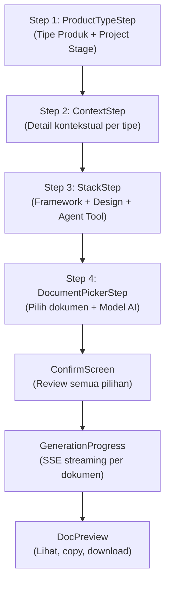
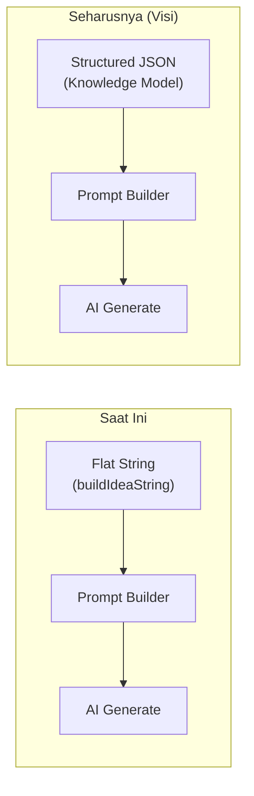
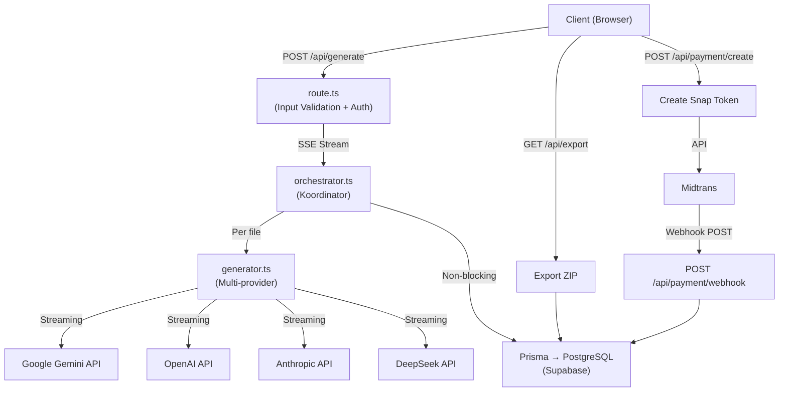
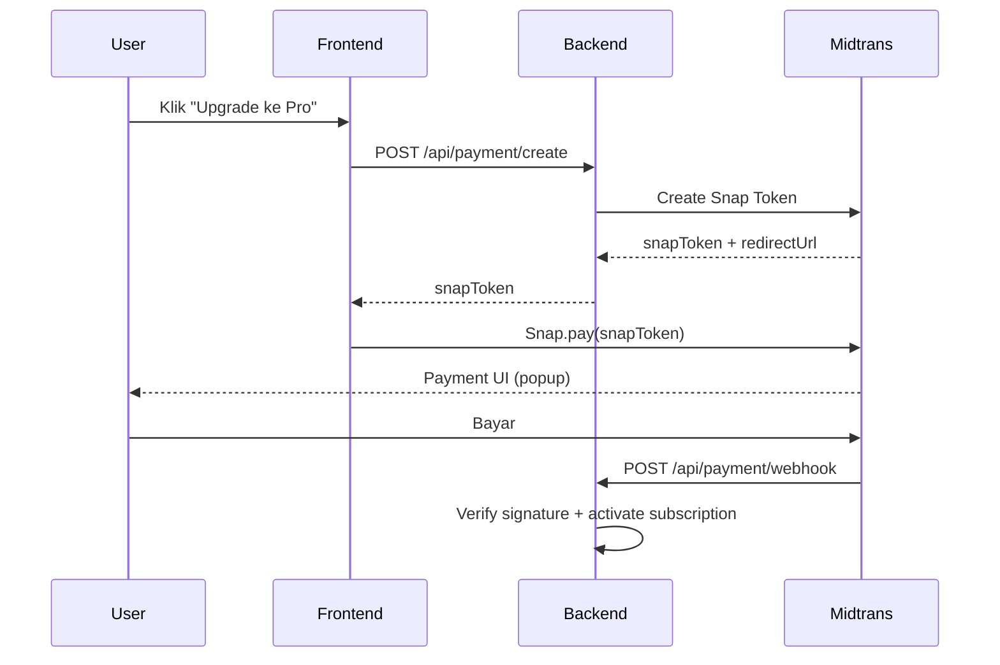

# 🔬 Analisis Komprehensif — Fitur Utama ArroBuild

> Dokumen ini adalah analisis mendalam (read-only, tanpa perubahan kode) terhadap fitur utama ArroBuild: dari **form plan flow**, **jenis markdown**, **paket harga & monetisasi**, hingga **backend, keamanan, dan API key**. Disertai solusi yang kuat dan catatan brainstorming.

---

## Daftar Isi

1. [Flow Form Plan](#1-flow-form-plan)
2. [Jenis-Jenis Markdown & Solusi](#2-jenis-jenis-markdown--solusi)
3. [Paket Harga, Monetisasi & Perhitungan](#3-paket-harga-monetisasi--perhitungan)
4. [Flow Backend, Keamanan & API Key](#4-flow-backend-keamanan--api-key)
5. [Rangkuman Risiko & Prioritas](#5-rangkuman-risiko--prioritas)
6. [Dokumentasi Brainstorming](#6-dokumentasi-brainstorming-dengan-ai-lain)

---

## 1. Flow Form Plan

### 1.1 Arsitektur Flow Saat Ini



**7 Step** total: `product-type → context → stack → docs → confirm → generating → preview`

### 1.2 Analisis Step-by-Step

#### Step 1: ProductTypeStep — ✅ Kuat tapi ada celah

| Aspek | Status | Detail |
|-------|--------|--------|
| **Tipe produk tersedia** | ✅ Baik | 9 tipe: SaaS, Marketplace, Mobile, API, AI-App, E-Commerce, Internal, Portfolio, Other |
| **Project stage** | ✅ Baik | 3 fase: idea, prototype, production |
| **Smart preset auto-apply** | ✅ Baik | Stage mempengaruhi dokumen yang dipilih otomatis |

> [!WARNING]
> **Celah ditemukan**: Stage `idea` hanya auto-select 3 dokumen (prd, context, plan), tapi user bisa manually select 8 dokumen. **Tidak ada enforcement** di frontend — hanya backend tier-enforcer yang memfilter. Ini bisa membingungkan user Free yang memilih 8 dokumen tapi hanya mendapat 3.

#### Step 2: ContextStep — ⚠️ Titik kritis terpenting

**Ini adalah step paling penting dan paling rapuh.** Setiap `ProductType` menghasilkan form field yang berbeda:

| ProductType | Field Khusus | Kualitas |
|-------------|-------------|----------|
| `saas` | pricingModel | ⚠️ Hanya 1 field ekstra, terlalu minim |
| `marketplace` | marketplaceSides, buyerDesc, sellerDesc, transactionType, category | ✅ Cukup detail |
| `mobile` | platforms, offlineFirst, nativeFeatures | ✅ OK |
| `api` | targetDev, authMethod, inputOutput, deploymentTarget | ✅ Baik |
| `portfolio` | stackHighlight, audienceType, caseStudy | ✅ OK |
| `internal` | teamSize, replacesTool, integrations | ✅ OK |
| `ecommerce` | productType, salesChannel | ⚠️ Minim |
| `ai-app` | aiUseCase, aiModel, aiPrivacy | ✅ OK |
| `other` | (hanya generic fields) | ⚠️ Terlalu generik |

> [!IMPORTANT]
> **Masalah Kritis #1**: Semua field bersifat opsional (`?`). User bisa melewati semua field dan hanya isi `freeText`. Ini berarti AI bisa menerima prompt yang sangat minimal dan menghasilkan output yang buruk — **garbage in, garbage out**.

> [!IMPORTANT]
> **Masalah Kritis #2**: Fungsi `buildIdeaString()` di [generate/page.tsx](file:///c:/Users/User/Documents/ArroBuild/src/app/generate/page.tsx#L132-L166) hanya menggabungkan semua field menjadi **flat string** tanpa struktur. Ini **melawan** visi "Single Source of Truth JSON" di [visi-Saas.md](file:///c:/Users/User/Documents/ArroBuild/visi-Saas.md). Tidak ada Knowledge Model JSON yang terbentuk.

#### Step 3: StackStep — ✅ Solid

- 20 framework options, 12 design presets, 6 agent tools
- Database dan deployment options tersedia
- Preset auto-select berdasarkan product type — **ini bagus**

#### Step 4: DocumentPickerStep — ⚠️ Inkonsistensi

- Frontend memperbolehkan user memilih **semua 8 dokumen** bahkan di tier Free
- Backend [tier-enforcer.ts](file:///c:/Users/User/Documents/ArroBuild/src/lib/ai/tier-enforcer.ts#L51-L123) hanya mengizinkan 3 dokumen untuk FREE
- **User experience gap**: User tidak diberitahu bahwa dokumen yang dipilih akan di-filter saat generate

#### Step 5-7: Confirm → Generate → Preview — ✅ Secara Teknis Baik

- SSE streaming bekerja dengan baik
- Accumulated context memastikan konsistensi antar dokumen
- Fallback chain untuk retry error
- Validation untuk memastikan dokumen lengkap

### 1.3 Kelemahan Fundamental Flow



> [!CAUTION]
> **Gap terbesar antara visi dan implementasi**: [visi-Saas.md](file:///c:/Users/User/Documents/ArroBuild/visi-Saas.md) berbicara tentang "Single Source of Truth JSON" dan "Knowledge Model", tapi implementasi sekarang hanya menggunakan flat string concatenation. **Tidak ada intermediary JSON yang disimpan**. Ini berarti:
> - Tidak bisa partial regeneration (regenerate hanya 1 dokumen)
> - Tidak bisa incremental update
> - Tidak ada relationship antar data (Knowledge Graph)

### 1.4 Solusi untuk Flow Form Plan

| # | Solusi | Prioritas | Impact |
|---|--------|-----------|--------|
| 1 | **Tambah minimum required fields** per product type — minimal targetUser + mainProblem + coreFeatures harus diisi | 🔴 HIGH | Menghindari output AI yang buruk |
| 2 | **Bangun Knowledge Model JSON** dari form output sebelum generate, simpan di DB | 🔴 HIGH | Fondasi untuk fitur regenerate, partial update, fork |
| 3 | **Sinkronkan frontend document picker dengan tier** — disable checkboxes yang di luar tier, bukan diam-diam memfilter di backend | 🟡 MEDIUM | UX yang jujur |
| 4 | **Tambah AI Clarification step** — setelah user isi form, AI bertanya 2-3 klarifikasi sebelum generate | 🟡 MEDIUM | Output yang lebih baik |
| 5 | **Preview prompt** sebelum generate — user bisa lihat apa yang akan dikirim ke AI | 🟢 LOW | Transparansi dan kepercayaan |

---

## 2. Jenis-Jenis Markdown & Solusi

### 2.1 Daftar Lengkap 8 Dokumen Markdown

| # | FileKey | File | Tier Min | Prompt Builder | Token Budget |
|---|---------|------|----------|----------------|--------------|
| 1 | `context` | context.md | FREE | [context.ts](file:///c:/Users/User/Documents/ArroBuild/src/lib/ai/prompts/context.ts) | 2000/4000/8000 |
| 2 | `prd` | prd.md | FREE | [prd.ts](file:///c:/Users/User/Documents/ArroBuild/src/lib/ai/prompts/prd.ts) | 2000/4000/8000 |
| 3 | `plan` | plan.md | FREE | [plan.ts](file:///c:/Users/User/Documents/ArroBuild/src/lib/ai/prompts/plan.ts) | 2000/4000/8000 |
| 4 | `design-system` | design-system.md | PRO | [design-system.ts](file:///c:/Users/User/Documents/ArroBuild/src/lib/ai/prompts/design-system.ts) | 4000/8000 |
| 5 | `agents` | agents.md | PRO | [agents-prompt.ts](file:///c:/Users/User/Documents/ArroBuild/src/lib/ai/prompts/agents-prompt.ts) | 4000/8000 |
| 6 | `production-hardening` | production-hardening.md | PRO_MAX | [production-hardening.ts](file:///c:/Users/User/Documents/ArroBuild/src/lib/ai/prompts/production-hardening.ts) | 8000 |
| 7 | `scale-performance` | scale-performance.md | PRO_MAX | [scale-performance.ts](file:///c:/Users/User/Documents/ArroBuild/src/lib/ai/prompts/scale-performance.ts) | 8000 |
| 8 | `growth-quality` | growth-quality.md | PRO_MAX | [growth-quality.ts](file:///c:/Users/User/Documents/ArroBuild/src/lib/ai/prompts/growth-quality.ts) | 8000 |

### 2.2 Analisis Mendalam per Dokumen

#### 📋 context.md — Fondasi proyek

**Kekuatan**: Terdifferensiasi per tier (FREE=4 section, PRO=10 section, PRO_MAX=18+ section). Prompt menginstruksikan output sebagai file yang bisa langsung di-paste ke Cursor/Claude Code.

**Kelemahan**:
- ⚠️ FREE tier terlalu singkat — hanya 4 section dengan 2000 token. Ini mungkin tidak cukup untuk AI agent memahami konteks proyek
- ⚠️ Tidak ada **database schema** di context.md — padahal ini kritis untuk AI coding agent
- ⚠️ Terlalu banyak overlap dengan PRD (keduanya membahas "Core Features")

**Solusi**: Pisahkan concern — context.md fokus pada **"apa yang sudah diputuskan"** (tech decisions, conventions, constraints), PRD fokus pada **"apa yang harus dibangun"** (requirements, user stories)

#### 📝 prd.md — Requirements utama

**Kekuatan**: Format sangat baik di PRO_MAX (FR-001 format, acceptance criteria, edge cases). Tier differentiation jelas.

**Kelemahan**:
- ⚠️ Validation pattern terlalu ketat — memaksa ada section "problem statement", "solution", "target users", "mvp scope", "user stories", "open questions" bahkan di FREE tier. Tapi prompt FREE hanya instruksikan 6 section sederhana yang **tidak semuanya match** dengan regex pattern di [validation.ts](file:///c:/Users/User/Documents/ArroBuild/src/lib/ai/validation.ts#L10-L21)
- ⚠️ Contoh: `requiredPatterns` mencari `/mvp scope/i` tapi prompt FREE menggunakan "Core Features (MVP)" — tergantung apakah AI menulis "MVP Scope" sebagai heading. Ini bisa menyebabkan **false validation failures**

**Solusi**: Sesuaikan regex validation dengan actual section yang diinstruksikan di prompt per tier

#### 🗺️ plan.md — Development plan

**Kekuatan**: Framework-aware (FRAMEWORK_STACK_DEFAULTS memberikan stack default per framework). Sprint-based di PRO_MAX sangat actionable.

**Kelemahan**:
- ⚠️ Tidak ada estimasi cost/biaya hosting di FREE/PRO — padahal ini penting untuk solo developer
- ⚠️ `requiredPatterns` mencari `/roadmap/i` tapi prompt menggunakan "Phase 1, Phase 2..." — mungkin tidak ada heading literal "Roadmap"

#### 🎨 design-system.md — Design tokens

**Kekuatan**: Design preset traits sangat spesifik per style (neo-brutalist, apple, linear, dll). CSS custom properties langsung siap pakai.

**Kelemahan**:
- ⚠️ `DEPTH_INSTRUCTIONS.FREE = ""` — artinya FREE tier yang entah bagaimana mendapat design-system akan mendapat prompt tanpa instruksi depth. Ini seharusnya tidak terjadi karena FREE tidak boleh akses, tapi defensive coding seharusnya tetap ada.
- ⚠️ Tidak ada mockup/wireframe reference — hanya text-based

#### 🤖 agents.md — AI agent rules

**Kekuatan**: Tool-specific output format (Cursor rules, CLAUDE.md, .windsurfrules). Sangat forward-thinking.

**Kelemahan**:
- ⚠️ Sama seperti design-system, `DEPTH_INSTRUCTIONS.FREE = ""` tidak defensif
- ⚠️ Output format untuk `cline` dan `opencode` terlalu generik — hanya "rules format" tanpa detail

#### 🛡️ production-hardening.md — Security & ops

**Kekuatan**: Comprehensive — OWASP Top 10, monitoring, DB hardening, CI/CD, incident response.

**Kelemahan**:
- ⚠️ **Tidak tier-aware** — prompt ini identik untuk semua tier (hanya tersedia di PRO_MAX, tapi tidak memanfaatkan accumulated context dari PRD/plan secara optimal)
- ⚠️ Prompt terlalu panjang sebagai satu monolith — AI mungkin menghasilkan output yang generic daripada spesifik per tech stack

#### ⚡ scale-performance.md & 📈 growth-quality.md

**Kelemahan serupa**:
- ⚠️ Kedua dokumen ini **tidak benar-benar memanfaatkan data spesifik proyek** — prompt-nya cenderung template-like
- ⚠️ Growth strategy seharusnya sangat berbeda antara SaaS vs Marketplace vs Portfolio — tapi prompt-nya satu untuk semua product type

### 2.3 Masalah Cross-Cutting

> [!CAUTION]
> **Masalah #1 — Tidak ada adaptasi prompt berdasarkan ProductType**
>
> Semua 8 prompt builder menerima `GenerationInput` yang berisi `idea` (flat string), `clarifications` (platform, monetization, scope saja — **bukan product type!**), dan `presets`. **ProductType hilang** saat masuk ke prompt builder karena tidak ada field `productType` di interface `GenerationInput` di [shared.ts](file:///c:/Users/User/Documents/ArroBuild/src/lib/ai/prompts/shared.ts#L65-L72).
>
> Akibatnya: PRD untuk SaaS identik structure-nya dengan PRD untuk Portfolio. Ini bertentangan dengan value proposition ArroBuild sebagai "AI Project Compiler yang adaptif".

> [!WARNING]
> **Masalah #2 — Duplikasi context antar dokumen**
>
> context.md berisi "Tech Stack" dan "Core Features". plan.md juga berisi "Tech Stack". prd.md berisi "Core Features". Ini bukan hanya token waste — AI coding agent yang membaca semua file bisa mendapat **informasi yang inkonsisten** jika ada perbedaan antar dokumen.

### 2.4 Solusi untuk Jenis Markdown — Restructuring

#### Solusi A: Product-Type-Aware Prompts (High Priority)

Tambahkan `productType` ke `GenerationInput` dan buat conditional sections:

```
SaaS PRD → Pricing Model, Churn Metrics, Onboarding Funnel
Marketplace PRD → Supply/Demand Dynamics, Trust & Safety, Transaction Flow  
Mobile PRD → Native Capabilities, Offline Strategy, App Store Compliance
API PRD → Rate Limiting, SDK Design, Developer Experience
```

#### Solusi B: Markdown Restructuring (Rekomendasi)

Ganti 8 dokumen saat ini dengan struktur yang lebih jelas dan tidak overlap:

| Saat Ini | Masalah | Rekomendasi |
|----------|---------|-------------|
| context.md + prd.md | Overlap di "Core Features" | **product-brief.md** (gabung: vision + problem + users + features + constraints) |
| plan.md | Terlalu banyak concern | **architecture.md** (tech stack + folder + database schema) + **tasks.md** (sprint/phase plan saja) |
| design-system.md | OK tapi bisa lebih actionable | **design-tokens.md** (CSS variables only, siap copy-paste) |
| agents.md | OK | Tetap, tapi generate format spesifik per tool |
| production-hardening + scale-performance + growth-quality | Terlalu generic, low value | **launch-checklist.md** (gabung: security essentials + deploy + monitoring) |

Perbandingan:

```
SAAT INI (8 file, banyak overlap):          REKOMENDASI (6 file, zero overlap):
├── context.md          ←─overlap─→         ├── product-brief.md
├── prd.md              ←─overlap─→         ├── architecture.md  
├── plan.md                                 ├── tasks.md
├── design-system.md                        ├── design-tokens.md
├── agents.md                               ├── agents.md (per-tool format)
├── production-hardening.md  ←─generic─→    └── launch-checklist.md
├── scale-performance.md     ←─generic─→
└── growth-quality.md        ←─generic─→
```

#### Solusi C: Format Isi Markdown yang Lebih Kuat

Untuk setiap dokumen, format isi harus:
1. **Machine-readable sections** — heading yang konsisten, bisa di-parse oleh AI
2. **Feature IDs** — FEAT-001, FEAT-002 (seperti visi di [visi-Saas.md](file:///c:/Users/User/Documents/ArroBuild/visi-Saas.md#L475-L549))
3. **Cross-references** — "Uses: FEAT-001" di architecture.md merujuk ke prd.md
4. **Token budget enforcement** — format yang konsisten per tier agar AI tidak waste tokens

---

## 3. Paket Harga, Monetisasi & Perhitungan

### 3.1 Pricing Saat Ini

| | Free | Pro (Rp 99K/bln) | Pro Max (Rp 199K/bln) |
|---|------|------|------|
| Projects/bulan | 5 (tapi [auth.ts](file:///c:/Users/User/Documents/ArroBuild/src/lib/auth.ts#L8) hardcode `FREE_PROJECT_LIMIT = 1`) | 30 | Unlimited |
| Dokumen | 3 | 5 | 8 |
| Models | Gemini Flash, DeepSeek | + Gemini Pro, GPT-4o | + Claude Sonnet 4 |
| Token/file | 2000 | 4000 | 8000 |
| Export | ZIP | + cursorrules, claude-md, system-prompt | + agents-json |
| Custom presets | ❌ | ✅ | ✅ |
| Project history | ❌ | ✅ | ✅ |
| Fork project | ❌ | ✅ | ✅ |
| Regen per file | ❌ | ❌ | ✅ |
| Daily limit | - | - | 10/hari |

### 3.2 Masalah Kritis Pricing

> [!CAUTION]
> **Inkonsistensi #1 — Free tier limit bertentangan**
>
> - [pricing.ts](file:///c:/Users/User/Documents/ArroBuild/src/lib/pricing.ts#L31): Menampilkan "5 project / bulan" ke user
> - [auth.ts](file:///c:/Users/User/Documents/ArroBuild/src/lib/auth.ts#L8): Hardcode `FREE_PROJECT_LIMIT = 1`
> - [tier-enforcer.ts](file:///c:/Users/User/Documents/ArroBuild/src/lib/ai/tier-enforcer.ts#L55): `maxProjectsPerMonth: 5`
>
> **Mana yang benar?** Auth.ts menang karena dia yang melakukan enforcement, jadi user sebenarnya hanya bisa generate **1 project** di Free tier — bukan 5 seperti yang ditampilkan di pricing page. **Ini berpotensi menyesatkan dan bisa menjadi masalah legal.**

> [!WARNING]
> **Inkonsistensi #2 — Tier naming mismatch**
>
> - `pricing.ts` mendefinisikan tier: `free | starter | pro | unlimited`
> - `shared.ts` (prompt system) menggunakan: `free | paid | unlimited`
> - `tier-enforcer.ts` (backend) menggunakan: `FREE | PRO | PRO_MAX`
> - Database enum: `FREE | STARTER | PRO | UNLIMITED`
>
> **Starter di pricing.ts tidak pernah ditampilkan** — PAID_TIER_IDS hanya berisi `["pro", "unlimited"]`. Tapi database masih punya `STARTER` enum. Mapping yang membingungkan:
> ```
> pricing.ts "pro" → DB "PRO" → shared.ts "paid" → tier-enforcer "PRO"
> pricing.ts "unlimited" → DB "UNLIMITED" → shared.ts "unlimited" → tier-enforcer "PRO_MAX"
> pricing.ts "starter" → TIDAK ADA DI UI PRICING → tapi DB "STARTER" → shared.ts "paid" → tier-enforcer "PRO"  
> ```
> **Starter adalah "ghost tier"** — ada di database tapi tidak dijual.

> [!WARNING]
> **Masalah #3 — Free tier tanpa login terlalu powerful**
>
> User Free bisa generate tanpa login sama sekali (anonymous). Generate page tidak memaksa auth. Backend di [route.ts](file:///c:/Users/User/Documents/ArroBuild/src/app/api/generate/route.ts#L93-L94) meng-set `userId = null` jika tidak login. Ini berarti:
> - **Tidak ada rate limiting per user** untuk anonymous
> - Siapa pun bisa generate unlimited projects tanpa login (karena `FREE_PROJECT_LIMIT` di auth.ts hanya berlaku jika `userId` ada)
> - Potential abuse: bot bisa hit API tanpa autentikasi

### 3.3 Perhitungan Biaya vs Revenue

#### Estimasi Cost per Generate (AI API)

| Model | Cost per 1K output tokens | Est. tokens per file | Cost per file | Cost per project (5 files) |
|-------|--------------------------|---------------------|---------------|--------------------------|
| Gemini Flash | Free (rate limited) | ~1500 | $0.00 | $0.00 |
| DeepSeek V3 | ~$0.28/1M output | ~1500 | $0.0004 | $0.002 |
| Gemini Pro | ~$10/1M output | ~3000 | $0.03 | $0.15 |
| GPT-4o | ~$10/1M output | ~3000 | $0.03 | $0.15 |
| Claude Sonnet 4 | ~$15/1M output | ~5000 | $0.075 | $0.60 |

#### Revenue vs Cost Analysis — Pro (Rp 99K/bln ≈ $6.20/bln)

```
Best case (user generates 30 projects/month with Gemini Pro):
  Cost  = 30 × $0.15 = $4.50/month
  Profit = $6.20 - $4.50 = $1.70/month → MARGIN: 27% ⚠️ TIPIS

Worst case (user generates 30 projects with GPT-4o):
  Cost  = 30 × $0.15 = $4.50/month  
  Profit = $6.20 - $4.50 = $1.70/month → MARGIN: 27% ⚠️ TIPIS
```

#### Revenue vs Cost Analysis — Pro Max (Rp 199K/bln ≈ $12.50/bln)

```
Best case (10 projects/day × 30 days = 300 projects with Claude Sonnet):
  Cost  = 300 × $0.60 = $180.00/month
  Revenue = $12.50/month
  LOSS = -$167.50/month ❌ SANGAT RUGI

Realistic case (2 projects/day × 30 days = 60 projects):
  Cost  = 60 × $0.60 = $36.00/month  
  LOSS = -$23.50/month ❌ MASIH RUGI

Conservative case (10 projects total/month):
  Cost  = 10 × $0.60 = $6.00/month
  Profit = $12.50 - $6.00 = $6.50/month → MARGIN: 52% ✅ OK
```

> [!CAUTION]
> **TEMUAN KRITIS: Pro Max dengan Claude Sonnet 4 bisa sangat merugikan.**
>
> Daily soft limit 10/hari berarti user bisa generate **300 project/bulan** (10 × 30 hari), masing-masing 8 file dengan Claude Sonnet. Total cost bisa mencapai **$180/bulan** sementara revenue hanya **$12.50/bulan**. Ini **kerugian 14x lipat**.

### 3.4 Solusi Pricing & Monetisasi

#### Solusi A: Revisi Pricing yang Sustainable

| | Free | Pro (Rp 149K/bln) | Pro Max (Rp 349K/bln) |
|---|------|------|------|
| Projects/bulan | 3 (enforce! hapus inkonsistensi) | 20 | 50 (BUKAN unlimited) |
| Dokumen | 3 | 5 | 8 |
| Models | Gemini Flash only | + DeepSeek, Gemini Pro | + GPT-4o, Claude Sonnet |
| Token/file | 2000 | 4000 | 8000 |
| Wajib login | ❌ (1 project tanpa login) | ✅ | ✅ |
| Daily limit | 1/hari | 5/hari | 10/hari |

**Alasan perubahan:**
- Pro naik Rp 149K → margin lebih aman
- Pro Max naik Rp 349K + cap 50 project → mencegah abuse Claude Sonnet
- Free hanya Gemini Flash (paling murah) — DeepSeek dipindah ke Pro
- Daily limit di semua tier mencegah abuse

#### Solusi B: Credit-Based / Token-Based Pricing (Lebih Scalable)

Alih-alih subscription flat:

```
Free:     50 credits/bulan (1 project = 5 credits, 1 file = 1 credit)
Pro:      300 credits/bulan → Rp 99K (rollover max 100)
Pro Max:  800 credits/bulan → Rp 249K (rollover max 200)
Topup:    Rp 49K / 100 credits tambahan
```

**Keuntungan**: User yang sedikit generate tidak merasa overpaying, user yang banyak generate membayar lebih. **Cost selalu proporsional dengan revenue.**

#### Solusi C: Model-Based Pricing Add-on

```
Base subscription: akses fitur (project history, export, dll)
AI credits:
  - Gemini Flash: 1 credit/file
  - DeepSeek V3: 1 credit/file  
  - Gemini Pro: 3 credits/file
  - GPT-4o: 3 credits/file
  - Claude Sonnet 4: 5 credits/file
```

Ini memindahkan risiko AI cost langsung ke usage, bukan flat subscription.

---

## 4. Flow Backend, Keamanan & API Key

### 4.1 Arsitektur Backend Saat Ini



### 4.2 Analisis Keamanan

#### 🔴 CRITICAL — API Keys Exposed

> [!CAUTION]
> **TEMUAN PALING KRITIS: Semua API keys terekspos di `.env.local` yang saat ini berisi production keys!**
>
> File [.env.local](file:///c:/Users/User/Documents/ArroBuild/.env.local) berisi:
> - **Supabase anon key** (line 3) — ini OK, memang publik
> - **Supabase SERVICE ROLE KEY** (line 4) — 🔴 **BERBAHAYA**, memberi akses admin penuh ke database
> - **Database password** (line 7, 10) — `6LNxkKB9Zq2H7frP` terekspos
> - **Gemini API Key** (line 14) — terekspos
> - **Midtrans Server Key** (line 37) — `Mid-server-BsiP7lBtYYqwebcUhfHMzwsL` — 🔴 **PRODUCTION KEY terekspos**
> - **Midtrans Client Key** (line 38) — terekspos
>
> **Jika file ini pernah di-commit ke Git (bahkan sekali), semua keys ini harus di-rotate segera.**

#### 🟡 WARNING — Auth & Authorization Gaps

| Area | Status | Detail |
|------|--------|--------|
| **Anonymous generate** | ⚠️ | User bisa generate tanpa login → tidak bisa enforce rate limit per user |
| **Supabase auth** | ✅ | Standard Supabase SSR auth via middleware |
| **Tier enforcement** | ✅ | Backend enforces tier di orchestrator |
| **API input validation** | ⚠️ | Zod schema di [route.ts](file:///c:/Users/User/Documents/ArroBuild/src/app/api/generate/route.ts#L16-L63) **tidak cover semua framework/design enum values** (hanya 5 framework, 9 design di schema vs 20+12 di types.ts) |
| **Export auth** | 🔴 | [export/route.ts](file:///c:/Users/User/Documents/ArroBuild/src/app/api/export/route.ts) **tidak memeriksa apakah user yang request memiliki project tersebut** — siapa pun dengan projectId bisa download |
| **Payment webhook** | ⚠️ | Signature verification ada tapi bersifat optional (`if signatureKey && statusCode && grossAmount`) |
| **Rate limiting** | 🔴 | **Tidak ada rate limiting** di level API route — hanya tier-based quota check |
| **CORS** | ❌ | Tidak ada konfigurasi CORS eksplisit |
| **CSP** | ❌ | Tidak ada Content Security Policy |

#### 🟡 WARNING — Zod Schema Mismatch

```
// route.ts Zod schema hanya menerima:
framework: z.enum(["nextjs", "laravel", "django", "rails", "fastapi"])
design: z.enum(["neo-brutalist", "minimal", "corporate", "bold", "apple", "linear", "stripe", "notion", "vercel"])

// Tapi types.ts mendefinisikan 20 framework dan 12 design options
// Framework yang hilang: nuxt, remix, sveltekit, astro, react-spa, vue-spa, vanilla-js,
//   express, nestjs, go-fiber, hono, react-native, flutter, expo, ai-recommend
// Design yang hilang: glassmorphism, dashboard, ai-recommend
```

> [!WARNING]
> **User yang memilih framework selain 5 yang listed di Zod schema akan mendapat error 422.** Ini adalah bug yang kemungkinan sudah terjadi di production.

### 4.3 Analisis Payment Flow (Midtrans)



**Masalah yang ditemukan:**

1. **Webhook signature verification bersifat conditional** — jika Midtrans tidak mengirim `signature_key`, webhook tetap diproses. Ini **berbahaya** karena attacker bisa forge webhook.

2. **Tidak ada idempotency check** — webhook yang sama bisa diproses multiple kali dan subscription bisa di-activate berulang kali.

3. **Tidak ada subscription expiry management** — subscription memiliki field `expiresAt` tapi tidak ada cron/scheduler yang meng-expire subscription yang sudah lewat tanggal.

4. **Tidak ada recurring billing** — Midtrans Snap hanya untuk one-time payment. Untuk subscription bulanan, perlu integrasi dengan Midtrans recurring/subscription API atau handle renewal secara manual.

### 4.4 Solusi Keamanan & Backend

| # | Solusi | Prioritas | Detail |
|---|--------|-----------|--------|
| 1 | **Rotate ALL exposed API keys** | 🔴 URGENT | Supabase service role, DB password, Gemini, Midtrans — semua harus di-rotate |
| 2 | **Tambah `.env.local` ke `.gitignore`** | 🔴 URGENT | Pastikan tidak pernah di-commit lagi |
| 3 | **Fix Zod schema** agar match dengan `types.ts` | 🔴 HIGH | Bug yang sudah terjadi di production |
| 4 | **Tambah auth check di export route** | 🔴 HIGH | Verifikasi `project.userId === currentUserId` |
| 5 | **Mandatory webhook signature verification** | 🔴 HIGH | Hapus conditional, tolak jika tidak ada signature |
| 6 | **Tambah rate limiting** (e.g., Upstash ratelimit) | 🟡 MEDIUM | Per-IP dan per-user |
| 7 | **Force login untuk generate** (minimal email) | 🟡 MEDIUM | Mencegah anonymous abuse |
| 8 | **Add CORS & CSP headers** | 🟡 MEDIUM | Security headers di Next.js config |
| 9 | **Implementasi subscription expiry scheduler** | 🟡 MEDIUM | Cron job atau Supabase Edge Function |
| 10 | **Add idempotency ke webhook** | 🟡 MEDIUM | Check payment status sebelum update |

---

## 5. Rangkuman Risiko & Prioritas

### Risk Matrix

| Risiko | Probability | Impact | Severity | Mitigasi |
|--------|------------|--------|----------|----------|
| **API keys leaked via git** | HIGH (jika pernah commit) | 🔴 CRITICAL | **P0** | Rotate semua keys, audit git history |
| **Export route tanpa auth** | HIGH | 🔴 HIGH | **P0** | Tambah ownership check |
| **Zod schema mismatch** | CONFIRMED | 🟡 MEDIUM | **P0** | Sync schema dengan types.ts |
| **Pricing inkonsistensi (1 vs 5 projects)** | CONFIRMED | 🟡 MEDIUM | **P1** | Unify ke satu angka |
| **Pro Max bisa rugi $167/user/bulan** | MEDIUM | 🔴 HIGH | **P1** | Cap project limit, naikkan harga |
| **Anonymous abuse** | MEDIUM | 🟡 MEDIUM | **P1** | Force login atau captcha |
| **Webhook forgery** | LOW | 🔴 HIGH | **P2** | Mandatory signature |
| **No rate limiting** | MEDIUM | 🟡 MEDIUM | **P2** | Implement rate limiter |
| **Subscription tidak expire** | HIGH | 🟡 MEDIUM | **P2** | Add expiry scheduler |
| **ProductType hilang di prompt** | CONFIRMED | 🟡 MEDIUM | **P2** | Add ke GenerationInput |

### Urutan Aksi yang Direkomendasikan

```
Hari 1 (URGENT):
  ✅ Rotate semua API keys
  ✅ Audit git history untuk leaked secrets
  ✅ Fix export route auth check
  ✅ Fix Zod schema mismatch

Minggu 1 (HIGH):
  ✅ Unify pricing numbers (auth.ts vs pricing.ts vs tier-enforcer.ts)
  ✅ Cap Pro Max project limit (50/bulan, bukan unlimited)
  ✅ Mandatory webhook signature verification
  ✅ Add required fields di ContextStep

Minggu 2-3 (MEDIUM):
  ✅ Add ProductType ke GenerationInput & prompt builders
  ✅ Implement rate limiting
  ✅ Add subscription expiry management
  ✅ Knowledge Model JSON (save structured data, not flat string)

Bulan 2 (LOW/FUTURE):
  ✅ Restructure markdown types (6 files, zero overlap)
  ✅ Credit-based pricing
  ✅ Partial regeneration
  ✅ Feature ID system (FEAT-001)
```

---

## 6. Dokumentasi Brainstorming dengan AI Lain

### Prompt Template untuk Brainstorming

Salin seluruh blok di bawah ini sebagai prompt ke AI lain (ChatGPT, Claude, dsb) untuk brainstorming:

---

````markdown
# Context: ArroBuild — AI Project Compiler SaaS

ArroBuild adalah SaaS yang mengubah ide software menjadi dokumentasi proyek lengkap yang siap digunakan AI Coding Agent (Cursor, Claude Code, Windsurf).

## Current Architecture

### Flow
1. User pilih Product Type (9 tipe: SaaS, Marketplace, Mobile, API, AI-App, E-Commerce, Internal, Portfolio, Other)
2. User isi Context Detail (form field berbeda per tipe produk)
3. User pilih Tech Stack (20 framework, 12 design preset, 6 agent tool)
4. User pilih Dokumen & AI Model
5. Confirm → Generate (SSE streaming) → Preview & Download

### Generated Documents (8 files)
1. context.md — Project overview, tech stack, conventions
2. prd.md — Requirements, user stories, acceptance criteria
3. plan.md — Development roadmap, sprint plan
4. design-system.md — Color, typography, components
5. agents.md — AI coding rules (format per tool: Cursor/Claude/Windsurf)
6. production-hardening.md — Security, monitoring, CI/CD
7. scale-performance.md — Scaling, optimization
8. growth-quality.md — GTM, testing, analytics

### Pricing Tiers (IDR)
- Free: Rp 0 | 3 docs, Gemini Flash
- Pro: Rp 99K/bln | 5 docs, Gemini Pro + GPT-4o
- Pro Max: Rp 199K/bln | 8 docs, Claude Sonnet 4

### Tech Stack
- Next.js 15 (App Router) + Tailwind CSS + Supabase Auth + Prisma + PostgreSQL
- AI: Gemini, OpenAI, Anthropic, DeepSeek
- Payment: Midtrans (Indonesian market)

## Masalah yang Ditemukan

### Flow & Form
1. ProductType TIDAK masuk ke prompt builder — semua tipe produk menghasilkan struktur dokumen yang sama
2. Semua form field opsional — user bisa generate dengan input minimal → output buruk
3. Visi "Knowledge Model JSON" belum diimplementasi — data masih flat string
4. Frontend memperbolehkan pilih 8 dokumen di Free tier tapi backend hanya generate 3

### Markdown Documents
1. context.md dan prd.md overlap di "Core Features"
2. 3 dokumen PRO_MAX (production-hardening, scale-performance, growth-quality) terlalu generic, tidak product-type-aware
3. Validation regex mismatch dengan actual prompt instructions
4. Tidak ada Feature ID system (FEAT-001) untuk cross-reference antar dokumen

### Pricing & Monetisasi
1. FATAL: pricing page tampilkan "5 project/bulan" untuk Free tapi code enforce 1 project
2. FATAL: Pro Max unlimited projects + Claude Sonnet = biaya AI $180/bln, revenue hanya $12.50/bln → RUGI 14x
3. Tier naming berbeda di 4 tempat (pricing.ts, shared.ts, tier-enforcer.ts, Prisma schema)
4. "Starter" tier ada di DB tapi tidak dijual

### Security
1. CRITICAL: .env.local berisi production API keys yang mungkin sudah ter-commit ke git
2. Export endpoint tidak verifikasi ownership — siapa pun bisa download project orang lain
3. Zod validation schema hanya cover 5 dari 20 framework → bug di production
4. Webhook signature verification bersifat optional
5. Tidak ada rate limiting
6. Anonymous user bisa generate tanpa batas

## Pertanyaan Brainstorming

1. **Dokumen mana yang benar-benar memberikan value tinggi untuk AI coding agent?** Apakah 8 terlalu banyak? Haruskah di-reduce dan dibuat lebih fokus?

2. **Bagaimana cara terbaik mengadaptasi output berdasarkan product type** tanpa membuat 9 × 8 = 72 template berbeda? Apakah conditional sections di dalam prompt cukup?

3. **Model pricing mana yang paling sustainable untuk AI-powered SaaS di pasar Indonesia?** Credit-based vs subscription flat vs pay-per-use?

4. **Haruskah ArroBuild mengimplementasi Knowledge Model JSON (seperti di visi produk)?** Atau markdown generation yang stateless sudah cukup?

5. **Bagaimana menghandle regeneration per file dan version history** tanpa bloating database?

6. **Apa differensiator terkuat** yang membuat ArroBuild tidak bisa ditiru oleh ChatGPT/Claude langsung?
````

---

> [!TIP]
> Gunakan prompt di atas sebagai **starting point** untuk brainstorming dengan AI lain. Semua fakta sudah di-extract dari codebase aktual, bukan asumsi.
