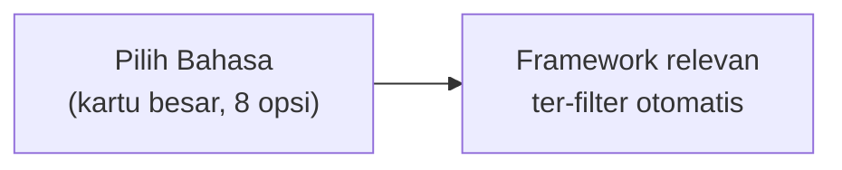

# 🚀 Redesain Form Plan & Alur Generate-to-Revisi ArroBuild (v2)

> Revisi dari `07-form-flow-redesign-v1.md`. Tiga fokus di versi ini: (1) perluasan & penataan ulang seluruh pilihan data di form — bahasa pemrograman, database, animasi, kombinasi paket stack, referensi desain, tools ekosistem, model AI, dan jawaban cepat untuk pertanyaan bebas; (2) penjelasan lengkap Mode Dipandu AI beserta **koreksi jujur** atas estimasi biaya yang sebelumnya terlalu optimis; (3) verifikasi integritas menyeluruh terhadap `00-overview.md`, `arrobuild_pricing_monetisasi_v2.md`, `arrobuild_mini_tools_plan.md`, dan `arrobuild_analysis.md`.

---

## Daftar Isi

1. [Apa yang Berubah dari v1](#1-apa-yang-berubah-dari-v1)
2. [Pilihan Data Diperluas — Redesain Step 3 (Stack & Preferensi)](#2-pilihan-data-diperluas--redesain-step-3-stack--preferensi)
3. [Model AI untuk Generate — Redesain Sesuai Sistem Kredit](#3-model-ai-untuk-generate--redesain-sesuai-sistem-kredit)
4. [Jawaban Cepat untuk Pertanyaan Bebas](#4-jawaban-cepat-untuk-pertanyaan-bebas)
5. [Mode Dipandu AI — Penjelasan Lengkap](#5-mode-dipandu-ai--penjelasan-lengkap)
6. [Update Data Model — Field Baru yang Perlu Disinkronkan](#6-update-data-model--field-baru-yang-perlu-disinkronkan)
7. [Verifikasi Integritas Lintas Dokumen](#7-verifikasi-integritas-lintas-dokumen)
8. [Ringkasan Aksi](#8-ringkasan-aksi)

---

## 1. Apa yang Berubah dari v1

| Bagian | v1 | v2 |
|---|---|---|
| Stack & Style (Step 3) | Framework + Design + Agent Tool saja, database/animasi belum dibahas | Diperluas: bahasa pemrograman, database kontekstual, animasi, kombinasi paket, referensi desain, tools ekosistem |
| Model AI | Belum dibahas ulang, masih implisit pakai daftar lama | Direstruktur penuh mengikuti 4 kelas kredit (Hemat/Menengah/Flagship/Ultra) |
| Pertanyaan bebas (Step 2) | Hanya Feature Builder yang dapat perlakuan "chip pilihan" | Pola chip cepat diperluas ke **semua** pertanyaan open-text |
| Mode Dipandu AI | Dijelaskan ringkas, estimasi biaya "~3-4 kredit" (terlalu optimis) | Flow konkret + transkrip + estimasi biaya dikoreksi jadi realistis |
| Integritas lintas dokumen | Diasumsikan konsisten | Diverifikasi eksplisit, 1 inkonsistensi ditemukan & diperbaiki |

---

## 2. Pilihan Data Diperluas — Redesain Step 3 (Stack & Preferensi)

Prinsip yang dipegang di seluruh bagian ini: **pilihan baru harus mengurangi kebingungan, bukan menambahnya** — makanya semua perluasan di bawah pakai pola *cascading* (pilihan awal mempersempit pilihan berikutnya) dan *contextual visibility* (section yang tidak relevan untuk tipe produk tertentu disembunyikan, bukan ditampilkan kosong).

### 2.1 Bahasa Pemrograman → Filter Framework

Alih-alih langsung menyodorkan grid 20 framework (yang sudah ditandai berpotensi membingungkan di `form-plan.md`), tambahkan satu langkah penyaring di depannya:



| Bahasa | Framework yang Muncul | Cocok Utamanya |
|---|---|---|
| JavaScript/TypeScript | Next.js, Nuxt, Remix, SvelteKit, Astro, React SPA, Vue SPA, Vanilla JS, Express, NestJS, Hono | Web, semua tipe |
| Python | Django, FastAPI | API, AI-App, Internal Tool |
| PHP | Laravel | Internal Tool, tim yang familiar PHP |
| Ruby | Rails | SaaS klasik |
| Go | Go Fiber | API performa tinggi |
| Dart | Flutter | Mobile cross-platform |
| Swift *(baru)* | Native iOS | Mobile — butuh performa/akses native penuh |
| Kotlin *(baru)* | Native Android | Mobile — butuh performa/akses native penuh |

> [!TIP]
> Grid 20 framework tidak dihapus — cuma disaring. User power-user masih bisa buka "Lihat semua framework" untuk lompat langsung tanpa filter bahasa. Ini menjawab langsung "pilihan stack jangan cuma frontend-backend" tanpa menambah beban kognitif, karena penyaringan justru **mengurangi** jumlah pilihan yang terlihat sekaligus.

### 2.2 Database — Kontekstual per Tipe Produk

Reorganisasi jadi kategori dengan rekomendasi otomatis berdasarkan `productType` yang sudah dipilih di Step 1:

| Kategori | Opsi | Disorot Otomatis Untuk |
|---|---|---|
| Relational | PostgreSQL, MySQL, SQLite | Marketplace, E-commerce, Internal Tool (butuh transaksi konsisten) |
| Document/NoSQL | MongoDB | Content-heavy app, portofolio dinamis |
| Cache/Realtime | Redis | Marketplace, E-commerce (session, cache, rate limit) |
| Backend-as-a-Service | Supabase, Firebase *(baru)*, PlanetScale, Turso | Mobile App (sinkronisasi realtime), SaaS solo developer |
| Vector *(baru)* | pgvector, Pinecone, Weaviate, Qdrant | **AI-Powered App** — highlight khusus, karena tanpa ini AI-app sering butuh workaround manual |
| Tidak perlu database | — | Portfolio statis, Landing page |

Badge "✨ Direkomendasikan untuk [tipe produkmu]" muncul otomatis di 1-2 opsi teratas berdasarkan `productType`, sisanya tetap bisa dipilih manual.

### 2.3 Animasi & Motion *(baru, kontekstual)*

Section ini **hanya muncul** untuk tipe produk yang relevan (SaaS, Mobile, E-commerce, Portfolio, AI-App) — disembunyikan total untuk API/Dev Tool dan Internal Tool supaya form tidak terasa penuh pertanyaan yang tidak relevan.

| Opsi | Cocok Untuk |
|---|---|
| Framer Motion | Ekosistem React/Next.js, animasi UI standar |
| GSAP | Animasi kompleks, timeline, cocok semua framework |
| Lottie | Mobile, onboarding flow, animasi hasil ekspor After Effects |
| Rive | Animasi vektor interaktif, trending untuk mobile & web |
| CSS-only / Minimal | Proyek yang mengutamakan kecepatan load |
| Biarkan AI pilih | Default untuk yang belum yakin |

Urutan tampilan opsi menyesuaikan platform: Mobile App akan menaruh Lottie/Rive di atas, sementara SaaS/Web menaruh Framer Motion/GSAP di atas.

### 2.4 Kombinasi Paket Stack — "Rakitan Siap Pakai"

Ini jawaban untuk "pilihan yang lebih asik" — daripada isi 5-6 dropdown terpisah, tawarkan paket jadi (seperti pilih trim mobil) yang otomatis mengisi Bahasa + Framework + Database + Animasi + Deployment sekaligus:

| Paket | Isi | Cocok Untuk |
|---|---|---|
| ⚡ Modern Fullstack | Next.js + TypeScript + PostgreSQL + Supabase + Tailwind + Framer Motion + Vercel | SaaS, startup cepat |
| 🏛️ Classic Reliable | Laravel + PHP + MySQL + Tailwind + VPS tradisional | Internal Tool, tim yang familiar PHP |
| 🤖 AI-Native Stack | Next.js (frontend) + FastAPI/Python (backend AI) + pgvector + Vercel/Railway | AI-Powered App |
| 📱 Mobile Cross-platform | Expo + TypeScript + Firebase + Lottie | Mobile App |
| 🛍️ Marketplace Ready | Next.js + PostgreSQL + Redis + Supabase Auth | Marketplace, E-commerce |
| 🎨 Portfolio Cepat | Astro + Tailwind + Vercel, tanpa database | Portfolio/Personal Site |
| 🛠️ Rakit Sendiri | Kosong — pilih tiap bagian manual | Power user |

Setelah pilih paket, tetap muncul tombol **"✏️ Sesuaikan dari sini"** untuk override satu-dua bagian tanpa perlu mulai dari nol lagi (misalnya suka semua dari "Modern Fullstack" tapi mau ganti database ke MongoDB). Ini murni preset konfigurasi statis — **zero cost AI**, karena hanya mengisi field, bukan memanggil model.

### 2.5 Referensi Gaya Desain — Visual Gallery + Sumber Sendiri

- **Ganti swatch teks jadi kartu visual** — tiap Design Style menampilkan mini-preview nyata (kartu contoh UI kecil dengan warna/tipografi aslinya, dari live-mockup yang sudah direncanakan di v1 Bagian 5.4), ditampilkan sebagai galeri sekaligus (bukan satu per satu) supaya bisa dibandingkan langsung.
- **Tag "gaya seperti"** — deskripsi singkat garis keturunan gaya, contoh: Neo-Brutalist → *"gaya tebal, kontras tinggi, banyak dipakai produk-produk indie/community-driven"*. Ini deskripsi umum, bukan reproduksi visual dari produk berhak cipta tertentu.
- **Field "Punya referensi sendiri?" (opsional)** — user bisa tempel link web yang gayanya disukai, atau cukup deskripsikan dengan kata-kata. Di versi form ini, ini **hanya catatan teks** yang dibaca AI sebagai konteks tambahan (tanpa scraping otomatis).

> [!IMPORTANT]
> Field referensi ini **sengaja ringan** karena ekstraksi desain otomatis dari URL (ambil warna/tipografi/spacing asli lewat headless browser) sudah punya rencana tersendiri sebagai mini tool terpisah: **Design Reference Scraper** di `arrobuild_mini_tools_plan.md` (Bagian 3.2, prioritas pembangunan #7). Jangan bangun infrastruktur scraping dua kali di dua tempat berbeda — field di form ini cukup jadi "catatan teks" sekarang, dan bisa di-upgrade memanggil mini tool tersebut begitu sudah dibangun sesuai urutan prioritasnya.

### 2.6 Tools & Ekosistem Dev *(perluasan dari "AI Tool Target")*

Step yang sebelumnya cuma menanyakan AI coding agent (Cursor/Claude Code/Windsurf) diperluas jadi bagian "Ekosistem & Tools", semua opsional kecuali AI Agent:

| Kategori | Opsi | Kenapa Relevan |
|---|---|---|
| AI Coding Agent (wajib) | Cursor, Claude Code, Windsurf, Cline, OpenCode, Custom | Menentukan format `agents.md` |
| Version Control | GitHub, GitLab, Bitbucket, Belum tahu | Konvensi commit/branch di Agent Rules |
| Desain Handoff | Figma, Tidak pakai | Kalau Figma dipilih, Agent Rules bisa sertakan konvensi terjemahan desain→kode |
| Project Management | Notion, Linear, Trello, Tidak pakai | Konteks tambahan untuk Plan/Task, opsional |

Semua field ini terstruktur (pilihan, bukan teks bebas) — hemat token dan tetap mudah diproses prompt builder.

---

## 3. Model AI untuk Generate — Redesain Sesuai Sistem Kredit

> [!WARNING]
> **Koreksi dari v1**: Bagian ini sebelumnya belum disesuaikan dan berisiko mengulang daftar model lama (Gemini Flash, GPT-4o, dst dari audit `form-plan.md`) yang sudah tidak sinkron dengan sistem kredit 4-kelas yang sudah ditetapkan di `arrobuild_pricing_monetisasi_v2.md`. Diperbaiki di bawah.

Ganti picker model flat jadi **per-dokumen, berdasarkan kelas**, dengan default otomatis sesuai tabel tier:

```
┌───────────────────────────────────────────────────────┐
│  Model AI per Dokumen                                  │
│                                                         │
│  PRD           [Hemat] [Menengah ✓] [Flagship] [Ultra🔒]│
│                 Default: Gemini 2.5 Pro                │
│                                                         │
│  Architecture  [Hemat] [Menengah ✓] [Flagship] [Ultra🔒]│
│                 Default: Gemini 2.5 Pro                │
│                                                         │
│  Plan/Task     [Hemat ✓] [Menengah] [Flagship] [Ultra🔒]│
│                 Default: DeepSeek V4 Flash              │
│                                                         │
│  💳 Estimasi total: 270 kredit  (sisa kreditmu: 6.730)  │
└───────────────────────────────────────────────────────┘
```

- Default per dokumen mengikuti rekomendasi resmi di `arrobuild_pricing_monetisasi_v2.md` Bagian 4.2 — user tidak wajib pilih manual, tapi bisa naik/turun kelas per dokumen kalau mau kontrol lebih detail.
- Kelas di luar tier (misal Starter coba pilih Flagship) tetap **terlihat, tapi disabled dengan label 🔒 "Upgrade ke Pro"** — prinsip yang sama dengan Document Picker (jangan diam-diam difilter backend).
- **Estimasi kredit dihitung ulang real-time** setiap kali kelas model diubah — supaya dampak "naikkan 1 dokumen ke Flagship" langsung terasa di angka, bukan kejutan di tagihan/histori kredit nanti.
- Nama model yang ditampilkan ke user memakai nama terkini sesuai migrasi di `arrobuild_pricing_monetisasi_v2.md` Bagian 4.4 (mis. **DeepSeek V4 Flash**, bukan alias lama `deepseek-chat` yang pensiun 24 Juli 2026).

---

## 4. Jawaban Cepat untuk Pertanyaan Bebas

Pola yang sebelumnya cuma dipakai di Feature Builder (v1 Bagian 4) sekarang diterapkan ke **semua** field open-text di Step 2 — tidak ada lagi pertanyaan yang cuma bergantung pada user mengetik dari nol.

**Pola universal**: tiap field open-text tampil sebagai kumpulan chip pilihan cepat (kurasi manual per `productType`, statis, zero-cost) + opsi "✏️ Lainnya, saya ketik sendiri" yang membuka textarea kalau tidak ada yang cocok.

Contoh untuk `productType = saas`:

| Field | Contoh Chip |
|---|---|
| Target User | Freelancer • Tim kecil (2-10 orang) • Startup tahap awal • Developer individu • Perusahaan menengah |
| Masalah Utama | Proses manual yang makan waktu • Data tersebar di banyak tools • Biaya software mahal • Sulit koordinasi tim jarak jauh |

Contoh untuk `productType = marketplace`:

| Field | Contoh Chip |
|---|---|
| Target User | Penjual UMKM • Freelancer jasa • Pembeli individu • Reseller |
| Masalah Utama | Sulit menemukan penjual/pembeli terpercaya • Transaksi manual via chat • Tidak ada sistem rating/escrow |

> [!TIP]
> Chip ini bukan menggantikan jawaban bebas — user tetap bisa klik lebih dari satu chip lalu menambahkan detail sendiri di belakangnya. Fungsinya cuma menghilangkan "blank page anxiety" (rasa bingung mulai dari mana) yang paling sering bikin user mengisi field seadanya.

---

## 5. Mode Dipandu AI — Penjelasan Lengkap

### 5.1 Alur Percakapan Konkret

Bukan chat bebas tanpa arah — AI punya daftar tetap field yang harus terisi (`productType`, `targetUser`, `mainProblem`, minimal 1 fitur), tapi jumlah & urutan pertanyaan **adaptif** terhadap kualitas jawaban user.

**Contoh Best-Case (3 giliran — user memberi jawaban detail sejak awal):**

```
🤖 "Oke, kita ngobrol santai aja. Ceritakan produk yang ada di kepalamu —
   sebebas mungkin, nanti aku yang rapikan."

👤 "Aku pengen bikin aplikasi buat bantu freelancer nge-track invoice dan
   pembayaran klien, soalnya aku sendiri sering lupa nagih."

--- [1 panggilan AI: deteksi productType + ekstraksi field] ---

🤖 "Paham — ini kedengaran seperti SaaS untuk freelancer soal invoicing.
   Masalah utamanya sudah aku catat. Satu hal lagi: ada fitur spesifik
   yang kebayang harus ada di versi pertama?"

👤 "Reminder otomatis, generate invoice PDF, sama tracking status
   udah dibayar apa belum"

--- [1 panggilan AI: ekstraksi 3 fitur → FEAT-001/002/003 + cek kelengkapan] ---

🤖 "Mantap, ini sudah cukup buat mulai:
    - Tipe: SaaS  |  Target: Freelancer
    - Masalah: Lupa nagih & tracking pembayaran manual
    - FEAT-001 Reminder otomatis
    - FEAT-002 Generate invoice PDF
    - FEAT-003 Tracking status pembayaran
   Ada yang mau dikoreksi, atau lanjut ke pilihan stack?"
```

**Contoh Worst-Case (mendekati batas 8 giliran — jawaban user singkat/vague):**

```
👤 "pengen bikin app"
🤖 "Oke! App buat apa kira-kira, siapa yang bakal pakai?"
👤 "buat orang-orang"
🤖 "Boleh lebih spesifik dikit? Orang yang kerja di bidang apa, atau
   ngalamin masalah apa sehari-hari?"
   ... (berlanjut hingga giliran ke-8)
```

Kalau di giliran ke-8 field minimal masih belum lengkap, sistem **berhenti bertanya** (tidak dipaksa jadi loop tanpa akhir) dan berkata jujur:

> *"Sepertinya ini butuh diskusi lebih detail — yuk lanjut isi sisanya manual, jawabanmu sejauh ini tetap tersimpan."*

→ Fallback ke Mode Cepat dengan field yang sudah terisi otomatis, sisanya dilengkapi manual.

### 5.2 Kontrol Token: Kenapa Estimasi Awal Saya Salah

Estimasi "~3-4 kredit" di v1 diam-diam mengasumsikan tiap giliran itu independen dan pendek. Padahal supaya AI tidak "lupa" jawaban sebelumnya, tiap giliran perlu tahu riwayat percakapan — dan **kalau riwayat itu dikirim mentah dan lengkap tiap giliran, tokennya menumpuk makin besar tiap giliran berikutnya**. Ini persis pola "akumulasi context meledak" yang sudah ditemukan di `arrobuild_analysis.md` Bagian 1.3 & 3.2 untuk sistem generate dokumen — cuma versi kecilnya, terjadi di dalam satu sesi wawancara.

**Solusi**: pakai teknik yang sama persis dengan cap context yang sudah ditetapkan di `arrobuild_pricing_monetisasi_v2.md` Bagian 3 — jangan kirim riwayat mentah, kirim **ringkasan terstruktur (field yang sudah terisi) + 2 giliran mentah terakhir saja**, ditambah **hard cap maksimal 8 giliran** supaya tidak ada skenario tak berujung.

### 5.3 Estimasi Biaya — Direvisi Jadi Realistis

| Skenario | Giliran | Token/giliran (dengan cap context) | Total Token | Kredit (kelas Hemat) |
|---|---|---|---|---|
| Best case | 3 | ~1.100-1.300 | ~3.500 | **~4-5 kredit** |
| Realistis rata-rata | 5 | ~1.200 | ~6.000 | **~6-7 kredit** |
| Worst case (mentok cap) | 8 | ~1.300 | ~10.400 | **~10-12 kredit** |
| ⚠️ Tanpa cap context (naif) | 8 | Menumpuk tiap giliran | Bisa 3-4x lebih besar | **~35-45 kredit** |

> [!CAUTION]
> Baris terakhir adalah peringatan konkret: kalau implementasi tidak memakai cap context sejak awal, biaya Mode Dipandu AI bisa mendekati biaya generate 1 dokumen PRD penuh di kelas Flagship — jelas tidak sepadan untuk sekadar sesi wawancara. Cap context di sini **wajib**, bukan opsional.

### 5.4 Kebijakan Kuota yang Disarankan (Direvisi dari v1)

Karena angka realistis (~6-12 kredit) lebih tinggi dari klaim awal "~3-4 kredit", rekomendasi kebijakan pun berubah — dari "gratis tanpa batas" menjadi:

- **Gratis dengan kuota**: 3x sesi/bulan di semua tier (termasuk Starter) — cukup murah dibanding pool bulanan (maks ~36 kredit/bulan dari 3.000-14.000 kredit yang tersedia, di bawah 1.5% bahkan di Starter).
- **Setelah kuota habis**: potong dari pool kredit seperti fitur lain, ditampilkan jelas sebelum sesi dimulai ("Sesi ke-4 bulan ini akan pakai ~6-12 kredit dari pool-mu").

---

## 6. Update Data Model — Field Baru yang Perlu Disinkronkan

Semua perluasan di Bagian 2 & 3 berarti field baru yang harus ditambahkan ke `ContextData`/`types.ts` **sekaligus** ke Zod schema API — supaya tidak mengulang bug P0 yang sudah ditemukan di `form-plan.md` (Zod schema tidak sinkron dengan `types.ts`).

| Field Baru | Tipe | Wajib? | Catatan |
|---|---|---|---|
| `programmingLanguage` | enum (8 opsi) | Tidak | Dipakai untuk filter framework, bukan dikirim terpisah kalau sudah implisit dari framework |
| `database` | enum (14 opsi, termasuk vector DB) | Tidak | Kontekstual sesuai `productType` |
| `animationLibrary` | enum (6 opsi) | Tidak | Hanya tampil untuk `productType` yang relevan |
| `stackBundle` | enum (id paket) atau `null` | Tidak | `null` = "Rakit Sendiri" |
| `designReferenceNote` | string (maks ~200 karakter) | Tidak | Catatan teks, bukan hasil scraping |
| `versionControl` | enum (4 opsi) | Tidak | |
| `designHandoffTool` | enum (2 opsi) | Tidak | |
| `projectManagementTool` | enum (4 opsi) | Tidak | |
| `perDocumentModelClass` | map `{ fileKey: modelClass }` | Tidak (ada default) | Override kelas model per dokumen |

> [!IMPORTANT]
> Karena semua field ini berupa pilihan terstruktur (enum), bukan teks bebas, dampaknya ke cap "maks token input dari form" (1.500/2.500/3.500 per tier di `arrobuild_pricing_monetisasi_v2.md` Bagian 3) sangat kecil — satu baris label pilihan jauh lebih hemat token dibanding paragraf teks bebas. Perluasan pilihan ini **tidak mengancam** cap token yang sudah ditetapkan.

---

## 7. Verifikasi Integritas Lintas Dokumen

### 7.1 Tabel Konsistensi

| Elemen di Dokumen Form-Flow | Sumber Acuan | Status |
|---|---|---|
| Struktur 6 dokumen inti + 8 modul opsional (Step 4) | `00-overview.md` | ✅ Konsisten |
| Nama tier Starter/Pro/Pro Max + rename preset (hindari bentrok nama) | `arrobuild_pricing_monetisasi_v2.md` Bag. 4 | ✅ Konsisten |
| Kelas model Hemat/Menengah/Flagship/Ultra di picker model | `arrobuild_pricing_monetisasi_v2.md` Bag. 2 | ⚠️→✅ **Diperbaiki di v2** (v1 belum menyesuaikan) |
| Nama model spesifik (Gemini 2.5 Pro, DeepSeek V4 Flash, dst) | `arrobuild_pricing_monetisasi_v2.md` Bag. 4.4 | ⚠️→✅ **Diperbaiki di v2** (v1 masih implisit pakai nama lama dari `form-plan.md`) |
| Cap token context (teknik dipakai ulang untuk Mode Dipandu AI) | `arrobuild_pricing_monetisasi_v2.md` Bag. 3 | ✅ Konsisten, prinsip yang sama diterapkan ke fitur baru |
| Estimasi kredit ditampilkan di titik keputusan (Step 4, revisi, Mode Dipandu AI) | Sistem kredit `arrobuild_pricing_monetisasi_v2.md` | ✅ Konsisten |
| Field "Referensi Desain" vs Design Reference Scraper | `arrobuild_mini_tools_plan.md` Bag. 3.2 & 6 | ✅ Dikaitkan eksplisit — versi ringan (catatan teks) di form sekarang, versi penuh (scraping) tetap sebagai mini tool terpisah sesuai prioritas #7, tidak dibangun dua kali |
| FEAT-ID lahir sejak Feature Builder (bukan setelah generate) | `00-overview.md` Bag. 3 (Knowledge Model) | ✅ Konsisten, memperkuat fondasi yang sudah digariskan |
| Field baru (bahasa, database, animasi, dst) masuk Zod schema + types.ts bersamaan | Bug P0 di `form-plan.md` | ✅ Ditandai eksplisit di Bagian 6 — mencegah pengulangan bug yang sama |
| Cap token input form tetap aman meski field bertambah | `arrobuild_pricing_monetisasi_v2.md` Bag. 3 | ✅ Diverifikasi — field baru berupa enum, bukan teks bebas, dampak token minimal |

### 7.2 Kesimpulan Verifikasi

Dari seluruh pengecekan, **hanya satu inkonsistensi nyata** yang ditemukan: picker model AI di v1 belum disesuaikan dengan sistem kelas kredit yang sudah final di `arrobuild_pricing_monetisasi_v2.md` — ini karena v1 ditulis dengan fokus ke UX flow, bukan ke detail model AI, dan wajar terlewat sampai diperiksa ulang secara eksplisit. Sudah diperbaiki di Bagian 3. Selebihnya semua elemen baru di v2 (stack, database, animasi, kombinasi paket, referensi desain, tools ekosistem, Mode Dipandu AI) dibangun sebagai **perluasan yang konsisten** dari fondasi yang sudah ada, bukan konsep baru yang berdiri sendiri.

---

## 8. Roadmap Implementasi Menyeluruh (Gabungan v1 + v2)

> Ini menggantikan roadmap parsial sebelumnya. Semua fase dari `07-form-flow-redesign-v1.md` Bagian 12 digabung di sini bersama seluruh penambahan v2 — supaya jadi satu peta eksekusi utuh, bukan tersebar di dua dokumen.

```
Fase 0 — P0 Bug Fix (wajib sebelum apa pun, dari v1):
  [ ] Fix selectedDocs tidak terkirim ke API
  [ ] Sinkronkan Zod schema dengan types.ts (field yang sudah ada)
  [ ] Fix hydration error di Navbar.tsx
  [ ] Hapus komponen legacy (IdeaInput, ClarificationStep, PresetSelector)

Fase 1 — Fondasi Data & Struktur Dokumen (dari v1, diperluas di v2):
  [ ] Bangun Feature Builder (ganti textarea fitur inti → list + FEAT-ID
      + toggle Wajib/Nice-to-have)
  [ ] Ganti buildIdeaString() → Knowledge Model JSON terstruktur
  [ ] Update Document Picker ke struktur 00-overview.md (6 dokumen inti
      + 8 modul opsional), checkbox di luar tier tampil disabled+upgrade
  [ ] Rename smart preset lama (hindari bentrok nama dengan tier Starter)
  [ ] [BARU v2] Tambahkan field baru — programmingLanguage, database,
      animationLibrary, stackBundle, designReferenceNote, versionControl,
      designHandoffTool, projectManagementTool, perDocumentModelClass —
      ke types.ts DAN Zod schema di waktu yang SAMA (jangan terpisah,
      ini persis penyebab bug P0 di Fase 0)

Fase 2 — Redesain Step 3: Stack & Preferensi (BARU, seluruhnya dari v2):
  [ ] Bahasa Pemrograman sebagai penyaring awal → mempersempit grid
      20 framework jadi relevan per bahasa
  [ ] Database dikelompokkan per kategori + badge rekomendasi otomatis
      sesuai productType (termasuk opsi vector DB untuk AI-App)
  [ ] Animasi & Motion — section kontekstual, hanya tampil untuk tipe
      produk yang relevan (disembunyikan untuk API/Internal Tool)
  [ ] Kombinasi Paket Stack ("Rakitan Siap Pakai") — 7 preset + opsi
      "Rakit Sendiri", dengan tombol sesuaikan per bagian
  [ ] Referensi Gaya Desain — ubah swatch teks jadi galeri visual +
      tag "gaya seperti" + field catatan teks ringan (bukan scraping)
  [ ] Tools & Ekosistem Dev — perluas dari sekadar AI Agent jadi +
      Version Control, Desain Handoff, Project Management (opsional)

Fase 3 — Model AI & Transparansi Kredit di Step 4 (BARU, dari v2):
  [ ] Ganti picker model flat → per-dokumen berdasarkan 4 kelas kredit
      (Hemat/Menengah/Flagship/Ultra) dengan default sesuai tier
  [ ] Kelas di luar tier tampil disabled + label "🔒 Upgrade ke Pro"
  [ ] Estimasi kredit real-time per dokumen & total, update tiap kelas
      model diubah

Fase 4 — Live Preview & Jawaban Cepat (dari v1, diperluas di v2):
  [ ] Live JSON preview di Step 2 (render dari state form, zero-cost)
  [ ] [BARU v2] Chip jawaban cepat kontekstual di SEMUA field open-text
      Step 2 (bukan cuma Feature Builder)
  [ ] Live mini-mockup di Step 3 (terhubung ke galeri referensi desain
      Fase 2)
  [ ] Mini Brief Preview di Confirm Screen (outline dokumen mini,
      bukan hasil AI final)

Fase 5 — Mode Dipandu AI (dari v1, kontrol biaya diperkuat di v2):
  [ ] Step 0: pilihan mode (Cepat / Dipandu AI)
  [ ] Alur wawancara adaptif + mapping langsung ke Knowledge Model JSON
      yang sama dengan Mode Cepat
  [ ] WAJIB sejak versi pertama: cap context (ringkasan field terisi +
      2 giliran mentah terakhir, BUKAN riwayat penuh) + hard cap
      maksimal 8 giliran
  [ ] Kebijakan kuota: 3x sesi/bulan gratis di semua tier, setelah itu
      potong dari pool kredit dengan estimasi ditampilkan di awal sesi

Fase 6 — Ruang Kerja IDE Pasca-Generate (dari v1):
  [ ] 3-panel workspace (daftar file / editor dokumen / chat revisi)
  [ ] Cross-reference FEAT-ID — klik ID di satu dokumen, lompat ke
      definisi di dokumen lain
  [ ] Section picker + diff view sebelum-sesudah + estimasi kredit
      ditampilkan sebelum revisi dikonfirmasi
  [ ] Version timeline ringan (snapshot per revisi berhasil)

Fase 7 — Polish & Handoff (dari v1):
  [ ] Live Build Log — presentasi generation bergaya terminal/compiler,
      tips edukatif kontekstual per dokumen yang sedang dibuat
  [ ] Micro-interaction — transisi antar step, hover lift, animasi
      progress bar mengisi
  [ ] Autosave draft (maks 5 draft aktif/akun, auto-expire 30 hari)
  [ ] Audit aksesibilitas menyeluruh — termasuk alternatif keyboard
      untuk drag-drop prioritas di Feature Builder
  [ ] Export: preview folder tree sebelum download, sesuai agentTool
      yang dipilih
```

> [!TIP]
> Fase 2 dan 3 (redesain Step 3 + model AI) sengaja dipisah jadi fase tersendiri, bukan diselipkan ke fase lain — karena cakupannya cukup besar untuk dikerjakan sebagai satu unit kerja yang utuh, dan keduanya adalah prasyarat data sebelum Fase 4 (Live Preview) bisa menampilkan sesuatu yang akurat (live mini-mockup di Step 3 butuh data stack & desain yang sudah lengkap strukturnya dari Fase 2).
