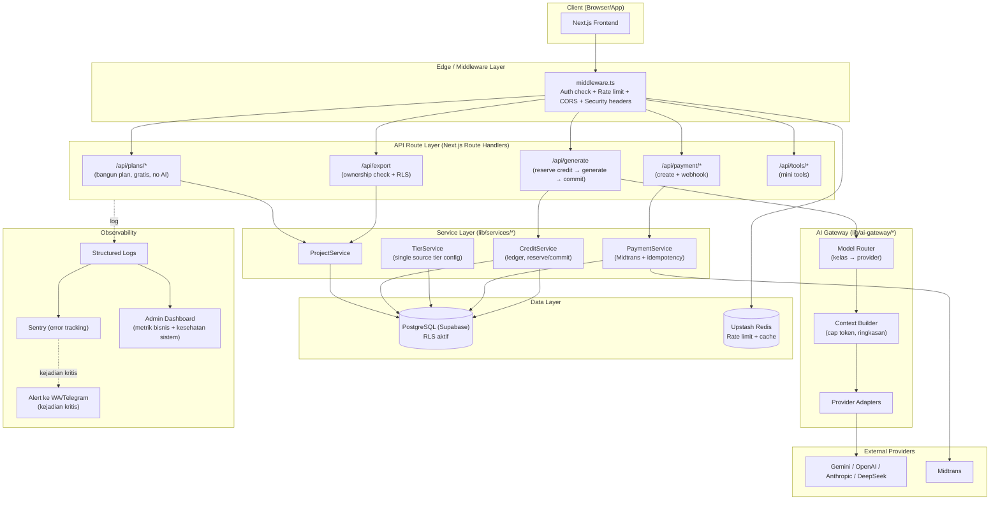
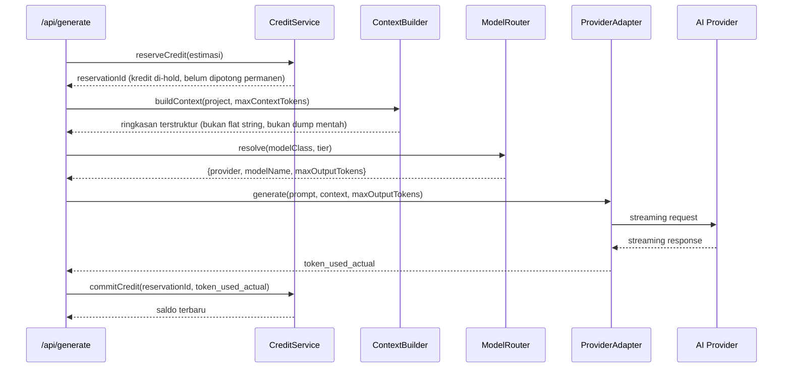
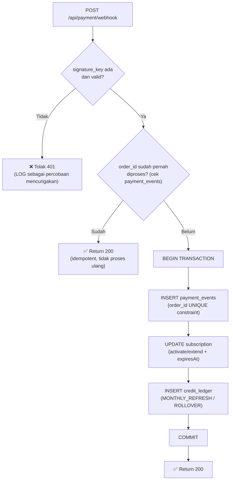
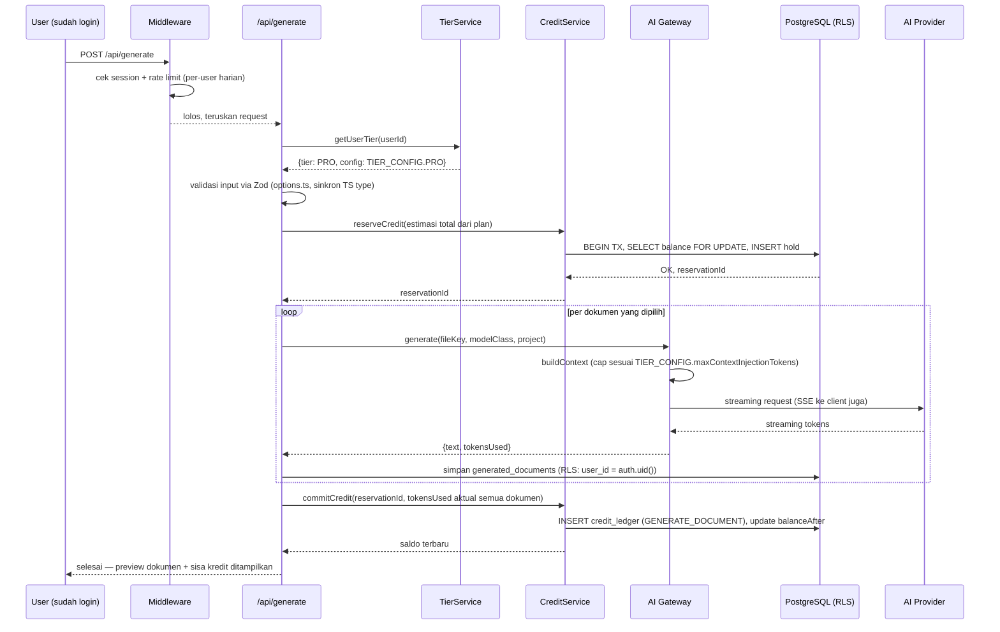

# 🏗️ Redesain Arsitektur & Flow Backend ArroBuild — Kokoh, Aman, Mudah Dipantau

> Menindaklanjuti **Poin 4** di `arrobuild_analysis.md` (Flow Backend, Keamanan & API Key). Dokumen ini bukan sekadar tambal satu-satu temuan lama — ini rancang ulang menyeluruh supaya kamu, sebagai solo founder, punya **satu sistem yang jelas alurnya, aman by-default, dan gampang dipantau tanpa perlu tim ops**. Disusun konsisten dengan sistem kredit & tier final di `arrobuild_pricing_monetisasi_v2.md` dan struktur dokumen di `00-overview.md`.

---

## Daftar Isi

1. [Prinsip Desain](#1-prinsip-desain)
2. [Arsitektur Baru — Peta Besar](#2-arsitektur-baru--peta-besar)
3. [Single Source of Truth — Tier & Config](#3-single-source-of-truth--tier--config)
4. [Perbaikan Keamanan per Temuan Lama](#4-perbaikan-keamanan-per-temuan-lama)
5. [AI Gateway — Lapisan Abstraksi Multi-Provider](#5-ai-gateway--lapisan-abstraksi-multi-provider)
6. [Sistem Kredit sebagai Ledger, Bukan Angka Tunggal](#6-sistem-kredit-sebagai-ledger-bukan-angka-tunggal)
7. [Payment & Webhook — Idempotent & Anti-Forgery](#7-payment--webhook--idempotent--anti-forgery)
8. [Cron & Scheduled Jobs](#8-cron--scheduled-jobs)
9. [Struktur Folder Backend Baru](#9-struktur-folder-backend-baru)
10. [Observability — Dashboard untuk Solo Founder](#10-observability--dashboard-untuk-solo-founder)
11. [Flow End-to-End (Diagram Lengkap)](#11-flow-end-to-end-diagram-lengkap)
12. [Migrasi DeepSeek — Aksi Mendesak](#12-migrasi-deepseek--aksi-mendesak)
13. [Roadmap Prioritas P0–P2](#13-roadmap-prioritas-p0p2)
14. [Ringkasan: Lama vs Baru](#14-ringkasan-lama-vs-baru)

---

## 1. Prinsip Desain

Sebelum masuk detail, ini 5 prinsip yang saya pegang menyusun ulang semua ini — supaya keputusan di bawah tidak terasa acak:

| # | Prinsip | Kenapa |
|---|---|---|
| 1 | **Modular monolith, bukan microservices** | Kamu solo founder. Microservices/Kubernetes cuma menambah beban operasional tanpa manfaat nyata di skala ini. Next.js API routes + Supabase + Prisma yang sudah kamu pakai **sudah cukup**, tinggal dirapikan strukturnya. |
| 2 | **Keamanan di banyak lapisan (defense in depth)**, bukan cuma 1 titik cek | Kalau app-layer check kelewat (seperti kasus export route), lapisan database (RLS) tetap menahan. Jangan taruh semua telur keamanan di satu keranjang. |
| 3 | **Satu sumber kebenaran (single source of truth) untuk tiap konsep** | Tier, harga, kelas model, kredit — masing-masing HARUS cuma didefinisikan di satu tempat. Ini akar dari hampir semua bug inkonsistensi yang ditemukan sebelumnya. |
| 4 | **Uang & kredit harus auditable** | Begitu ada uang sungguhan (Midtrans) dan kredit yang dihitung, sistem harus bisa menjawab "kenapa saldo user ini segini" — pakai ledger, bukan cuma `UPDATE users SET credits = credits - x`. |
| 5 | **Semua yang butuh dipantau, ada di 1 dashboard** | Karena kamu jalan sendirian, kalau ada masalah kamu harus tahu dalam hitungan menit, bukan nemu dari komplain user. |

---

## 2. Arsitektur Baru — Peta Besar



**Perubahan paling penting dari arsitektur lama:**
- Ada **Service Layer** eksplisit di antara route handler dan database — dulu logic bisnis (cek tier, hitung kredit) tersebar langsung di dalam `route.ts`, sekarang dikumpulkan jadi modul yang bisa di-test terpisah dan tidak diduplikasi.
- Ada **Model Router** di dalam AI Gateway yang jadi **satu-satunya** tempat pemetaan tier → model → kelas kredit. Prompt builder tidak lagi perlu tahu detail model, cukup minta "kelas Menengah untuk dokumen ini".
- **Redis (Upstash)** masuk sebagai komponen baru — dipakai untuk rate limiting dan cache ringan (misal cache hasil `TierService.getConfig()` supaya tidak query DB tiap request).

---

## 3. Single Source of Truth — Tier & Config

Ini akar dari masalah "Starter di pricing.ts tidak pernah ditampilkan tapi ada di DB", "tier naming beda di 4 tempat", dan "pricing page bilang 5 project tapi kode enforce 1". Solusinya: **satu file config**, semua tempat lain wajib import dari sini — tidak boleh ada angka/nama tier di-hardcode di tempat lain.

```typescript
// lib/config/tiers.ts — SATU-SATUNYA sumber kebenaran untuk tier & kredit

export const TIER = {
  STARTER: 'STARTER',
  PRO: 'PRO',
  PRO_MAX: 'PRO_MAX',
} as const;
export type TierId = typeof TIER[keyof typeof TIER];

export const MODEL_CLASS = {
  HEMAT: 'HEMAT',
  MENENGAH: 'MENENGAH',
  FLAGSHIP: 'FLAGSHIP',
  ULTRA: 'ULTRA',
} as const;
export type ModelClassId = typeof MODEL_CLASS[keyof typeof MODEL_CLASS];

export const CREDIT_MULTIPLIER: Record<ModelClassId, number> = {
  HEMAT: 1,
  MENENGAH: 24,
  FLAGSHIP: 35,
  ULTRA: 65,
};

export const TIER_CONFIG: Record<TierId, {
  priceIdr: number;
  creditsPerMonth: number;
  rolloverMax: number;
  coreDocuments: string[];       // fileKey yang di-generate
  allowedModelClasses: ModelClassId[];
  maxOutputTokensPerDoc: number;
  maxContextInjectionTokens: number;
  maxFormInputTokens: number;
  maxProjectsPerMonth: number;
  maxProjectsPerDay: number;
}> = {
  STARTER: {
    priceIdr: 65_000,
    creditsPerMonth: 3_000,
    rolloverMax: 0,
    coreDocuments: ['prd', 'architecture', 'plan-task'],
    allowedModelClasses: ['HEMAT'],
    maxOutputTokensPerDoc: 2_500,
    maxContextInjectionTokens: 3_000,
    maxFormInputTokens: 1_500,
    maxProjectsPerMonth: 10,
    maxProjectsPerDay: 3,
  },
  PRO: {
    priceIdr: 145_000,
    creditsPerMonth: 7_000,
    rolloverMax: 2_000,
    coreDocuments: ['prd', 'architecture', 'plan-task', 'design-system', 'agent-rules'],
    allowedModelClasses: ['HEMAT', 'MENENGAH', 'FLAGSHIP'],
    maxOutputTokensPerDoc: 5_000,
    maxContextInjectionTokens: 5_000,
    maxFormInputTokens: 2_500,
    maxProjectsPerMonth: 30,
    maxProjectsPerDay: 8,
  },
  PRO_MAX: {
    priceIdr: 199_000,
    creditsPerMonth: 14_000,
    rolloverMax: 4_000,
    coreDocuments: ['prd', 'architecture', 'plan-task', 'design-system', 'agent-rules', 'adaptive-document'],
    allowedModelClasses: ['HEMAT', 'MENENGAH', 'FLAGSHIP', 'ULTRA'],
    maxOutputTokensPerDoc: 10_000,
    maxContextInjectionTokens: 8_000,
    maxFormInputTokens: 3_500,
    maxProjectsPerMonth: 60,
    maxProjectsPerDay: 15,
  },
};
```

> [!IMPORTANT]
> **Aturan tegas**: `pricing.ts` (yang render UI), Prisma schema (enum `Tier`), `tier-enforcer.ts`, dan prompt builder — **semuanya import angka dari `TIER_CONFIG` ini**, tidak ada satu pun yang boleh punya angka sendiri. Kalau mau ubah harga atau kuota, cukup edit 1 file ini. Ini langsung menutup celah "pricing.ts bilang 5, auth.ts hardcode 1, tier-enforcer bilang 5" yang jadi temuan P0 sebelumnya.

> [!TIP]
> Simpan juga salinan `TIER_CONFIG` ini (atau hasil hash-nya) di 1 baris tabel `system_config` di database, di-cache di Redis dengan TTL pendek (misal 5 menit). Kalau suatu saat kamu mau ubah kuota tanpa deploy ulang (misal saat promo), tinggal ubah baris DB itu — kode tetap fallback ke nilai default di file ini kalau DB tidak terjangkau.

---

## 4. Perbaikan Keamanan per Temuan Lama

Saya petakan tiap temuan lama di `arrobuild_analysis.md` Poin 4 ke solusi konkret — supaya jelas tidak ada yang terlewat.

### 4.1 🔴 API Keys Terekspos di `.env.local`

| Aksi | Detail |
|---|---|
| **Rotate SEMUA key sekarang** | Supabase service role key, DB password, Gemini/OpenAI/Anthropic/DeepSeek API key, Midtrans server key — anggap semua **sudah bocor**, jangan tunggu konfirmasi apakah pernah ke-commit. |
| **Audit git history** | `git log --all --full-history -- .env.local` dan tools seperti `gitleaks` atau `trufflehog` untuk scan seluruh history repo. Kalau ketemu, key itu **wajib** dianggap bocor permanen (rewrite history tidak cukup — GitHub cache, fork, dsb). |
| **Pindah ke secret manager platform** | Kalau pakai Vercel: gunakan **Environment Variables** terenkripsi bawaan (jangan taruh di file apa pun di repo). Untuk key yang sangat sensitif (service role, Midtrans server key), pertimbangkan **Vercel/Supabase Vault** atau layanan seperti **Doppler**/**Infisical** (ada free tier) supaya rotasi dan audit akses lebih rapi ketimbang env var polos. |
| **`.gitignore` + pre-commit hook** | Tambah `.env*.local` ke `.gitignore` (kalau belum), dan pasang `pre-commit` hook (misal pakai `gitleaks protect`) supaya secret ke-detect **sebelum** commit, bukan sesudah. |
| **Prinsip least privilege** | Service role key Supabase idealnya **hanya dipakai di server-side code tertentu** (misal cron job), bukan dipakai bebas di semua route — sebagian besar akses data harusnya lewat RLS + anon/user key (lihat 4.2). |

### 4.2 🟡 Auth & Authorization Gaps

**Masalah lama**: anonymous generate, export tanpa ownership check, tier enforcement cuma di 1 titik.

**Solusi — 2 lapis independen:**

**Lapis 1 — App-layer middleware** (cepat gagal sebelum sampai ke business logic):
```typescript
// middleware.ts (disederhanakan)
export async function middleware(req: NextRequest) {
  const session = await getSupabaseSession(req);
  if (!session && requiresAuth(req.nextUrl.pathname)) {
    return NextResponse.redirect(new URL('/login', req.url));
  }
  // rate limit check (lihat 4.4), lalu lanjut
}
```
Karena alur baru mewajibkan login sejak awal (`arrobuild_pricing_monetisasi_v2.md` Bagian 1), praktis **semua** route API butuh session — anonymous generate otomatis tertutup di titik ini, bukan lagi soal "lupa dicek di 1 route".

**Lapis 2 — Row Level Security (RLS) di PostgreSQL** — ini yang menutup permanen kasus "export route tidak cek ownership":

```sql
-- Aktifkan RLS di tabel projects & generated_documents
ALTER TABLE projects ENABLE ROW LEVEL SECURITY;
ALTER TABLE generated_documents ENABLE ROW LEVEL SECURITY;

-- Policy: user cuma bisa SELECT project miliknya sendiri
CREATE POLICY "own_projects_only"
  ON projects FOR SELECT
  USING (auth.uid() = user_id);

CREATE POLICY "own_documents_only"
  ON generated_documents FOR SELECT
  USING (
    project_id IN (SELECT id FROM projects WHERE user_id = auth.uid())
  );
```

> [!IMPORTANT]
> **Kenapa ini krusial**: dengan RLS aktif, **bahkan kalau ada bug lagi di app-layer** yang lupa cek ownership (seperti export route dulu) — query ke database akan otomatis kembali kosong untuk user yang bukan pemiliknya, karena Postgres sendiri yang menolak baris itu. Ini yang dimaksud "defense in depth": satu lapis bolong, lapis lain masih menahan.

Backend service (`ProjectService`) tetap melakukan pengecekan eksplisit juga (`if (project.userId !== session.userId) throw new ForbiddenError()`) — RLS bukan pengganti pengecekan aplikasi, tapi jaring pengaman kedua.

### 4.3 🟡 Zod Schema Mismatch dengan `types.ts`

**Masalah lama**: Zod cuma cover 5 dari 20 framework, 9 dari 12 design — user pilih opsi lain → error 422 di production.

**Solusi struktural** (bukan cuma "tambah manual ke Zod"): **generate Zod enum otomatis dari satu sumber array**, supaya keduanya **tidak bisa** berbeda lagi:

```typescript
// lib/config/options.ts — satu sumber untuk daftar pilihan
export const FRAMEWORKS = [
  'nextjs', 'nuxt', 'remix', 'sveltekit', 'astro', 'react-spa', 'vue-spa',
  'vanilla-js', 'express', 'nestjs', 'go-fiber', 'hono', 'laravel', 'django',
  'rails', 'fastapi', 'react-native', 'flutter', 'expo', 'ai-recommend',
] as const;

export const DESIGN_PRESETS = [
  'neo-brutalist', 'minimal', 'corporate', 'bold', 'apple', 'linear',
  'stripe', 'notion', 'vercel', 'glassmorphism', 'dashboard', 'ai-recommend',
] as const;

// TypeScript type diturunkan dari array yang sama
export type Framework = typeof FRAMEWORKS[number];
export type DesignPreset = typeof DESIGN_PRESETS[number];
```

```typescript
// route.ts — Zod schema import dari sumber yang SAMA
import { FRAMEWORKS, DESIGN_PRESETS } from '@/lib/config/options';

const generateSchema = z.object({
  framework: z.enum(FRAMEWORKS),      // otomatis 20 opsi, tidak bisa telat sync
  design: z.enum(DESIGN_PRESETS),      // otomatis 12 opsi
  // ...
});
```

> [!TIP]
> Pola ini (satu array sumber → dipakai untuk Zod, TypeScript type, dan opsi UI dropdown sekaligus) sudah ditandai eksplisit sebagai kewajiban di `08-form-flow-redesign-v2.md` Bagian 6 untuk field-field baru — dokumen ini menegaskan pola yang sama berlaku untuk field lama (`framework`, `design`) yang jadi biang bug P0 sebelumnya.

Tambahan: pasang **CI check** (GitHub Action sederhana) yang menjalankan type-check + build sebelum merge — supaya kalau suatu saat ada yang menambah opsi cuma di satu tempat, build gagal duluan sebelum sampai production.

### 4.4 🔴 Tidak Ada Rate Limiting

**Solusi**: Upstash Redis (`@upstash/ratelimit`), sliding window, 2 lapis:

| Lapis | Kunci | Limit contoh | Tujuan |
|---|---|---|---|
| Per-IP (semua endpoint publik) | `ip:{ip}` | 30 request/menit | Anti bot/script kasar, jalan bahkan sebelum tahu siapa usernya |
| Per-user (endpoint generate) | `user:{userId}:generate` | Sesuai `maxProjectsPerDay` di `TIER_CONFIG` | Cegah abuse dari akun asli yang mencoba spam generate |
| Per-user (mini tools) | `user:{userId}:tool:{toolId}` | Sesuai kuota tier (Bagian 8.3 `arrobuild_mini_tools_plan.md`) | Trial Starter (misal 3x/bulan) ditegakkan di sini, bukan cuma di UI |

```typescript
// lib/rate-limit.ts
import { Ratelimit } from '@upstash/ratelimit';
import { redis } from './redis';

export const ipLimiter = new Ratelimit({
  redis,
  limiter: Ratelimit.slidingWindow(30, '1 m'),
  prefix: 'ratelimit:ip',
});

export const generateLimiter = (tier: TierId) => new Ratelimit({
  redis,
  limiter: Ratelimit.slidingWindow(TIER_CONFIG[tier].maxProjectsPerDay, '1 d'),
  prefix: 'ratelimit:generate',
});
```

### 4.5 ❌ Tidak Ada CORS & CSP

```typescript
// next.config.js — tambahkan security headers
const securityHeaders = [
  { key: 'Content-Security-Policy', value: "default-src 'self'; script-src 'self' 'unsafe-inline'; connect-src 'self' *.supabase.co api.midtrans.com" },
  { key: 'X-Frame-Options', value: 'DENY' },
  { key: 'X-Content-Type-Options', value: 'nosniff' },
  { key: 'Referrer-Policy', value: 'strict-origin-when-cross-origin' },
];

module.exports = {
  async headers() {
    return [{ source: '/(.*)', headers: securityHeaders }];
  },
};
```

CORS: karena tidak ada rencana ArroBuild dipanggil dari domain eksternal (bukan API publik untuk pihak ketiga), kebijakan paling aman adalah **tidak mengizinkan cross-origin sama sekali** kecuali domain sendiri — cukup andalkan same-origin default Next.js, dan eksplisit tolak origin lain di API route yang sensitif (payment, export).

---

## 5. AI Gateway — Lapisan Abstraksi Multi-Provider

Ini komponen baru yang tidak ada eksplisit di arsitektur lama. Tujuannya: **prompt builder dan route handler tidak perlu tahu apa-apa soal provider AI** — mereka cuma bicara "kelas model" dan "budget token", sisanya diurus di sini.



**Kenapa pola *reserve → commit* penting** (bukan langsung potong kredit di akhir): kalau user mengirim 2 request generate hampir bersamaan (double-click, atau bug di frontend), tanpa reservasi kredit bisa saja **kedua request lolos** karena saat pengecekan saldo pertama dilakukan, potongan dari request pertama belum tercatat. Dengan reservasi (hold kredit di awal, dalam 1 transaksi database terkunci), request kedua akan melihat saldo yang sudah terpotong reservasi pertama dan ditolak kalau tidak cukup.

**Provider Adapter** — interface seragam supaya menambah/mengganti provider (termasuk migrasi DeepSeek di Bagian 12) tidak menyentuh kode di luar folder ini:

```typescript
// lib/ai-gateway/types.ts
export interface ProviderAdapter {
  generate(params: {
    prompt: string;
    context: string;
    maxOutputTokens: number;
    onChunk?: (chunk: string) => void;
  }): Promise<{ text: string; tokensUsed: number }>;
}

// lib/ai-gateway/adapters/deepseek.ts
export class DeepSeekAdapter implements ProviderAdapter {
  async generate(params) {
    // pakai model name terkini (lihat Bagian 12), bukan alias yang akan pensiun
  }
}
```

**Fallback chain**: kalau provider utama gagal (timeout/rate limit dari provider), `ModelRouter` otomatis coba provider cadangan **di kelas kredit yang sama** (misal Flagship gagal di GPT-5.4 → coba Claude Sonnet, tetap 35 kredit/1.000 token, bukan diam-diam downgrade ke Hemat tanpa bilang user).

---

## 6. Sistem Kredit sebagai Ledger, Bukan Angka Tunggal

**Masalah dengan pendekatan naif** (`users.credits = users.credits - x`): tidak ada jejak audit. Kalau user komplain "kredit saya kok tiba-tiba habis", kamu tidak punya cara menjawab selain percaya begitu saja.

**Solusi**: tabel `credit_ledger` — setiap perubahan saldo adalah 1 baris, saldo saat ini = SUM semua baris (atau di-cache dan divalidasi ulang berkala).

```prisma
model CreditLedger {
  id          String   @id @default(cuid())
  userId      String
  amount      Int      // positif = tambah (topup, refresh bulanan), negatif = potong (generate, revisi)
  type        LedgerType
  referenceId String?  // projectId, paymentId, toolUsageId — untuk telusur balik
  balanceAfter Int      // saldo setelah transaksi ini (snapshot, mempercepat query)
  metadata    Json?     // { modelClass, tokensUsed, documentType, dst }
  createdAt   DateTime @default(now())

  user User @relation(fields: [userId], references: [id])

  @@index([userId, createdAt])
}

enum LedgerType {
  MONTHLY_REFRESH
  ROLLOVER
  TOPUP
  GENERATE_DOCUMENT
  REVISION
  TOOL_USAGE
  RESERVATION_HOLD
  RESERVATION_RELEASE
  MANUAL_ADJUSTMENT   // kamu manual, misal kompensasi ke user — selalu ada catatan alasan di metadata
}
```

**Reservasi kredit** dilakukan sebagai 2 baris: `RESERVATION_HOLD` (negatif, saat request masuk) lalu setelah generate selesai baik jadi `GENERATE_DOCUMENT` (jumlah aktual, biasanya sama atau lebih presisi) atau kalau gagal total, `RESERVATION_RELEASE` (positif, kembalikan hold). Semua ini di dalam **1 transaksi database** dengan `SELECT ... FOR UPDATE` di baris saldo user supaya tidak ada race condition antar request paralel.

> [!TIP]
> Dashboard admin (Bagian 10) bisa langsung query tabel ini untuk jawab pertanyaan bisnis real: "berapa total kredit terpakai bulan ini per kelas model?", "user mana yang paling sering kena reservation release (kemungkinan sering gagal generate — cek kenapa)?" — ini data yang tidak mungkin didapat dari sekadar kolom `credits` tunggal.

---

## 7. Payment & Webhook — Idempotent & Anti-Forgery

**3 masalah lama**: signature verification opsional, tidak ada idempotency check, tidak ada subscription expiry scheduler.



```typescript
// app/api/payment/webhook/route.ts (disederhanakan)
export async function POST(req: Request) {
  const body = await req.json();

  // WAJIB — tidak ada lagi "if signatureKey && ..."
  if (!verifyMidtransSignature(body)) {
    logSecurityEvent('webhook_signature_invalid', body);
    return new Response('Invalid signature', { status: 401 });
  }

  return await prisma.$transaction(async (tx) => {
    // UNIQUE constraint di kolom order_id mencegah proses dobel
    const existing = await tx.paymentEvent.findUnique({ where: { orderId: body.order_id } });
    if (existing) {
      return new Response('Already processed', { status: 200 }); // idempotent
    }

    await tx.paymentEvent.create({ data: { orderId: body.order_id, rawPayload: body } });
    await activateOrExtendSubscription(tx, body);
    await refreshMonthlyCredit(tx, body);

    return new Response('OK', { status: 200 });
  });
}
```

**Rekomendasi tambahan untuk recurring billing**: Midtrans Snap murni one-time payment. Untuk langganan bulanan otomatis, dua opsi realistis:
1. **Midtrans Subscription API** (kalau tersedia untuk akun bisnismu) — recurring charge otomatis, paling sedikit kerja manual.
2. **Manual renewal reminder**: kirim notifikasi (email/WA) H-3 sebelum `expiresAt`, user klik bayar lagi manual lewat Snap. Lebih sederhana untuk dibangun sekarang, tapi butuh disiplin cron job pengingat.

> [!TIP]
> Untuk tahap awal dengan basis user masih kecil (lihat cap Fase 1 di `arrobuild_pricing_monetisasi_v2.md` Bagian 7), opsi 2 (manual renewal + reminder) **cukup memadai** dan jauh lebih cepat dibangun — pindah ke opsi 1 begitu volume user membuat renewal manual jadi beban.

---

## 8. Cron & Scheduled Jobs

| Job | Jadwal | Fungsi |
|---|---|---|
| **Subscription expiry check** | Tiap hari, 00:00 WIB | Cari subscription dengan `expiresAt < now()` dan status masih aktif → set nonaktif, downgrade akses tier |
| **Monthly credit refresh** | Tiap hari (cek per user berdasarkan tanggal langganan masing-masing, bukan tanggal kalender global) | Tambah `creditsPerMonth` dari `TIER_CONFIG`, terapkan rollover cap sesuai tier |
| **Draft plan cleanup** | Tiap hari | Hapus draft plan yang belum di-generate dan sudah lewat 30 hari (`arrobuild_pricing_monetisasi_v2.md` Bagian 1, tip terakhir) |
| **Renewal reminder (kalau pakai opsi manual)** | Tiap hari | Cari subscription dengan `expiresAt` H-3 → kirim notifikasi |
| **Ledger reconciliation check** | Mingguan | Bandingkan `SUM(credit_ledger.amount)` per user vs kolom cache saldo — kalau selisih, log sebagai anomali untuk diperiksa manual |

Implementasi: **Vercel Cron** (kalau hosting di Vercel) atau **Supabase Edge Function + `pg_cron`** — keduanya cukup untuk skala ini, tidak perlu job queue terpisah (Bull/Redis queue) di tahap awal.

---

## 9. Struktur Folder Backend Baru

```
src/
├── app/api/
│   ├── plans/              # bangun plan — gratis, tanpa AI
│   ├── generate/           # reserve → generate → commit
│   ├── export/             # dengan ownership check + RLS
│   ├── payment/
│   │   ├── create/
│   │   └── webhook/        # idempotent, signature wajib
│   ├── tools/[toolId]/     # mini tools
│   └── admin/              # dashboard internal, auth khusus founder
│
├── lib/
│   ├── config/
│   │   ├── tiers.ts         # Bagian 3 — single source of truth
│   │   └── options.ts       # Bagian 4.3 — sumber Zod + TS type
│   ├── ai-gateway/
│   │   ├── model-router.ts
│   │   ├── context-builder.ts
│   │   └── adapters/{gemini,openai,anthropic,deepseek}.ts
│   ├── services/
│   │   ├── project.service.ts
│   │   ├── credit.service.ts    # reserve/commit, ledger
│   │   ├── tier.service.ts
│   │   └── payment.service.ts
│   ├── rate-limit.ts
│   └── security/
│       ├── verify-midtrans-signature.ts
│       └── rls-policies.sql
│
└── middleware.ts             # auth + rate limit + security headers
```

> [!TIP]
> Perhatikan: **tidak ada logic bisnis langsung di dalam `route.ts`** manapun — route handler cuma jadi "penerima request → panggil service → format response". Ini yang bikin gampang dipantau: kalau ada bug di perhitungan kredit, kamu tahu pasti cuma perlu buka `credit.service.ts`, bukan menelusuri banyak file route.

---

## 10. Observability — Dashboard untuk Solo Founder

Karena kamu jalan sendirian, prinsipnya: **jangan bangun tooling monitoring yang butuh effort maintenance sendiri** — pakai layanan managed yang murah/gratis untuk skala awal.

| Kebutuhan | Tool yang disarankan | Kenapa |
|---|---|---|
| Error tracking | **Sentry** (free tier cukup untuk awal) | Otomatis kirim notifikasi begitu ada exception di production, dengan stack trace lengkap |
| Uptime check | **UptimeRobot** atau **Better Uptime** | Ping `/api/health` tiap 1-5 menit, kirim alert WA/email/Telegram kalau down |
| Log terstruktur | `pino` (Node logger) → Vercel Log Drain atau **Axiom** (free tier) | Log dalam format JSON supaya bisa di-filter/search, bukan cuma `console.log` biasa |
| Metrik bisnis | **Halaman `/admin/dashboard` custom** (Next.js, auth khusus kamu) | Layanan generik (Datadog dkk) overkill dan mahal untuk skala ini — cukup 1 halaman internal yang query langsung ke Postgres |

**Isi minimal dashboard `/admin/dashboard`** — angka yang perlu kamu cek tiap hari dalam < 2 menit:

| Metrik | Query dasar |
|---|---|
| Generate hari ini (sukses/gagal) | COUNT dari tabel generation log, group by status |
| Total kredit terpakai hari ini per kelas model | SUM `credit_ledger` where type='GENERATE_DOCUMENT', group by metadata.modelClass |
| Margin real-time (revenue aktif vs biaya AI aktual) | Bandingkan biaya token aktual (dari `metadata.tokensUsed`) vs `TIER_CONFIG.priceIdr` user aktif |
| Webhook payment gagal/signature invalid (24 jam terakhir) | COUNT dari log security event |
| User baru & churn (subscription expired tidak renewal) | COUNT subscription status |
| Sisa kapasitas chat WA bulan ini (Fase 1-2, `arrobuild_pricing_monetisasi_v2.md` Bag. 7) | COUNT thread terpakai vs kapasitas 200/bulan |
| Antrian mini tools terpakai vs kuota tier | COUNT tool_usage per tier |

> [!IMPORTANT]
> **Alert untuk 3 hal yang harus langsung kamu tahu, bukan nunggu cek dashboard**: (1) webhook signature invalid berulang dari IP yang sama (indikasi percobaan forgery aktif), (2) margin harian jatuh di bawah ambang batas (misal <40%) — tanda ada abuse model mahal, (3) error rate generate di atas normal (indikasi provider AI down atau bug baru). Ketiganya dikirim ke WA/Telegram kamu real-time, bukan cuma masuk log.

---

## 11. Flow End-to-End (Diagram Lengkap)

Menggabungkan semua bagian di atas jadi satu alur utuh, dari klik "Generate" sampai dokumen selesai:



---

## 12. Migrasi DeepSeek — Aksi Mendesak

> [!CAUTION]
> **Alias `deepseek-chat` dan `deepseek-reasoner` pensiun 24 Juli 2026.** Hari ini **7 Juli 2026** — sisa waktu **17 hari**. Ini bukan lagi "nice to have", ini action item P0.

**Langkah konkret:**
1. Identifikasi semua tempat di kode yang memanggil alias lama (`grep -r "deepseek-chat\|deepseek-reasoner" src/`).
2. Ganti ke nama model versi eksplisit terbaru (**DeepSeek V4 Flash**, sesuai penamaan final di `arrobuild_pricing_monetisasi_v2.md` Bagian 4.4) — hindari alias generik lagi ke depannya, selalu pin ke versi spesifik supaya tidak kena kejutan pensiun mendadak lagi.
3. Karena arsitektur baru ini sudah punya **Provider Adapter** terpisah (Bagian 5), perubahan ini **cuma menyentuh 1 file** (`lib/ai-gateway/adapters/deepseek.ts`) — bukti konkret kenapa abstraksi ini berharga: migrasi provider tidak lagi menyebar ke banyak prompt builder.
4. Test generate end-to-end dengan model baru sebelum tanggal 24 Juli, termasuk cek format output tidak berubah drastis (DeepSeek kadang beda gaya output antar versi).
5. Set reminder kalender untuk cek changelog provider tiap kuartal ke depannya — supaya tidak kejadian serupa lagi.

---

## 13. Roadmap Prioritas P0–P2

Diselaraskan dengan roadmap yang sudah ada di `08-form-flow-redesign-v2.md` Bagian 8 (Fase 0-7) — ini fokus khusus ke bagian backend/keamanan yang belum tercakup detail di sana.

```
P0 — Hari 1-3 (sebelum apa pun lain):
  [ ] Rotate SEMUA API key & password yang pernah ada di .env.local
  [ ] Audit git history (gitleaks/trufflehog), pasang pre-commit hook
  [ ] Migrasi DeepSeek ke nama model versi eksplisit (deadline 24 Juli)
  [ ] Aktifkan RLS di tabel projects & generated_documents
  [ ] Fix export route: tambah ownership check eksplisit (selain RLS)
  [ ] Satukan Zod schema + types.ts lewat 1 sumber array (options.ts)

P0 — Minggu 1:
  [ ] Bangun lib/config/tiers.ts sebagai single source of truth
  [ ] Hapus semua angka tier hardcode di pricing.ts/auth.ts/tier-enforcer.ts,
      ganti jadi import dari tiers.ts
  [ ] Mandatory webhook signature verification (hapus kondisional lama)
  [ ] Tambah UNIQUE constraint order_id + idempotency check di webhook

P1 — Minggu 2-3:
  [ ] Bangun CreditLedger table + CreditService (reserve/commit pattern)
  [ ] Bangun AI Gateway (Model Router + Context Builder + Provider Adapter)
  [ ] Rate limiting via Upstash (per-IP + per-user)
  [ ] Cron: subscription expiry + monthly credit refresh + draft cleanup

P2 — Bulan 2:
  [ ] Dashboard /admin/dashboard (metrik bisnis + kesehatan sistem)
  [ ] Sentry + UptimeRobot + alert WA/Telegram untuk 3 kejadian kritis
  [ ] CORS/CSP headers
  [ ] Ledger reconciliation job mingguan
  [ ] Evaluasi Midtrans Subscription API vs manual renewal (Bagian 7)
```

---

## 14. Ringkasan: Lama vs Baru

| Aspek | Arsitektur Lama | Arsitektur Baru |
|---|---|---|
| Tier config | Tersebar di 4 tempat, saling bentrok | 1 file `tiers.ts`, semua import dari situ |
| Kredit | Kolom angka tunggal, tidak auditable | Ledger table, tiap perubahan tercatat + bisa ditelusuri |
| Ownership check | Cuma app-layer, bisa kelewat (kasus export) | App-layer + RLS database (2 lapis independen) |
| Validasi input | Zod manual, gampang telat sync dgn types.ts | Satu array sumber → Zod & TypeScript type otomatis sinkron |
| Webhook | Signature opsional, tanpa idempotency | Signature wajib, UNIQUE constraint order_id, dalam 1 transaksi |
| Rate limiting | Tidak ada | Upstash Redis, 2 lapis (IP + user) |
| Provider AI | Logic provider tersebar di tiap prompt builder | AI Gateway — 1 lapisan abstraksi, migrasi provider = ubah 1 adapter |
| Monitoring | Tidak eksplisit dibahas | Sentry + Uptime + dashboard custom + alert kejadian kritis |
| Subscription expiry | Field ada, tidak ada scheduler | Cron job harian |
| Struktur kode | Logic bisnis campur di route.ts | Route → Service → Data, terpisah rapi |

> [!TIP]
> Kalau harus mulai dari satu hal saja hari ini: **rotate API keys + migrasi DeepSeek** (keduanya berbatas waktu nyata, bukan cuma soal kerapian arsitektur). Sisanya bisa dicicil sesuai roadmap Bagian 13 tanpa terburu-buru.
