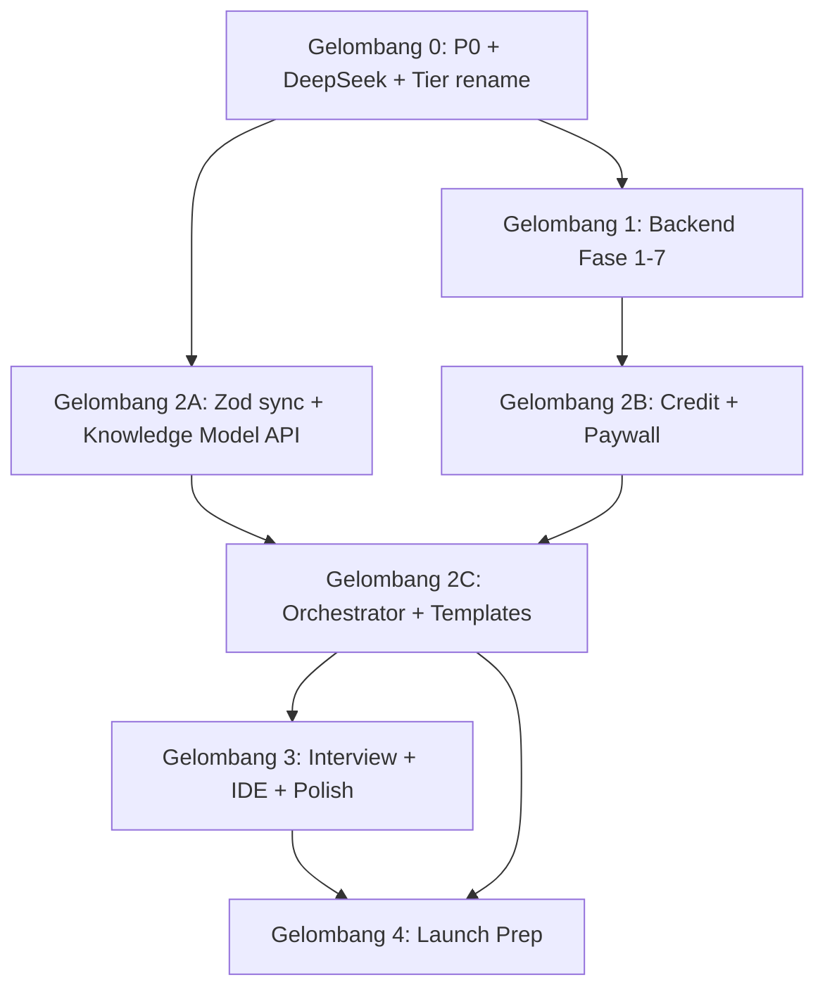

# 🗺️ Master Implementation Plan — ArroBuild v2

> **Dibuat:** 8 Juli 2026  
> **Sumber kebenaran:** Seluruh isi `docs-v2/` + status codebase di `context-docs-v2.md`  
> **Tujuan:** Satu peta eksekusi utuh supaya perombakan besar-besaran bisa dikerjakan berurutan tanpa kehilangan konteks.

---

## Ringkasan Eksekutif

ArroBuild v2 bukan sekadar redesign UI — ini perubahan paradigma di **3 sumbu**:

| Sumbu | Dari | Ke |
|---|---|---|
| **Data** | Teks bebas / `buildIdeaString()` | Knowledge Model JSON + FEAT-ID sejak form |
| **Monetisasi** | Tier FREE + anonymous generate | Login wajib → bangun plan gratis → paywall di Generate |
| **Backend** | Config tersebar, tanpa ledger | Modular monolith: ledger kredit, RLS, AI Gateway |

**Status saat ini (per `context-docs-v2.md`):**
- ✅ Frontend form flow Sprint 1–4 (~Fase 0–4 dari `08-form-flow-redesign-v2.md`)
- 🚧 Backend baru: **belum terintegrasi** ke codebase (masih pakai `FREE` / `free` / `unlimited`)
- 🚧 Mode Dipandu AI, IDE workspace, mini tools: **belum dimulai**

---

## Keputusan Final: Tidak Ada Lagi Tier FREE

> **Keputusan sudah final di `arrobuild_pricing_monetisasi_v2.md` §1 — bukan open question lagi.**

| Aspek | Kebijakan v2 |
|---|---|
| Anonymous generate | ❌ Dihapus total |
| Login | ✅ Wajib sebelum akses form generate |
| Isi form (Step 1–4) | ✅ Gratis, tanpa AI, tanpa potong kredit |
| Generate dokumen | Paywall — butuh subscription aktif + kredit cukup |
| Tier enum | `STARTER` \| `PRO` \| `PRO_MAX` (bukan FREE/STARTER/PRO/UNLIMITED) |
| User tanpa subscription | Tidak bisa generate; arahkan ke halaman pricing |
| Migrasi data lama | `FREE` → tidak ada; `STARTER` tetap; `UNLIMITED` → `PRO_MAX` |

**Implikasi implementasi:**
1. Hapus `assertCanGenerate()` untuk anonymous
2. Middleware: `/generate` dan `/api/generate` butuh session
3. Frontend: ganti `UserTier = "free" \| "paid" \| "unlimited"` → `"starter" \| "pro" \| "pro_max"`
4. Paywall di ConfirmScreen saat klik Generate (bukan di landing)

---

## Peta Dokumen → Tanggung Jawab Implementasi

```
docs-v2/
├── arrobuild_pricing_monetisasi_v2.md   → Tier, kredit, paywall, max user
├── 08-form-flow-redesign-v2.md          → UX form + roadmap frontend (Fase 0–7)
├── context-docs-v2.md                   → Checkpoint status codebase
├── Document-isi/00-overview.md          → 6 core + 8 opsional dokumen
├── Document-isi/01–14/*.md              → Template prompt per dokumen
├── Backend-sistem-baru/                 → Skeleton backend (tiers, prisma, RLS, services)
├── arrobuild_mini_tools_plan.md         → Fase post-launch (bukan blocker MVP)
└── MASTER-IMPLEMENTATION-PLAN.md        → ← dokumen ini
```

**Aturan sinkronisasi angka:** `10-tiers-config.ts` → `src/lib/config/tiers.ts` adalah single source of truth. Update di sana dulu, baru sinkronkan ke `Document-isi/` dan frontend `types.ts`.

---

## Timeline Keseluruhan (Estimasi)

| Gelombang | Durasi | Fokus |
|---|---|---|
| **Gelombang 0 — P0 & Deadline** | 2–3 hari | Bug fix, DeepSeek migration, rename tier di frontend |
| **Gelombang 1 — Backend Core** | 8–9 hari | `implementation_plan.md` Fase 1–7 |
| **Gelombang 2 — Integrasi Generate** | 4–5 hari | Knowledge Model → orchestrator + prompt templates |
| **Gelombang 3 — Fitur Lanjutan** | 10–14 hari | AI Interview, IDE workspace, revisi |
| **Gelombang 4 — Launch Prep** | 3–5 hari | QA, security checklist, staging E2E |
| **Total ke MVP launch** | **~4–6 minggu** | Asumsi 4–6 jam/hari solo dev |

Gelombang 1 dan sebagian Gelombang 2 bisa overlap setelah Fase 1 backend selesai.

---

## Gelombang 0 — P0 & Migrasi Urgent (Mulai Sekarang)

### 0.1 Deadline: DeepSeek Model (24 Juli 2026)
- [ ] Ganti alias `deepseek-chat` / `deepseek-reasoner` → **DeepSeek V4 Flash** di `tier-enforcer.ts`, orchestrator, prompts
- [ ] Verifikasi di staging sebelum 20 Juli

### 0.2 Bug P0 dari `08-form-flow-redesign-v2.md` Fase 0
- [ ] Pastikan `selectedDocs` terkirim ke API
- [ ] Sinkronkan Zod schema `route.ts` dengan field v2 di `types.ts`:
  - `programmingLanguage`, `database`, `animationLibrary`, `stackBundle`
  - `designReferenceNote`, `versionControl`, `designHandoffTool`, `projectManagementTool`
  - `perDocumentModelClass`, `features[]`, `productType`, `projectStage`
- [ ] Fix hydration error Navbar (jika masih ada)
- [ ] Konfirmasi komponen legacy sudah dihapus (IdeaInput, ClarificationStep, PresetSelector)

### 0.3 Rename Tier di Frontend (tanpa backend dulu)
- [ ] `types.ts`: `UserTier` → `"starter" | "pro" | "pro_max"`
- [ ] Update `TOKEN_BUDGET`, `DEFAULT_MODEL_CLASS`, `calcDocCredits` key mapping
- [ ] Update `DocumentPickerStep`, `ConfirmScreen`, pricing page labels
- [ ] Mapping sementara di API: terima `starter/pro/pro_max`, tolak `free` dengan pesan "login & subscribe"

**Exit criteria:** `npm run build` hijau, form v2 kirim payload lengkap ke API.

---

## Gelombang 1 — Backend Core (`implementation_plan.md`)

Ikuti 7 fase di `implementation_plan.md` secara berurutan. Ringkasan:

| Fase | Deliverable | Blokir |
|---|---|---|
| **1** | `tiers.ts`, `options.ts`, Prisma migration, `logger.ts` | Semua fase lain |
| **2** | RLS policies + export ownership check | Fase 3+ |
| **3** | `credit.service.ts`, `tier.service.ts` | Generate route |
| **4** | `payment.service.ts`, webhook idempotent | Paywall |
| **5** | Upstash rate limit + middleware | Launch |
| **6** | Refactor generate/auth/pricing routes | E2E |
| **7** | AI Gateway adapters + DeepSeek V4 | Kualitas output |

### Prasyarat sebelum coding Fase 1
- [ ] Founder UUID dari Supabase Auth (untuk RLS)
- [ ] Akun Upstash Redis (`UPSTASH_REDIS_REST_URL`, `UPSTASH_REDIS_REST_TOKEN`)
- [ ] Backup database + rencana migrasi tier existing
- [ ] Rotate API keys (lihat `09-backend-architecture-keamanan.md`)

### Migrasi data tier
```sql
-- Contoh mapping (sesuaikan dengan data production)
-- SubscriptionTier.UNLIMITED → Tier.PRO_MAX
-- SubscriptionTier.PRO → Tier.PRO
-- SubscriptionTier.FREE → hapus / arahkan subscribe STARTER
-- SubscriptionTier.STARTER → Tier.STARTER
```

**Exit criteria:** Checklist P0 di `09A` §3.2 semua hijau.

---

## Gelombang 2 — Integrasi Generate & Dokumen

Menghubungkan frontend v2 (sudah jadi) dengan backend baru + template dokumen.

### 2.1 Knowledge Model di API
- [ ] `generate/route.ts` terima `KnowledgeModel` JSON (bukan string gabungan)
- [ ] Validasi Zod import enum dari `options.ts` (bukan hardcode)
- [ ] `CreditService.reserveCredit()` sebelum generate, `commitCredit()` / `releaseReservation()` di catch

### 2.2 Orchestrator & Prompt Builder
- [ ] Refactor orchestrator baca `features[]`, `productType`, `perDocumentModelClass`
- [ ] Context builder: ringkasan terstruktur, cap token per tier (`3k/5k/8k`)
- [ ] Inject blok YAML FEAT-ID ke awal PRD (template `01-prd.md`)
- [ ] Dokumen lain hanya terima YAML + ringkasan, bukan dump PRD penuh

### 2.3 Template Dokumen (Document-isi/)
Prioritas implementasi prompt per file:

| Prioritas | File | Catatan |
|---|---|---|
| P0 | `01-prd.md`, `02-architecture.md`, `04-plan-task.md` | Core Starter (3 dokumen) |
| P1 | `03-design-system.md`, `05-agent-rules.md` | Pro tier |
| P1 | `06-adaptive-documents.md` | Pro Max — branching per `productType` |
| P2 | `07`–`14` (opsional) | Pro/Pro Max picker |

- [ ] Tier-gating di orchestrator: Starter hanya 3 core; opsional disabled
- [ ] Model router: `ModelClass` → provider konkret via AI Gateway

### 2.4 Alur Paywall (pricing §1)
- [ ] User login → isi form gratis → ConfirmScreen
- [ ] Klik Generate → cek subscription + estimasi kredit
- [ ] Tidak cukup → redirect pricing dengan rekomendasi tier otomatis
- [ ] Draft autosave: max 5 draft/akun, expire 30 hari (model `Project.planData`)

### 2.5 Login Wajib
- [ ] Middleware protect `/generate`, `/api/generate`, `/api/export`
- [ ] Hapus semua path anonymous generate
- [ ] Landing CTA → Sign up, bukan "coba gratis tanpa akun"

**Exit criteria:** E2E — login → isi form → bayar sandbox → generate 3 dokumen Starter → saldo kredit berkurang benar.

---

## Gelombang 3 — Fitur Lanjutan (Post-Backend)

### 3.1 Mode Dipandu AI (`08-form-flow-redesign-v2.md` Fase 5)
- [ ] Step 0: Mode Cepat vs Dipandu AI
- [ ] Endpoint `/api/interview` dengan cap context (ringkasan + 2 giliran terakhir)
- [ ] Hard cap 8 giliran; fallback ke Mode Cepat
- [ ] Kuota: 3 sesi/bulan gratis semua tier; sesi ke-4+ potong kredit (~6–12 kredit)

### 3.2 Ruang Kerja IDE (`08-form-flow-redesign-v2.md` Fase 6)
- [ ] Halaman `/project/[id]` → layout 3 panel
- [ ] Cross-reference FEAT-ID antar dokumen
- [ ] Section picker + diff view + estimasi kredit sebelum revisi
- [ ] Model `DocumentRevision` di Prisma (sudah ada di schema baru)

### 3.3 Polish (`08-form-flow-redesign-v2.md` Fase 7)
- [ ] Live Build Log (SSE terminal style)
- [ ] Autosave draft form
- [ ] Chip jawaban cepat di semua field open-text Step 2 (jika belum lengkap)
- [ ] Export: preview folder tree sesuai `agentTool`

### 3.4 Mini Tools (Non-blocker MVP)
Ikuti prioritas di `arrobuild_mini_tools_plan.md` — mulai setelah launch stabil:
1. Stitch Prompt Composer
2. Prompt Doctor
3. MVP Scope Cutter
4. (dst.)

**Exit criteria:** Revisi 1 section dokumen berfungsi; interview mode menghasilkan Knowledge Model valid.

---

## Gelombang 4 — Launch Prep

### 4.1 Testing (`Document-isi/09-testing-qa-plan.md` + `09A`)
- [ ] RLS test 2 user
- [ ] Race condition 50 concurrent reserve
- [ ] Webhook signature invalid → 401
- [ ] Rate limit 429
- [ ] Margin tracking sample 5 proyek

### 4.2 Security (`Document-isi/12-security-launch-checklist.md`)
- [ ] CSP + security headers
- [ ] API key rotation verified
- [ ] Export ownership 403 untuk project orang lain

### 4.3 Compliance & Legal (`Document-isi/14-compliance-legal-checklist.md`)
- [ ] ToS, privacy policy update untuk model login-wajib + kredit
- [ ] Midtrans webhook di production

### 4.4 Max User Fase 1 (`pricing` §7)
- [ ] Cap: 150 Starter / 60 Pro / 15 Pro Max
- [ ] Waitlist UI saat slot penuh

**Exit criteria:** Staging E2E 3 skenario (Starter/Pro/Pro Max) + checklist P0 hijau.

---

## Dependency Graph



---

## Checklist Cepat: Apa yang Dikerjakan Berikutnya?

Urutan rekomendasi untuk AI agent / developer berikutnya:

```
Minggu ini (prioritas tertinggi):
  1. [ ] Gelombang 0.1 — DeepSeek V4 Flash migration
  2. [ ] Gelombang 0.2 — Zod ↔ types.ts sync (field v2)
  3. [ ] Gelombang 1 Fase 1 — tiers.ts + Prisma migration

Minggu depan:
  4. [ ] Gelombang 1 Fase 2-4 — RLS + Credit + Payment
  5. [ ] Gelombang 0.3 + 2.5 — Tier rename frontend + login wajib middleware

Minggu 3:
  6. [ ] Gelombang 1 Fase 5-7 — Rate limit + route refactor + AI Gateway
  7. [ ] Gelombang 2 — Orchestrator + 3 template core

Minggu 4+:
  8. [ ] Gelombang 3 — Interview mode, IDE workspace
  9. [ ] Gelombang 4 — Launch checklist
```

---

## File Referensi per Tugas

| Tugas | Baca dulu |
|---|---|
| Backend coding | `Backend-sistem-baru/13-implementasi-konkret.md` |
| Tier & kredit | `arrobuild_pricing_monetisasi_v2.md` + `10-tiers-config.ts` |
| Form UX | `08-form-flow-redesign-v2.md` |
| Status codebase | `context-docs-v2.md` |
| Template prompt | `Document-isi/01–14` + `00-overview.md` |
| Keamanan | `Backend-sistem-baru/09A-backend-validation-risk-assessment.md` |
| Backend detail | `implementation_plan.md` (7 fase teknis) |

---

## Risiko & Mitigasi

| Risiko | Dampak | Mitigasi |
|---|---|---|
| DeepSeek deadline 24 Jul | Generate gagal | Gelombang 0.1 — minggu ini |
| Zod/types tidak sinkron | Data hilang di API | Gelombang 0.2 — satu PR khusus |
| Migrasi Prisma gagal | Downtime | Backup + staging migrate dulu |
| Context token meledak | Margin minus | Context builder + cap wajib sejak Gelombang 2 |
| Scope creep mini tools | Delay launch | Mini tools = Gelombang 3.4, bukan MVP |

---

*Dokumen ini adalah peta navigasi. Detail teknis backend tetap di `implementation_plan.md`; detail UX form di `08-form-flow-redesign-v2.md`.*
