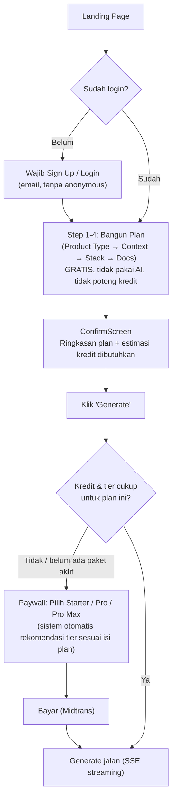

# 💳 Poin 3 (Revisi v3) — Starter/Pro/Pro Max, Sistem Kredit, Max User & Layanan Final

> Melanjutkan `arrobuild_pricing_monetisasi_2026.md` (v1) dan revisi sebelumnya (v2). Update di versi ini: **harga baru yang lebih agresif** (Starter Rp65.000 / Pro Rp145.000 / Pro Max Rp199.000, hasil diskusi dan perbandingan langsung ke screenshot pricing kompetitor), **top-up kredit lebih murah**, **paket 3-4 bulan khusus Pro & Pro Max**, **sistem max user bertahap** supaya kapasitas layananmu (WA chat, revisi manual) tidak kewalahan, ringkasan "berapa kali bisa generate" yang user-friendly, dan Layanan Tambahan yang sudah disesuaikan (chat via WhatsApp, revisi dokumen bergaya IDE). Harga model AI & metodologi token tetap dari v1, kelas kredit tetap dari v2 — tidak diulang mentah-mentah di sini.

---

## Daftar Isi
1. [Alur Baru: Login → Bangun Plan → Baru Pilih Paket](#1-alur-baru-login--bangun-plan--baru-pilih-paket)
2. [Sistem Kredit: 1 Kredit = Berapa Token?](#2-sistem-kredit-1-kredit--berapa-token)
3. [Sistem Max Token (Lapisan Pengaman Teknis)](#3-sistem-max-token-lapisan-pengaman-teknis)
4. [Paket Baru: Starter / Pro / Pro Max](#4-paket-baru-starter--pro--pro-max)
   - [4.1 Struktur Dokumen Final Dipetakan ke Tier](#41-struktur-dokumen-final-dipetakan-ke-tier)
   - [4.2 Token & Kredit — Dokumen Inti](#42-token--kredit--dokumen-inti-per-proyek)
   - [4.3 Token & Kredit — Dokumen Opsional](#43-token--kredit--8-dokumen-opsional)
   - [4.4 Migrasi Model — Nama Lama vs Baru](#44-migrasi-model--nama-lama-vs-baru)
5. [Berapa Kali Bisa Generate? (Ringkasan User-Friendly)](#5-berapa-kali-bisa-generate-ringkasan-user-friendly)
6. [Uji Margin Tiap Paket](#6-uji-margin-tiap-paket)
7. [Sistem Max User (Fase Peluncuran)](#7-sistem-max-user-fase-peluncuran)
8. [Layanan Tambahan](#8-layanan-tambahan)
9. [Add-on, Top-up & Paket Multi-Bulan](#9-add-on-top-up--paket-multi-bulan)
10. [Positioning vs Kompetitor (Data Riil)](#10-positioning-vs-kompetitor-data-riil)
11. [Dashboard Angka Kunci v3](#11-dashboard-angka-kunci-v3)
12. [Pertanyaan Balik dari Saya](#12-pertanyaan-balik-dari-saya)

---

## 1. Alur Baru: Login → Bangun Plan → Baru Pilih Paket



**Kenapa ini bagus secara bisnis:**
- Membangun plan itu **hampir tanpa biaya AI** (cuma form data + mungkin 1 panggilan AI kecil untuk validasi/preview, bukan generate penuh) — jadi aman dibuat gratis-tanpa-batas untuk semua orang yang sudah login.
- User yang sudah investasi waktu isi 4 step form (product type, context, stack, pilih dokumen) **jauh lebih siap membayar** dibanding orang yang baru lihat landing page. Ini "sunk cost" positif — bukan manipulatif, karena mereka memang sudah dapat nilai (melihat draft plan mereka jadi terstruktur) sebelum diminta bayar.
- **Login wajib dari awal** (bukan cuma saat generate) otomatis menutup celah "anonymous abuse" yang jadi temuan P1 di dokumen keamanan sebelumnya — tanpa perlu keputusan terpisah soal "force login," itu sudah built-in ke alur.
- Paywall di titik generate bisa **otomatis merekomendasikan tier yang pas** berdasarkan isi plan: kalau user pilih 8 jenis dokumen + model Claude Opus, sistem langsung sodorkan "Paket ini butuh Pro Max" alih-alih user bingung sendiri baca tabel perbandingan tier.

> [!TIP]
> Simpan plan yang belum di-generate sebagai draft (misal maks 5 draft aktif/akun, auto-expire 30 hari kalau tidak pernah di-generate) supaya tidak jadi tempat sampah data gratis yang menumpuk di database tanpa nilai bisnis.

---

## 2. Sistem Kredit: 1 Kredit = Berapa Token?

**Jawaban langsung: 1 kredit = 1.000 token, untuk kelas model termurah (Gemini 2.5 Flash-Lite / DeepSeek V4 Flash).**

Model lain lebih mahal per token, jadi mereka "menghabiskan" kredit lebih cepat per 1.000 token yang dihasilkan. Rasio ini dihitung dari harga riil tiap model (dokumen v1 Bagian 2), dibulatkan ke angka bersih — **kelas dan multiplier ini tidak berubah dari v2**, cuma alokasi kredit per paket yang disesuaikan di Bagian 4:

| Kelas Model | Contoh Model | Kredit per 1.000 token | Artinya |
|---|---|---|---|
| **Hemat** (baseline) | Gemini 2.5 Flash-Lite, DeepSeek V4 Flash | **1 kredit** | 1 kredit = 1.000 token persis |
| **Menengah** | Gemini 3.5 Flash, Gemini 2.5 Pro | **24 kredit** | 1.000 token model ini = 24x lebih mahal dari model hemat |
| **Flagship** | GPT-5.4, Claude Sonnet, Gemini 3.1 Pro | **35 kredit** | ~35x lebih mahal dari hemat |
| **Ultra** | Claude Opus, GPT-5.5 | **65 kredit** | ~65x lebih mahal dari hemat |

Rasio ini diturunkan dari perbandingan biaya blended (input+output tertimbang) tiap model, jadi **margin kotor per kredit relatif konsisten (~67-73%) di semua kelas model** — dan berlaku juga di harga baru yang lebih agresif ini, karena sistem kredit itu proporsional: harga turun, kredit yang dikasih juga turun proporsional, margin persennya tetap terjaga.

**Nilai internal 1 kredit ≈ Rp 20** (dipakai untuk menghitung alokasi kredit per paket, bukan harga jual langsung per kredit ke user — biaya riil per kredit ≈ Rp 5,58 di semua kelas model, jadi ada ruang margin di semua level).

---

## 3. Sistem Max Token (Lapisan Pengaman Teknis)

Kredit saja **tidak cukup ketat** kalau model hemat dipakai — karena murahnya, user bisa generate ratusan dokumen dan kredit tidak akan habis-habis. Makanya perlu lapisan kedua yang keras di level teknis, terlepas dari sisa kredit:

| Batasan | Starter | Pro | Pro Max | Kenapa perlu |
|---|---|---|---|---|
| Maks token *output*/dokumen | 2.500 | 5.000 | 10.000 | Hard cap di parameter `max_tokens` API — tidak bisa ditembus meski kredit banyak |
| Maks token *context* yang di-inject (accumulated context) | 3.000 | 5.000 | 8.000 | **Ini kunci.** Alih-alih dump seluruh dokumen sebelumnya (yang bikin token input meledak kuadratik — lihat dokumen v1 Bagian 3.2), context dipotong jadi ringkasan terstruktur maks segini token, berapa pun banyaknya dokumen sebelumnya |
| Maks token input dari form user (freeText dll) | 1.500 | 2.500 | 3.500 | Cegah user paste teks raksasa yang membengkakkan prompt di luar kendali |
| Maks proyek/bulan | 10 | 30 | 60 | Batas operasional (beban DB, storage, support) — independen dari kredit |
| Maks proyek/hari | 3 | 8 | 15 | Anti bot/script |

> [!IMPORTANT]
> Baris "maks token context" di atas **sekaligus menuntaskan dua masalah dari dokumen Poin 1 & Poin 3 v1 sekaligus**: (1) ini adalah bentuk konkret dari "Knowledge Model JSON" yang kamu identifikasi belum diimplementasi — ringkasan terstruktur per dokumen jadi wajib ada supaya bisa dipotong ke budget token tetap, dan (2) ini yang mematikan risiko ledakan biaya di tier Pro Max yang saya temukan di dokumen v1 (input tokens bisa tembus 236.000/proyek). Dengan cap ini, input context maksimal **8.000 token flat**, tidak peduli proyeknya punya 3 dokumen atau 8 dokumen.

---

## 4. Paket Baru: Starter / Pro / Pro Max

| | **Starter** | **Pro** | **Pro Max** |
|---|---|---|---|
| **Harga/bulan** | **Rp 65.000** | **Rp 145.000** | **Rp 199.000** |
| Kredit/bulan | 3.000 | 7.000 | 14.000 |
| Rollover kredit | Tidak ada | Maks 2.000 | Maks 4.000 |
| Jenis dokumen | 3 (PRD, Architecture, Plan/Task) | 5 (+Design System, Agent Rules) | 6 (+Adaptive Document) + akses modul opsional |
| Kelas model tersedia | Hemat saja | Hemat, Menengah, Flagship | Semua (+Ultra) |
| Riwayat proyek | 30 hari | Selama berlangganan | Selama berlangganan + export permanen |
| Custom preset & fork | ❌ | ✅ | ✅ |
| Regenerate/revisi per dokumen | ❌ | 1x gratis/bulan (kredit-based setelahnya) | Unlimited (kredit-based) |
| Chat langsung dengan founder (WA) | ❌ | ✅ gratis, 2x/bulan | ✅ gratis, 5x/bulan, prioritas |
| Mini tools | 1 tool, trial terbatas | 3 tools, unlimited | Semua tools, unlimited |

> [!TIP]
> **Soal "menutup modal dan kasih rasa berbisnis dulu"**: dengan harga ini, margin kotor tetap di **72-99%** untuk Starter/Pro dan **~56%** di kasus terburuk Pro Max (lihat Bagian 6) — jauh di atas sekadar "balik modal". Kamu punya ruang cukup lebar buat naikkan harga nanti begitu produk terbukti, dan justru **lebih mudah dijustifikasi** menaikkan harga dari titik "jelas menguntungkan" daripada dari titik "pas-pasan".

### 4.1 Struktur Dokumen Final Dipetakan ke Tier

`00-overview.md` mendefinisikan 6 dokumen inti (wajib) + 8 modul opsional — ini menggantikan struktur 8-dokumen lama di `arrobuild_analysis.md` yang jadi basis dokumen v1. Karena `00-overview.md` awalnya cuma didesain untuk 2 tier berbayar (Pro & Pro Max), Starter di-slot ke struktur ini:

| Dokumen Inti | Starter | Pro | Pro Max |
|---|---|---|---|
| 1. PRD | ✅ | ✅ | ✅ |
| 2. Architecture & Technical Blueprint | ✅ | ✅ | ✅ |
| 3. Plan/Task | ✅ | ✅ | ✅ |
| 4. Design System | ❌ | ✅ | ✅ |
| 5. Agent Rules | ❌ | ✅ | ✅ |
| 6. Adaptive Document | ❌ | ❌ | ✅ |
| **Total dokumen inti** | **3** | **5** | **6** |

> [!TIP]
> Starter sengaja dapat PRD + Architecture + Plan/Task — bukan cuma PRD seperti pola kompetitor (Bagian 10). `00-overview.md` sendiri menekankan Architecture "tidak boleh opsional" karena AI coding agent paling sering ngaco akibat skema data yang tidak konsisten antar sesi kerja.

### 4.2 Token & Kredit — Dokumen Inti (per proyek)

`00-overview.md` belum mendefinisikan token budget untuk Starter — diisi dengan versi ringkas proporsional di bawah Pro.

| Dokumen | Token Starter | Token Pro | Token Pro Max | Model Default Pro | Model Default Pro Max |
|---|---|---|---|---|---|
| PRD | 2.500 | 4.000 | 7.000 | Gemini 2.5 Pro (Menengah) | GPT-5.4 (Flagship) |
| Architecture | 2.500 | 4.000 | 7.000 | Gemini 2.5 Pro (Menengah) | GPT-5.4 (Flagship) |
| Plan/Task | 2.000 | 3.000 | 5.000 | DeepSeek V4 Flash (Hemat) | Gemini 2.5 Pro (Menengah) |
| Design System | — | 3.000 | 5.000 | Gemini 2.5 Pro (Menengah) | Gemini 2.5 Pro (Menengah) |
| Agent Rules | — | 2.500 | 4.000 | DeepSeek V4 Flash (Hemat) | GPT-5.4 (Flagship) |
| Adaptive Document | — | — | 6.500 | — | Claude Sonnet (Flagship) |

Dikonversi ke kredit (Hemat 1x / Menengah 24x / Flagship 35x per 1.000 token):

| Dokumen | Kredit Starter | Kredit Pro (default) | Kredit Pro Max (default) |
|---|---|---|---|
| PRD | 3 | 96 | 245 |
| Architecture | 3 | 96 | 245 |
| Plan/Task | 2 | 3 | 120 |
| Design System | — | 72 | 120 |
| Agent Rules | — | 3 | 140 |
| Adaptive Document | — | — | 228 |
| **Total/proyek (default mix)** | **8 kredit** | **270 kredit** | **1.098 kredit** |

Dibagi ke alokasi kredit/bulan yang baru (Bagian 4):
- **Starter**: 3.000 ÷ 8 = 375 proyek dari sisi kredit — kredit jelas bukan pembatas, **hard cap 10 proyek/bulan (Bagian 3) yang jadi pembatas riil**.
- **Pro**: 7.000 ÷ 270 ≈ **26 proyek/bulan** (mix model default). Kalau semua dokumen di-upgrade manual ke opsi termahal yang tersedia di Pro: 512 kredit/proyek → turun ke **≈14 proyek/bulan** (worst case, dipakai di uji margin Bagian 6).
- **Pro Max**: 14.000 ÷ 1.098 ≈ **13 proyek/bulan** (default). Skenario ekstrem semua dokumen dipaksa ke kelas Ultra (Opus/GPT-5.5, 65 kredit/1.000 token): 2.243 kredit/proyek → turun ke **≈6 proyek/bulan**.

### 4.3 Token & Kredit — 8 Dokumen Opsional

Belum ada budget token resmi di `00-overview.md` untuk kategori ini — berikut usulan siap pakai, langsung dalam bentuk kredit (memotong dari pool kredit bulanan yang sama, tidak perlu skema pembayaran terpisah):

| Dokumen Opsional | Tersedia di | Token | Model Direkomendasikan | Kelas | Kredit |
|---|---|---|---|---|---|
| Cost & Infrastructure Estimate | Pro | 2.000 | DeepSeek V4 Flash | Hemat | 2 |
| Analytics & Metrics Spec | Pro | 2.000 | DeepSeek V4 Flash | Hemat | 2 |
| Analytics & Metrics Spec | Pro Max | 3.500 | Gemini 2.5 Pro | Menengah | 84 |
| Testing & QA Plan | Pro | 2.500 | Gemini 2.5 Pro | Menengah | 60 |
| Testing & QA Plan | Pro Max | 4.000 | Gemini 2.5 Pro | Menengah | 96 |
| Onboarding & Email Flow | Pro | 2.500 | Gemini 2.5 Pro | Menengah | 60 |
| Onboarding & Email Flow | Pro Max | 4.000 | Gemini 2.5 Pro | Menengah | 96 |
| Competitive Analysis | Pro | 3.000 | Claude Sonnet | Flagship | 105 |
| Security & Launch Checklist | Pro Max | 5.000 | Claude Sonnet | Flagship | 175 |
| Database Deep-Dive | Pro Max | 4.500 | Claude Sonnet | Flagship | 158 |
| Compliance & Legal Checklist | Pro Max | 3.500 | Claude Sonnet | Flagship | 123 |

> [!TIP]
> Dokumen yang butuh reasoning/riset dalam (Competitive Analysis, Security Checklist, Database Deep-Dive, Compliance) dapat kelas Flagship karena di situ kualitas model benar-benar kelihatan bedanya. Dokumen yang lebih templated/numerik (Cost Estimate, Analytics versi Pro) cukup kelas Hemat.

### 4.4 Migrasi Model — Nama Lama vs Baru

| Disebut di 00-overview.md | Status Juli 2026 | Ganti ke |
|---|---|---|
| Gemini Pro | Nama generik lama | Gemini 2.5 Pro (default, Menengah) atau Gemini 3.5 Flash |
| GPT-4o | **Sudah tidak ada di price list resmi OpenAI** | GPT-5.4 (Flagship) |
| DeepSeek V3 | **Alias `deepseek-chat`/`deepseek-reasoner` pensiun 24 Juli 2026** | DeepSeek V4 Flash (Hemat) |
| Claude Sonnet | Masih relevan, pastikan versi (4.6/5) yang dipanggil | Tidak berubah kelas harga ($3/$15, Flagship) |

---

## 5. Berapa Kali Bisa Generate? (Ringkasan User-Friendly)

Versi bahasa sederhana untuk halaman pricing — meniru kejelasan gaya kompetitor ("5 PRD/bulan", "Unlimited PRD") tapi jujur ke karakter ArroBuild yang generate banyak dokumen sekaligus per proyek (bukan cuma 1 PRD):

**Starter — Rp 65.000/bulan**
- 3 dokumen inti/proyek: PRD, Architecture, Plan/Task
- Model AI kelas Hemat
- Hingga **10 proyek/bulan**
- Chat AI **unlimited** untuk diskusi planning (bukan generate dokumen)
- Download Markdown

**Pro — Rp 145.000/bulan**
- 5 dokumen inti/proyek (+Design System, +Agent Rules)
- Model AI Hemat s/d Flagship (termasuk GPT-5.4, Claude Sonnet, Gemini 3.1 Pro)
- Hingga **±26 proyek/bulan** (model hemat-menengah) atau **±14 proyek/bulan** (full model paling mahal di tier ini)
- Chat AI **unlimited** untuk diskusi planning
- Chat langsung dengan founder via WhatsApp: **2x/bulan, gratis**
- Revisi dokumen per bagian: **1x gratis/bulan**
- Custom preset, fork proyek, export cursorrules/claude-md

**Pro Max — Rp 199.000/bulan**
- 6 dokumen inti (+Adaptive Document) + akses semua modul opsional
- Semua kelas model termasuk Claude Opus & GPT-5.5
- Hingga **±13 proyek/bulan** (mix model) atau **±6 proyek/bulan** (full model paling mahal/Ultra)
- Chat AI **unlimited**
- Chat langsung dengan founder via WhatsApp: **5x/bulan, gratis, prioritas antrian**
- Revisi dokumen: **unlimited** (tetap potong kredit dari pool)
- Regenerate per file, akses semua mini tools, riwayat proyek permanen

> [!TIP]
> Perhatikan pola "unlimited" cuma dipakai untuk hal yang benar-benar murah biayanya (chat AI planning, bukan generate dokumen) — ini sengaja meniru cara kompetitor menandai "Unlimited PRD" di paket mereka (PRD saja murah untuk digenerate berkali-kali), tapi tidak disamakan untuk "unlimited proyek" karena ArroBuild generate banyak dokumen sekaligus per proyek, jadi risikonya beda.

---

## 6. Uji Margin Tiap Paket

**Starter** (worst case: 10 proyek penuh/bulan, 3 dokumen @2.500 token output, model hemat):
```
Token realisasi ≈ 10 proyek × 3 dok × (2.500 output + 3.000 context maks) ≈ 165.000 token
Biaya riil       = 165.000/1.000 × Rp 5,58 (biaya blended hemat)  ≈ Rp 921
Revenue          = Rp 65.000
Margin kotor     = 98,6%  ✅
```

**Pro** (worst case: 7.000 kredit habis semua di kelas Flagship, 35 kredit/1.000 token):
```
Token realisasi = 7.000 ÷ 35 × 1.000 = 200.000 token
Biaya riil      = 200.000/1.000 × Rp 202,5 (rata2 biaya Flagship blended) ≈ Rp 40.500
Revenue         = Rp 145.000
Margin kotor    = 72,1%  ✅
```

**Pro Max** (worst case: 14.000 kredit habis semua di kelas Ultra, 65 kredit/1.000 token):
```
Token realisasi = 14.000 ÷ 65 × 1.000 = 215.385 token
Biaya riil      = 215.385/1.000 × Rp 405 (biaya GPT-5.5, kelas Ultra termahal) ≈ Rp 87.230
Revenue         = Rp 199.000
Margin kotor    = 56,2%  ✅
```

Dibanding skema lama yang bisa **minus jutaan rupiah per user** di kasus terburuk (lihat dokumen v1 Bagian 3.4), ketiga paket ini **tidak pernah rugi** — bahkan dengan harga yang jauh lebih agresif dari usulan v2, margin terendah (56,2%) hanya terjadi kalau user memaksimalkan kredit ke model paling mahal terus-menerus.

> [!TIP]
> **Validasi silang**: dihitung dari jumlah kredit/proyek berdasarkan dokumen riil (Bagian 4.2: Pro worst-case ≈512 kredit/proyek → ≈14 proyek/bulan; Pro Max worst-case ≈2.243 kredit/proyek → ≈6 proyek/bulan), hasilnya konsisten dengan margin di atas (selisih <2%).

---

## 7. Sistem Max User (Fase Peluncuran)

Kapasitas layanan personal (chat WA, revisi manual) terbatas ke **2 jam/hari** yang kamu sanggupi — dengan asumsi rata-rata 15-20 menit fokus per thread WA, kapasitas riil ada di **±200 thread/bulan total**. Supaya tidak kaget begitu user bertambah, cap jumlah user aktif dulu, dinaikkan bertahap:

| Fase | Durasi | Max Starter | Max Pro | Max Pro Max | Beban WA terpakai (worst case, semua pakai kuota penuh) |
|---|---|---|---|---|---|
| **Fase 1 — Founding Member** | Bulan 1-2 | 150 | 60 | 15 | 60×2 + 15×5 = 195 thread/bulan (di bawah kapasitas 200) ✅ |
| **Fase 2 — Validasi** | Bulan 3-4 | 300 | 120 | 30 | 120×2 + 30×5 = 390 thread/bulan (di atas kapasitas 2 jam/hari) ⚠️ |
| **Fase 3 — Terbuka** | Bulan 5+ | Dibuka/naik signifikan | — | — | Evaluasi ulang: rekrut bantuan, atau geser respons ke rentang lebih longgar (mis. 3-5 hari kerja) |

> [!WARNING]
> Fase 2 secara matematis **melebihi kapasitas 2 jam/hari** kalau semua user memakai kuota WA penuh bersamaan — ini realistis karena tidak semua orang akan pakai kuotanya tiap bulan, tapi tetap perlu keputusan sebelum dibuka: (a) perpanjang target respons jadi beberapa hari kerja (bukan real-time) supaya lonjakan permintaan tersebar, (b) mulai rekrut bantuan paruh waktu untuk pegang sebagian chat, atau (c) tunda pelebaran cap Pro Max sampai (a) atau (b) siap. Saya sarankan opsi (a) dulu karena paling murah untuk dieksekusi sekarang.

> [!TIP]
> Kalau slot satu tier penuh, arahkan calon user baru ke **waitlist** (bukan generate error atau halaman pembayaran gagal tanpa penjelasan) — ini sekaligus jadi alat marketing ("slot terbatas") yang memperkuat kesan "harga peluncuran, belum terbuka untuk semua orang".

---

## 8. Layanan Tambahan

### 8.1 Chat Langsung dengan Kamu (via WhatsApp)
- Kapasitas: 2 jam/hari (~200 thread/bulan pada pemakaian penuh, lihat Bagian 7)
- **Pro**: 2x thread/bulan, **gratis** (revisi dari draf sebelumnya yang tadinya add-on berbayar)
- **Pro Max**: 5x thread/bulan, **gratis**, prioritas antrian
- **Starter**: tidak termasuk, ditampilkan sebagai upsell ("Upgrade untuk chat langsung dengan founder")
- Bot WA otomatis menunjukkan jadwal slot yang available, bisa auto-antre, dan otomatis menahan permintaan baru kalau kuota bulan itu sudah habis (supaya tidak perlu kamu jaga manual)

### 8.2 Revisi Dokumen (Tampilan Mirip IDE)
- Setelah generate selesai, tampilan pindah ke layout tiga panel: **kiri** = daftar file dokumen, **tengah** = isi dokumen yang sedang dibuka, **kanan** = panel chat AI untuk revisi (user bisa pilih model AI sesuai tier)
- **Onboarding pilihan bagian**: sebelum user mengetik feedback bebas, sistem tampilkan dropdown/checklist bagian dokumen (berdasarkan heading terstruktur yang sudah ada) — user pilih bagian yang mau direvisi dulu, baru kasih instruksi. Ini bikin revisi lebih presisi & hemat token
- Revisi hanya meregenerate bagian yang dipilih (bukan seluruh dokumen) — estimasi **±116 kredit/revisi** di kelas Flagship, jauh lebih murah dari generate ulang dokumen penuh (contoh: PRD Pro Max penuh = 245 kredit)
- **Pro**: 1x gratis/bulan, setelah itu potong kredit dari pool
- **Pro Max**: unlimited, tetap potong kredit dari pool (tidak ada batas jumlah kali)
- **Revisi manual** (direview langsung olehmu, bukan AI): eksklusif Pro Max, kuota 2x/bulan, terpisah dari kuota chat WA umum di Bagian 8.1

### 8.3 Mini Tools
- Saat ini baru 1 tool yang sudah ada: generator prompt portfolio berbasis HTML/CSS/JS murni
- Ide pengembangan, prioritas pembangunan, dan estimasi biaya AI per tool ada di file terpisah: **`arrobuild_mini_tools_plan.md`**
- Akses per tier: Starter 1 tool (trial terbatas), Pro 3 tools pilihan (unlimited), Pro Max semua tools (unlimited + akses awal ke tools baru)

---

## 9. Add-on, Top-up & Paket Multi-Bulan

### 9.1 Top-up Kredit (Lebih Agresif)

| Item | Harga | Kredit didapat | Rate/kredit | Margin |
|---|---|---|---|---|
| Top-up Kecil | Rp 20.000 | 1.000 kredit | Rp 20/kredit | ~72% |
| Top-up Sedang | Rp 45.000 | 2.500 kredit | Rp 18/kredit | ~69% |
| Top-up Besar | Rp 85.000 | 5.000 kredit | Rp 17/kredit | ~67% |

Dibanding versi sebelumnya (Rp25rb/1.000 kredit), top-up sekarang dipatok **sama atau lebih murah dari rate dalam paket** — sengaja agresif karena top-up seharusnya jadi jalan mudah buat user "nanggung" kekurangan kredit tanpa berasa dihukum, sambil tetap untung (margin ~67-72%, cost dasar per kredit tetap ~Rp5,58 di semua kelas model).

### 9.2 Paket Multi-Bulan (Khusus Pro & Pro Max)

Starter sengaja **tidak** dapat opsi multi-bulan — tier ini untuk yang baru coba-coba, komitmen jangka panjang belum relevan di situ.

| | Pro | Pro Max |
|---|---|---|
| 1 bulan | Rp 145.000 | Rp 199.000 |
| **3 bulan** | **Rp 365.000** (hemat ~16%) | **Rp 499.000** (hemat ~16%) |
| **4 bulan** | **Rp 459.000** (hemat ~21%) | **Rp 629.000** (hemat ~21%) |

> [!TIP]
> Kredit tetap **di-refresh tiap bulan** (bukan langsung dikasih 3x/4x lipat di muka) meski harga dibayar sekaligus di awal — ini menjaga supaya tidak ada user yang bayar 4 bulan lalu habiskan semua kredit di bulan pertama ke model paling mahal. Yang didiskon cuma harganya, bukan kecepatan pemakaian kreditnya.

---

## 10. Positioning vs Kompetitor (Data Riil)

Dari screenshot halaman pricing ngodingpakeai.com:

| | Starter (kompetitor) | Pro (kompetitor) | Pro Bundle (kompetitor) |
|---|---|---|---|
| Harga/bulan | Rp 75.000 | Rp 149.000 (dicoret dari Rp200.000, 25% OFF) | Rp 199.000 ("Paling Worth") |
| Fitur kunci | Premium AI model, 5 PRD/bulan, chat AI planning 100x/bln, download markdown | Premium AI model, unlimited PRD, chat AI unlimited, chat langsung dengan founder mereka | Semua fitur Pro + bonus produk terpisah (AndalAI Pro senilai Rp129rb, gratis) |
| Taktik UI | Badge global "Diskon hingga 34%" di atas halaman | Harga asli dicoret + badge 25% OFF | Badge "Paling Worth" menonjolkan tier tengah-atas |

Dibandingkan harga baru ArroBuild:

| | ArroBuild Starter | ArroBuild Pro | ArroBuild Pro Max |
|---|---|---|---|
| Harga/bulan | **Rp 65.000** — 13% lebih murah dari kompetitor | **Rp 145.000** — Rp4rb lebih murah, hampir sama | **Rp 199.000** — persis sama dengan harga tertinggi kompetitor |

**Kenapa ini pas untuk posisimu sekarang**: Starter & Pro sengaja dipatok di bawah/setara kompetitor — konsisten dengan alasan kamu sendiri bahwa layanan ArroBuild "belum sebanyak web lain yang sudah pasti kualitasnya", jadi harga jadi kompensasi kepercayaan di masa awal. Tapi Pro Max dipatok **persis sama** dengan harga tertinggi kompetitor — supaya orang yang sudah biasa bayar segitu di kompetitor tidak merasa "mahal" pindah ke ArroBuild, meski cakupannya jauh lebih luas (6 dokumen + modul opsional vs cuma PRD).

**Taktik UI yang layak ditiru** (polanya, bukan kydan kontennya): harga asli dicoret + badge diskon untuk kesan "harga peluncuran" (selaras dengan strategi founding member yang sudah dibahas), badge "Paling Direkomendasikan" di salah satu tier (biasanya Pro — psikologis paling gampang dijual sebagai pilihan tengah), dan bundling bonus di Pro Max sebagai pengganti skema "bonus produk lain" kompetitor — misalnya "+bonus 500 kredit di bulan pertama" atau "+akses semua mini tools sejak hari pertama, bukan menunggu rilis satu-satu".

---

## 11. Dashboard Angka Kunci v3

| Metrik | Nilai |
|---|---|
| 1 kredit (baseline) | = 1.000 token model hemat |
| Nilai internal 1 kredit | ≈ Rp 20 (biaya riil ≈ Rp 5,58) |
| Harga Starter / Pro / Pro Max | Rp 65.000 / Rp 145.000 / Rp 199.000 |
| Kredit Starter / Pro / Pro Max | 3.000 / 7.000 / 14.000 per bulan |
| Margin kotor worst-case Starter / Pro / Pro Max | 98,6% / 72,1% / 56,2% |
| Kredit/proyek (default mix) Starter / Pro / Pro Max | 8 / 270 / 1.098 |
| Kredit/proyek (worst-case, semua model termahal) Pro / Pro Max | 512 / 2.243 |
| Proyek/bulan (default → worst-case) Pro / Pro Max | 26→14 / 13→6 |
| Top-up termurah | Rp 17/kredit (beli 5.000 kredit) |
| Paket 3 bulan / 4 bulan (Pro, hemat) | ~16% / ~21% |
| Max user Fase 1 (Starter/Pro/Pro Max) | 150 / 60 / 15 |
| Kapasitas WA chat | ~200 thread/bulan (2 jam/hari) |

---

## 12. Pertanyaan Balik dari Saya

Sebagian besar pertanyaan di versi sebelumnya sudah terjawab (kapasitas chat, revisi manual, target segmen, arah harga). Yang masih relevan didiskusikan:

1. **Cap Fase 1** — apakah 150/60/15 (Starter/Pro/Pro Max) terasa realistis buat awal, atau kamu mau mulai lebih kecil dulu (misal 50/20/5) supaya benar-benar bisa dipantau ketat di bulan pertama?
2. **Mini tools** — mau saya susun jadi file rencana terpisah sekarang (`arrobuild_mini_tools_plan.md`) dengan urutan prioritas pembangunan dan estimasi biaya AI per tool, termasuk 2 ide kamu (Stitch prompt composer, design scraper) dan tambahan dari saya?
3. **Bundling bonus Pro Max** — ada preferensi bonus konkret yang mau ditawarkan (kredit tambahan, akses mini tools lebih awal, atau lainnya) untuk mendekati taktik "bonus produk lain" ala kompetitor?

Kalau semua sudah pas, tinggal bilang lanjut dan saya siapkan file mini tools terpisah sekalian.
